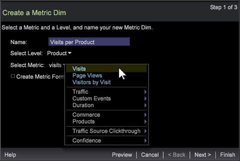
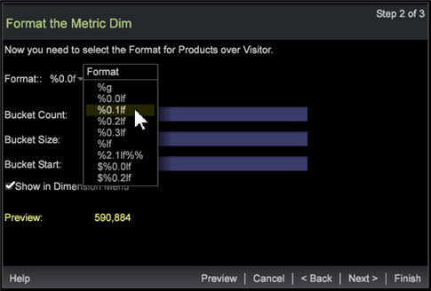

# wizard Metrische schijf{#metric-dim-wizard}

Creeer Afmetingen die door metrische attributen (de Metrische Vormen) worden bepaald gebruikend een stapsgewijze tovenaar. Dan test, voorproef, en bewaar de nieuwe Metrische Duim aan uw lijst van Afmetingen.

Een metrische Duim zet metrisch in een nieuwe dimensie om. Bijvoorbeeld, zal een Metrische Mam die op metrisch van de Meningen van de Pagina en het niveau van Bezoeker wordt gebaseerd afmetingselementen tonen die op de totale Meningen van de Pagina voor elke Bezoeker worden gebaseerd. Het laat u momenteel bepaalde metrisch uitbreiden gebaseerd op afmetingselementen om als nieuwe afmeting tot stand te brengen en te bewaren.

## Stap 1: Afmetingen en metrisch selecteren {#section-58b6ea7bbba5487ba1a3c264aa3dcb95}

1. Open de Metrische Tovenaar van de Mam.

   In een werkruimte, klik en selecteer **[UICONTROL de Hulpmiddelen]** > **[UICONTROL creeer Metrische Wijm]** met de rechtermuisknop aan.

1. Noem de Metrische Dim.

   Als gebrek, zal het gebied van de Naam op Niveau en de Metrische selecties worden gebaseerd automatisch bevolken.

1. Selecteer een Dimension-niveau.

   Het afmetingsniveau is de ouderafmeting die alle samenstellende elementenwaarden aan filterinput bevat en een afmetingstype bepaalt.

   De niveaus van de afmetingen omvatten:

   * Klikken
   * Hit
   * Product
   * Bezoek
   * Bezoeker

1. Selecteer een metrisch.

   Selecteer vooraf ingebouwd metrisch om zich uit te breiden en te bewaren als metrische mijl.

   

1. (facultatief) creeer een Metrische Formule.

   Klik de doos om een douane metrische formule in te gaan. De berekende waarde van de Voorproef zal het bevestigen van de uitdrukking lijken.

   

   U kunt uw eigen [metrische uitdrukking](https://docs.adobe.com/content/help/en/data-workbench/using/client/qry-lang-syntx/c-syntx-mtrc-exp.html) of besnoeiing en deeg van een andere metrische redacteur of visualisatie toevoegen. De fouten van de syntaxis, formulefouten, niet gedefiniëerde filters, en andere fouten worden gemeld in de tovenaar.

1. Klik op **[!UICONTROL Next]**.

## Stap 2: Opmaak en Emmers instellen {#section-5bddf3cd306545d7806a501637f80f77}

1. Selecteer een formaat voor de nieuwe metrische mijl.

   

   Het formaat bepaalt hoe metrisch wanneer geopend in een visualisatie zal worden voorgesteld. Deze formaten worden geselecteerd [druk normen](http://www.cplusplus.com/reference/cstdio/printf/), die hieronder worden bepaald:

   ```
   %[flags][width][.precision][length][specifier]
   % 0.2lf = % _ [flags] 0 [width] .2 [.precision] l [length] f[ specifier]
   ```

   Op het **[!UICONTROL Preview]** gebied, zal een waarde gebaseerd op metrisch en geselecteerd formaat verschijnen.

1. Voeg de uitdrukking van de Telling van de Emmer toe.

   U kunt een metrische diepte met diverse waaiers, of emmers bepalen. Dit keert ondergroepen van elementen terug die op grootte worden gebaseerd, zoals [0-4], [5-10],...). De elementen van het Niveau van de Dimensie hebben op de elementen betrekking de waarvan waaier de waarde van metrisch bevat. Zie de beschrijving van de emmer uitdrukking bij [Syntax voor de Uitdrukkingen](https://docs.adobe.com/content/help/en/data-workbench/using/client/qry-lang-syntx/c-syntx-dim-exp.html)van de Dimensie.

1. Klik **[!UICONTROL Preview]** aan open lijst van de Metrische waarden van de Duim alvorens te bewaren.

   

   De lijst detailleert metrische waarden per metrische diepte.

1. Klik **[!UICONTROL Show in Dimension Menu]** om de pas gecreëerde dimensie aan het lusje van de **Dimensie** in de **Vinder** toe te voegen.

1. Klik op **[!UICONTROL Next]**.

## Stap 3: Voltooien en opslaan {#section-d9043235b18a425f9de0db668d4b1683}

1. Selecteer om de Metrische Redacteur van de Duim, grafiekvisualisatie, of lijst na besparing te lanceren.

   | Veld | Beschrijving |
   |---|---|
   | **[!UICONTROL Launch Metric Dim Editor]** | Open de Metrische Redacteur van de Duim. |
   | **[!UICONTROL Launch Graph]** | Start een PNG-afbeelding van de tabel. |
   | **[!UICONTROL Launch Table]** | Lanceer een lijst in de werkruimte met waarden in kolommen die van de nieuwe metrische mijl een lijst maken vergeleken met waarden van geselecteerde metrisch. |

1. Klik **[!UICONTROL Finish]** en bewaar.

   Een sparen dialoog zal openen toestaand u om het dossier op te slaan. De geselecteerde opties aan meningswaarden zullen in de werkruimte openen.

