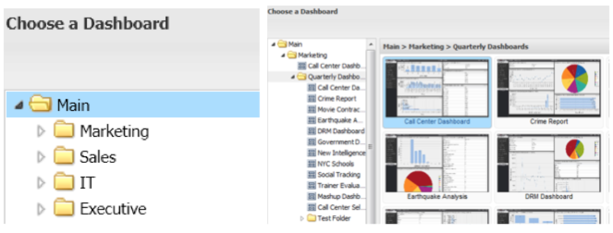

# Browser van het dashboard Meningen{#dashboard-browser-views}

Verklaart de Mening van de Duimnagel en de Mening van de Lijst.

Er zijn twee meningen die kunnen worden gebruikt om dashboards binnen Browser van het Dashboard te navigeren: de Miniatuurweergave en de lijstweergave. De mening van de Duimnagel verstrekt duimnagels van dashboards aangezien u doorbladert, terwijl de Mening van de Lijst een meer op detail-georiënteerde lijst-gebaseerde mening van de beschikbare dashboards is.

## Miniatuurweergave {#section-b522ce5e6e184ef9a0e1b9a42f7a9ae0}

De mening van de Duimnagel verstrekt een galerij van duimnagels die met de dashboards beantwoorden waarvoor u toegang hebt. Als een duimnagel een standaardpictogram toont, gelieve uw beheerder te contacteren om een duimnagel te hebben die voor dat dashboard wordt gevestigd. De pictogrammen links van de onderzoeksbar staan u toe om tussen de Meningen van de Duimnagel en van de Lijst van een knevel te voorzien.

In de duimnagelmening, toont het linkernavigatiepaneel van Browser van het Dashboard de omslaghiërarchie die de opslag van dashboards organiseert. Om de inhoud van een omslag te bekijken, klik op de omslag om zijn inhoud als duimnagels in het centrumpaneel van Browser van het Dashboard te tonen. Als er geen dashboards bewaard in dat niveau van de omslag zijn, zal het bericht &quot;geen dashboards in deze plaats&quot;in het centrumpaneel van het venster tonen.

U kunt subfolders ook onderzoeken door op de pijl links van de omslag van belang te klikken. Dit zal een lijst van subfolders en dashboards binnen de omslag uitbreiden u selecteerde. Door een omslag te selecteren die minstens één dashboard bevat, zal het centrumpaneel een duimnagel voor elk van de dashboards tonen die op het niveau van die selectie worden gevestigd. De titel van het centrumpaneel zal ook veranderen om op de weg van de geselecteerde omslag te wijzen.

U kunt het dashboard van belang dan selecteren door op het te klikken. Zodra u op een dashboardduimnagel hebt geklikt, zal het rechtse kader met de details over het dashboard bevolken. De dashboardgegevens bevatten een miniatuurweergave van het geselecteerde dashboard, de naam ervan, een korte beschrijving, de eigenaar, de datum van oprichting, de laatste wijzigingsdatum, het profiel of de profielen die worden gebruikt om de gegevens samen te stellen, zichtbaarheidscontroles en een selectie van bewerkingen.

## Lijstweergave {#section-aa79d51168a7430ea2816413dc6cc73a}

De mening van de Lijst verstrekt op lijst-gebaseerde informatie over de dashboards waarvoor u toegang hebt. Elke rij in de lijst van de Mening van de Lijst vertegenwoordigt een uniek dashboard. Het klikken op kolomkopballen zal u toestaan om de lijst door die kolom in of dalende of stijgende orde te sorteren.

Het klikken op een dashboardingang zal de details van het dashboard in het rechterpaneel van dashboardbrowser tonen. Om tussen meningen te schakelen, selecteer de gewenste meningsoptie opnieuw.
