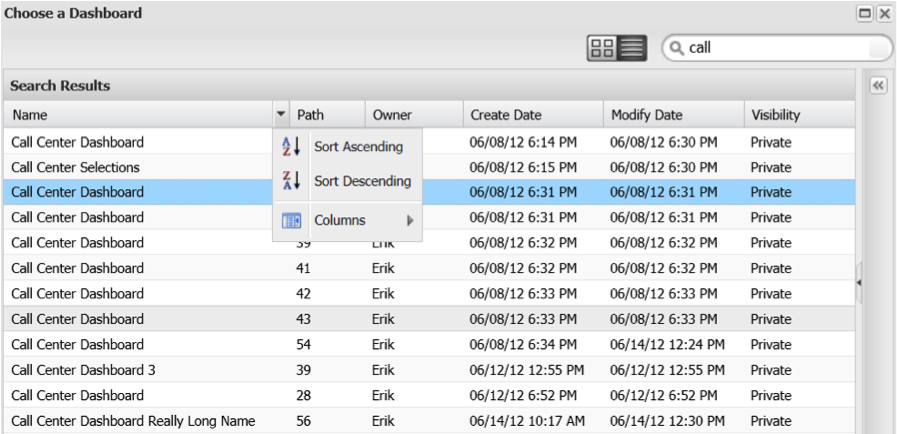

# Zoeken in de dashboardbrowser{#searching-within-the-dashboard-browser}

Met de dashboardbrowser kunt u ook zoeken naar bestaande dashboards.

Als u een zoekopdracht wilt uitvoeren, gebruikt u het zoekvak op de werkbalk van de Dashboard-browser. Terwijl u typt, worden de zoekresultaten weergegeven in de dashboardbrowser. U kunt een zoekopdracht op elk gewenst moment wissen door de zoektekst te verwijderen of op het pictogram **[!UICONTROL X]** in het zoekvak te klikken.

U kunt de resultaten ook sorteren met de sorteerfuncties in elke kolomkop. Als u op een kolomkop klikt, wordt het sorteren van die kolom in- en uitgeschakeld. U kunt de sorteeropties ook gebruiken in het keuzemenu in elke kolomkop.

Met dit menu kunt u ook zichtbare kolommen in de lijstweergave van het dashboard wijzigen. **[!UICONTROL Columns]** Hier kunt u de zichtbaarheid van kolommen in- of uitschakelen door de gewenste kolom(men) te selecteren of uit te schakelen.

## Deelvenster Details {#section-e1e5a5a0f9cc4eb89b0b94764587ae9c}

In het deelvenster Dashboard Details wordt gedetailleerde informatie over een dashboard weergegeven, samen met een miniatuurversie van het dashboard. De informatie in het deelvenster bevat de naam van het dashboard, een korte beschrijving, de eigenaar en de aanmaakdatum, de laatste datum waarop het is gewijzigd en de profielen die zijn gebruikt om het dashboard te maken. De zichtbaarheid van het dashboard (privé of gedeeld) is ook beschikbaar in dit deelvenster.
