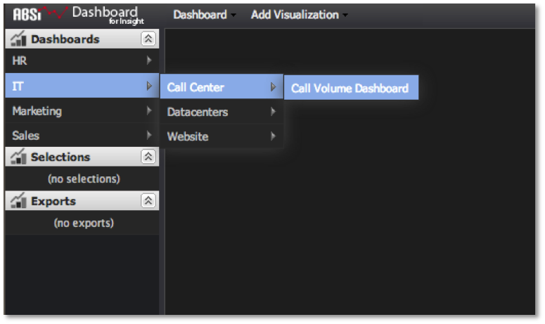

# QuickAccess-menu{#quick-access-menu}

Een van de gemakkelijkste manieren om een dashboard te openen is door het snelmenu in het linkernavigatievenster van de dashboardinterface te gebruiken.

Als u de cursor op een mapmenu-item plaatst (aangeduid met de pijl naar rechts), wordt de inhoud van de cursor uitgebreid en kunt u snel door de mappenhiërarchie van het dashboard navigeren om het gewenste dashboard te zoeken. Als u op de menuoptie van het dashboard klikt (aangeduid met de dashboardtitel en zonder naar rechts wijzende pijl), wordt het dashboard geopend voor weergave en analyse.

Deze methode is ideaal als u de naam en locatie kent van het dashboard dat u wilt openen. Als u niet zeker weet wat de naam en/of locatie van het dashboard is, kunt u het dashboard gemakkelijker vinden en openen met de Dashboard-browser.

