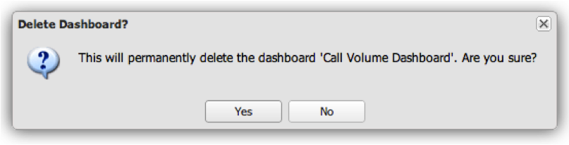

# Andere dashboardfuncties{#other-dashboard-functions}

Speciale functies zijn het delen, exporteren en verwijderen van dashboards. Deze functies worden uitgevoerd in het deelvenster Details van een geselecteerd dashboard.

## Een dashboardhyperlink delen {#section-16b592f157de404fb25bd2c739d2e2c1}

De bewerking **[!UICONTROL Share]** biedt een URL die kan worden gebruikt om een bladwijzer te maken van het dashboard of om een koppeling te versturen naar een andere gebruiker om toegang te krijgen tot het dashboard. Er verschijnt een venster Koppeling dashboard dat u de informatie verschaft die nodig is om de koppeling naar het gewenste dashboard te delen.

>[!NOTE]
>
>Ontvangers van de koppeling moeten ook toegang hebben tot het dashboard om het dashboard te kunnen bekijken.

## Dashboardgegevens exporteren {#section-ace2f5f8807548ee8436f5c1dc2cd9d2}

Met de bewerking **[!UICONTROL Export Data]** wordt het exporteren van het geselecteerde dashboard gestart en opgeslagen als Excel- of CSV-bestand (door komma&#39;s gescheiden waarden).

## Dashboards {#section-adc10cb1b3174ff699c024ddc8f994fa} verwijderen

Met de bewerking **[!UICONTROL Delete]** wordt een dashboard verwijderd. Als u een dashboard wilt verwijderen, moet de gebruiker de eigenaar van het dashboard zijn of beheerderstoegang hebben. Als u op de bewerking Verwijderen klikt, wordt een venster weergegeven om te bevestigen dat u het dashboard wilt verwijderen.

