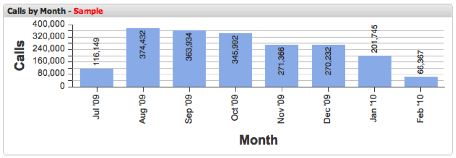

# Query-naar-parameter{#query-to-parameter}

{{eol}}

Het dashboard staat u toe om steekproeven van gegevens van de werkbank van Adobe gegevens tegenover het vragen van uw dataset aan voltooiing visualiseren.

Omdat de steekproefresultaten snel worden teruggegeven, gebruikend lager **[!UICONTROL Query To]** met de functie percentage kunt u snel dashboard maken en analyseren totdat een volledig resultaat wordt geretourneerd. De **[!UICONTROL Query To]** kan op elk moment gemakkelijk worden aangepast met behulp van de **[!UICONTROL Query To]** in het **[!UICONTROL Update]** van de werkbalk.

Aangezien het runnen van vragen aan 100 percenten voltooiing verscheidene notulen kan vergen, adviseert men dat u aanpast **[!UICONTROL Query To]** parameter aan een lagere waarde terwijl het bouwen van dashboards, of het toevoegen van en het vormen van visualisaties. U wordt ook aangeraden deze waarde te verlagen wanneer u de selecties in een dashboard bijstelt totdat u zeker weet dat u de query op 100% kunt uitvoeren.

>[!NOTE]
>
>Een indicator zal in de kopbal voor elke visualisatie worden getoond die geen 100 percenten volledig vraagresultaat heeft.

