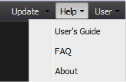

# Menu Help{#help-menu}

{{eol}}

Via het vervolgkeuzemenu Help hebt u toegang tot de documentatie van het dashboardproduct

* **[!UICONTROL User’s Guide]** - Als u de optie Handboek in het vervolgkeuzemenu Help selecteert, wordt u verwezen naar een webkoppeling waarin u op elk gewenst moment toegang kunt krijgen tot dit document.
* **[!UICONTROL FAQ]** - De veelgestelde vragen bevatten een lijst met veelgestelde vragen en antwoorden die specifiek zijn voor het dashboard. Deze sectie fungeert als snelle naslaggids voor algemene gebruikersproblemen.
* **[!UICONTROL About]** - Het gedeelte Info bevat systeeminformatie, zoals het versienummer en de juridische overeenkomst. Het bevat ook uw user-agent koord, dat een nuttig stuk van informatie is om te verstrekken wanneer het zoeken van technische steun.

## Aanvullende ondersteuning {#section-c211c01637984e10918fd2367c097b60}

Neem contact op met de systeembeheerder voor verdere ondersteuning met betrekking tot technische of softwareprestatieproblemen. Om het afwikkelingsproces te vergemakkelijken, moet men bereid zijn de volgende informatie te verstrekken:

* Gebruikersnaam dashboard voor Adobe-gegevenswerkbank
* Type en versie van webbrowser
* Naam en versie van besturingssysteem
* Versienummer dashboard
* Gedetailleerde uitleg van het probleem dat u ondervindt
* Schermopnamen van probleem (indien mogelijk)
