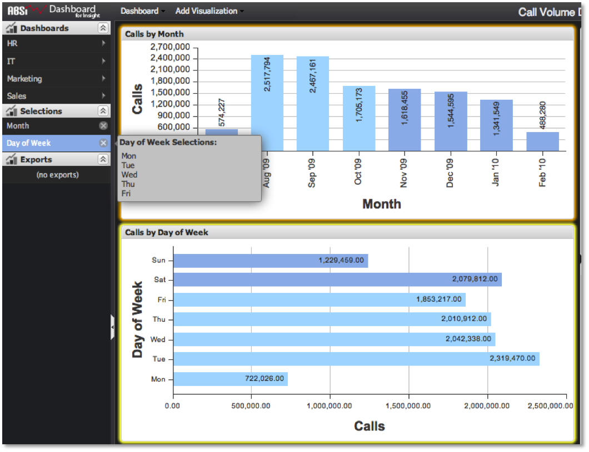

# Bepalen wat er is geselecteerd{#determining-what-s-selected}

Er zijn twee manieren om te bepalen welke selecties zijn gemaakt in een dashboard.

* Ten eerste worden alle selecties die op het dashboard zijn gemaakt, weergegeven door een item in het menu **[!UICONTROL Selections]**. Elke groep selecties uit een visualisatie wordt als één item in de lijst weergegeven. Deze zullen worden geëtiketteerd met de overeenkomstige afmetingsnaam (d.w.z. &quot;Dag&quot;, &quot;Maand&quot; enz.). Als u de muiscursor op dit item plaatst, wordt een pop-up weergegeven die precies aangeeft welke metrische waarden zijn geselecteerd.

   

* Een andere functie waarmee u de gemaakte selecties kunt identificeren, is het markeren van de visualisatie. Elke visualisatie die een selectie bevat, krijgt een oranje omtrek. Als u de muiscursor op een selectie-item plaatst, wordt de bijbehorende visualisatie bovendien in heldergeel gemarkeerd en wordt de gebruiker weergegeven waar de selectie vandaan komt.
