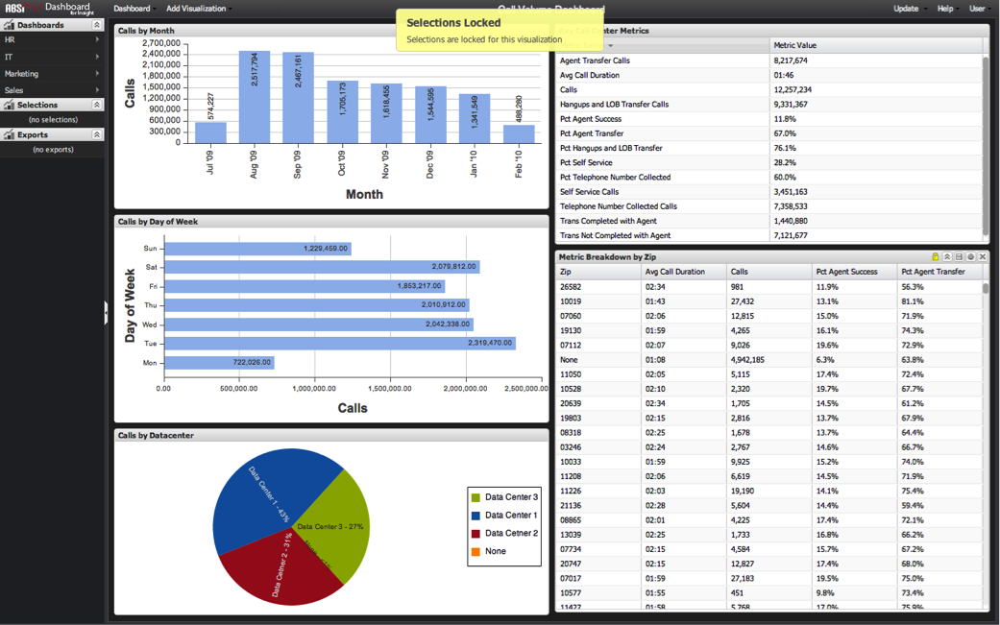

# Vergrendelde selecties{#locked-selections}

{{eol}}

Selecties in een of meer visualisaties op een dashboard kunnen worden vergrendeld om de huidige selecties te behouden en verdere wijzigingen te voorkomen.

Het vergrendelen van visualisaties is handig voor het bepalen van de analyse, aangezien bepaalde items vooraf kunnen worden geselecteerd en permanent kunnen worden toegepast op het hele dashboard. Dit verstrekt een visuele indicator op het scherm van wat wordt gefilterd zonder het toe te laten om het worden veranderd.

Vergrendelen is ook handig als leidraad voor analyse door gebruikers alleen in staat te stellen visualisaties te selecteren die relevant zijn voor de analyse die het dashboard beoogt te maken. Bijvoorbeeld, in het hieronder steekproef dashboard, kan het boren tot het postcodeniveau voorbij het werkingsgebied van de analyse van het hoog vraagvolume zijn. In dit geval kan het zinvol zijn **[!UICONTROL Metric Breakdown by Zip]** de tabel moet zijn vergrendeld en selecties mogen alleen worden gebruikt voor de visualisaties Maand, Dag van week en Datacenter.

Als u probeert selecties te maken op een vergrendelde visualisatie, wordt er een bericht weergegeven dat aangeeft dat de visualisatie is vergrendeld. Er verschijnt ook een gouden vergrendelingspictogram in de visualisatiekop wanneer de muiscursor boven de vergrendelde visualisatie wordt gehouden.

Net als bij elke selectie blijven vergrendelde selecties behouden wanneer een dashboard wordt opgeslagen en blijven deze actief wanneer een dashboard wordt geladen. Zie voor meer informatie [Visualisaties vergrendelen en ontgrendelen](../../../home/c-adobe-data-workbench-dashboard/c-visualizations/c-manipulating-visualizations/c-locking-and-unlocking-visualizations.md#concept-9215bcdd5bb44dee8d92ef0cc82f44d2).
