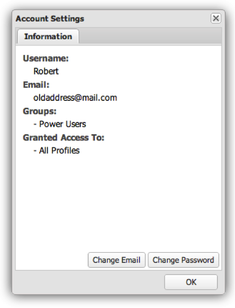

# Gebruikersaccountbeheer{#user-account-management}

{{eol}}

Informatie over hoe u toegang krijgt tot uw accountinstellingen en hoe u uw wachtwoord wijzigt.

## Uw accountgegevens openen {#section-7c39e79d8d6445059c9a6237e140bc6a}

Als u toegang wilt krijgen tot uw accountgegevens, selecteert u Accountinstellingen in het menu Gebruiker.

Er wordt een venster weergegeven met informatie over uw account. Dit omvat uw gebruikersnaam, e-mailadres, groepslidmaatschap, en de gegevensprofielen beschikbaar aan u. Om te controleren of uw gebruikersprofiel correct is geconfigureerd en of u toegang hebt tot al uw gegevensprofielen, kunt u de profielen controleren die worden vermeld in de sectie Toegang verleend tot. Neem contact op met de beheerder als u geen gegevensprofielen hebt.

## Het wachtwoord wijzigen {#section-4ba1ee3d5d584455a1a77e992b7b876c}

Als u uw wachtwoord wilt wijzigen, hebt u eerst toegang tot uw accountgegevens. Selecteer **[!UICONTROL Account Settings]** van de **[!UICONTROL User]** -menu. Klik op **[!UICONTROL Change Password]**.
