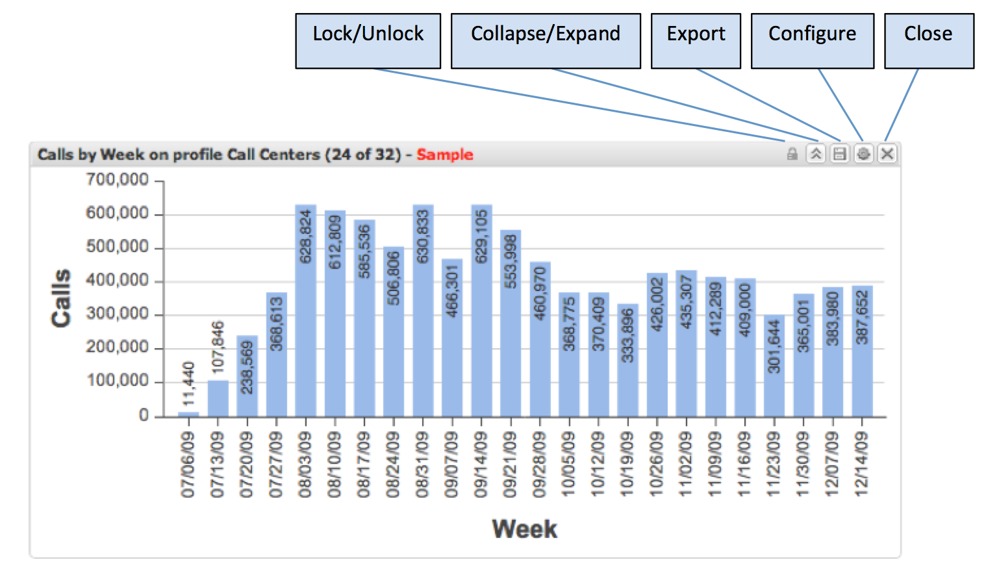

# Bezig met bewerken van visualisaties{#manipulating-visualizations}

Met het menu van het gereedschap Visualisatie kunt u snel bepaalde bewerkingen op de visualisatie uitvoeren. Als u de cursor op een van de pictogrammen in het menu van het visualisatiegereedschap plaatst, wordt de functie van dat pictogram uitgelegd.

