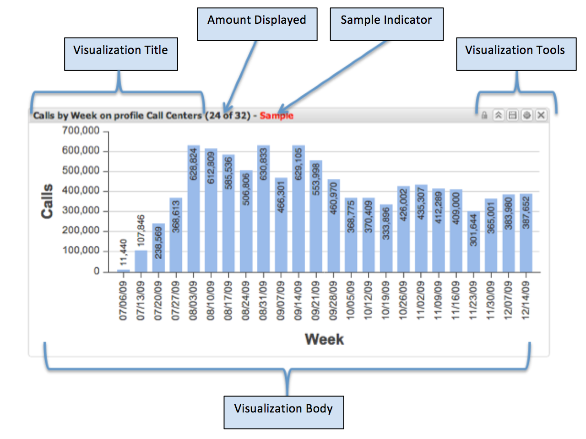

# Visualisaties{#visualizations}

De visualisaties zijn elementen die aan het dashboardcanvas worden toegevoegd en worden gevormd om diverse metrische en op maat-gebaseerde gegevens te tonen.

Alle dashboards zijn samengesteld uit één of meerdere visualisaties. Elke visualisatie kan, onafhankelijk van alle andere visualisaties op het dashboardcanvas worden gecreeerd, worden verwijderd, resized en worden aangepast.

De visualisaties zijn ook interactief, toestaand gebruikers om gegevens snel te segmenteren door selecties op één of meerdere gegevenselementen binnen de visualisatie te maken. De selecties die binnen één visualisatie worden gemaakt zullen dynamisch filters in real time op andere visualisaties op het canvas toepassen. Dit geeft de zelfde gegevens over alle visualisaties op het canvas terug.

Er zijn acht verschillende visualisaties. Elke kan worden toegevoegd, resized, gevormd, en onafhankelijk van een andere visualisatie worden verwijderd. De vertoningsgegevens van visualisaties die in gegevenswerkbank door een architect van de gegevenswerkbank worden bepaald.

De acht beschikbare soorten visualisaties omvatten:

* Kolomgrafieken
* Bar-grafieken
* Lijndiagrammen
* Tabellen
* Metrische legaten
* Piekgrafieken
* Scatter Plots
* Rijke tekst

## Visualisatie-gebruikersinterface {#section-54a73865f00742268340cf9123d6c590}

Het kopbalgedeelte van de visualisatie bevat de visualisatitel en visualisatiehulpmiddelen, die afhankelijk van het type en de staat van de visualisatie variëren. Het lichaam van de visualisatie bevat de inhoud, en is afhankelijk van het type en de configuratie van de visualisatie die worden getoond. De visualisatiehulpmiddelen verschijnen slechts wanneer de muis het visualisatievenster ingaat. Anders zijn ze verborgen.

* Visualisatietitel. Beschrijft deze visualisatie. De titel wordt automatisch geproduceerd of manueel met voeten getreden met een douanetitel.
* Bedrag weergegeven. Voor de afmeting die wordt gevisualiseerd, toont de hoeveelheid getoonde gegevens tegenover het totale beschikbare bedrag.
* Monsterindicator. Getoond wanneer de visualiseerde gegevens een steekproef en niet een volledig 100% vraagresultaat zijn.
* Visualisatieprogramma&#39;s. Voert specifieke verrichtingen op de visualisaties uit. De beschikbare hulpmiddelen hangen van het visualisatietype, de staat, en de huidige gebruikerstoestemmingen af.
* Visualiseringsorgaan. Toont de gegevens van de visualisatie zoals gevormd. Dit gebied is interactief en hangt van het type van visualisatie af die wordt getoond.

