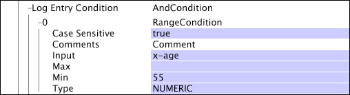

# Testomstandigheden{#test-operation-conditions}

De informatie over de voorwaarden van de testverrichting met inbegrip van vergelijkt, niet leeg, waaier, regelmatige uitdrukking, en koordgelijke.

* [Vergelijken](../../../../home/c-dataset-const-proc/c-conditions/c-test-ops/c-test-op-con.md#section-fb2bdb3838504099b324b9838cdeeaac)
* [Niet leeg](../../../../home/c-dataset-const-proc/c-conditions/c-test-ops/c-test-op-con.md#section-1decb9d887894073a1b6b3d985729ac8)
* [Bereik](../../../../home/c-dataset-const-proc/c-conditions/c-test-ops/c-test-op-con.md#section-1db31583bb09418b8f49481a897b08a6)
* [Regelmatige expressie](../../../../home/c-dataset-const-proc/c-conditions/c-test-ops/c-test-op-con.md#section-ae9c016502cb44128760c58f2d2d5297)
* [String Match](../../../../home/c-dataset-const-proc/c-conditions/c-test-ops/c-test-op-con.md#section-f8d132085c6b4500bfbe4515b848142f)

## Vergelijken {#section-fb2bdb3838504099b324b9838cdeeaac}

De [!DNL Compare] voorwaarde vergelijkt koord of numerieke waarden. Voor vergelijkingen van koordwaarden, kunt u specificeren of het geval zou moeten worden overwogen.

De parameters van de [!DNL Compare] voorwaarde worden beschreven in de volgende lijst:

<table id="table_05B1FBB2AED242D99081E62BE2FBEC60"> 
 <thead> 
  <tr> 
   <th colname="col1" class="entry"> Parameter </th> 
   <th colname="col2" class="entry"> Beschrijving </th> 
   <th colname="col3" class="entry"> Standaard </th> 
  </tr> 
 </thead>
 <tbody> 
  <tr> 
   <td colname="col1"> Gevallengevoelig </td> 
   <td colname="col2">Waar of vals. Gebruikt slechts als het Type  LEXICALis. Als de reeks aan vals, hogere en lagere hoofdletters als gelijk wordt beschouwd. </td> 
   <td colname="col3"> waar </td> 
  </tr> 
  <tr> 
   <td colname="col1"> Opmerkingen </td> 
   <td colname="col2"> Optioneel. Opmerkingen over de aandoening. </td> 
   <td colname="col3"> Opmerkingen </td> 
  </tr> 
  <tr> 
   <td colname="col1"> Invoer A </td> 
   <td colname="col2"> De eerste van de twee te vergelijken waarden. Deze waarde vertegenwoordigt de linkeroperand in de voorwaarde. </td> 
   <td colname="col3"> </td> 
  </tr> 
  <tr> 
   <td colname="col1"> Invoer B </td> 
   <td colname="col2"> De tweede van de twee te vergelijken waarden. Deze waarde vertegenwoordigt de juiste operand in de voorwaarde. </td> 
   <td colname="col3"> </td> 
  </tr> 
  <tr> 
   <td colname="col1"> Exploitatie </td> 
   <td colname="col2"> 
De vergelijkingsverrichting. De beschikbare activiteiten (en hun betekenis) zijn als volgt: 
     <ul id="ul_74F3C298E9CC4FE89897BA0052A9EB9F"> 
      <li id="li_1605FA73474E404A84056D40E7082623"> = of == (Input A is gelijk aan Input B) </li> 
      <li id="li_F694A262ED7A4787B2A68B877339620C"> &lt;&gt; of!= (Input A is niet gelijk aan Input B) </li> 
      <li id="li_1A75437E23B64BEB92297E1C771092B0"> &lt; (Input A is minder dan Input B) </li> 
      <li id="li_B80ED6BE9DEA41FE84BC6BA3B7759276"> &lt;= (input A is kleiner dan of gelijk aan input B) </li> 
      <li id="li_93148F34065F489E8E198DFB9F9F0E70"> &gt; (Input A is groter dan Input B) </li> 
      <li id="li_8A98EE9AED2445429805169040BB253D"> &gt;= (Input A is groter dan of gelijk aan Input B) </li> 
     </ul> 
 </td> 
   <td colname="col3"> = </td> 
  </tr> 
  <tr> 
   <td colname="col1"> Type </td> 
   <td colname="col2">Het soort vergelijking dat moet worden gemaakt. De beschikbare types zijn  LEXICAL,  NUMERIC, en  DATETIME. Voor beschrijvingen van de types, zie de Types van <a href="../../../../home/c-dataset-const-proc/c-conditions/c-test-ops/c-test-types.md#concept-a9fca97a2f03464cb0cbab8b5f809d0a"> Test voor de Verrichtingen</a>van de Test. </td> 
   <td colname="col3">  LEXISCH </td> 
  </tr> 
 </tbody> 
</table>

Dit voorbeeld gebruikt een [!DNL Compare] voorwaarde om te bepalen [!DNL Log Entry Condition]. Aangezien de server van de gegevenswerkbank elk verslag van gebeurtenisgegevens leest, vergelijkt het de numerieke waarden x-leeftijd en 55. Als voor een bepaalde logboekingang, x-leeftijd minder dan of gelijk aan 55 is, is de logboekingang inbegrepen in het proces van de datasetconstructie.

## Niet leeg {#section-1decb9d887894073a1b6b3d985729ac8}

De [!DNL Not Empty] voorwaarde controleert een gebied om te zien of bevat het een waarde of is leeg. Aan de voorwaarde wordt voldaan voor om het even welke logboekingang de waarvan waarde voor het [!DNL Input] gebied niet leeg is.

De parameters van de [!DNL Not Empty] voorwaarde worden beschreven in de volgende lijst:

| Parameter | Beschrijving | Standaard |
|---|---|---|
| Opmerkingen | Optioneel. Opmerkingen over de aandoening. | Opmerkingen |
| Invoer | De naam van het gebied van de logboekingang om inhoud te controleren. |  |

Dit voorbeeld neemt als zijn input x-some-field en test of het gebied niet leeg is. Aan de voorwaarde wordt voldaan als het gebied wordt bevolkt.

## Bereik {#section-1db31583bb09418b8f49481a897b08a6}

De [!DNL Range] voorwaarde neemt een inputgebied en bepaalt of de waarde van dat gebied, met inbegrip van, binnen de bepaalde minimum (Min) en maximum (Maximum) parameterwaarden valt.

De parameters van de [!DNL Range] voorwaarde worden beschreven in de volgende lijst:

<table id="table_1587D8D333804FC28024C0DFC2F2D4D3"> 
 <thead> 
  <tr> 
   <th colname="col1" class="entry"> Parameter </th> 
   <th colname="col2" class="entry"> Beschrijving </th> 
   <th colname="col3" class="entry"> Standaard </th> 
  </tr> 
 </thead>
 <tbody> 
  <tr> 
   <td colname="col1"> Gevallengevoelig </td> 
   <td colname="col2">Waar of vals. Gebruikt slechts als het  Type  LEXICALis. Als de reeks aan vals, hogere en lagere hoofdletters als gelijk wordt beschouwd. </td> 
   <td colname="col3"> waar </td> 
  </tr> 
  <tr> 
   <td colname="col1"> Opmerkingen </td> 
   <td colname="col2"> Optioneel. Opmerkingen over de aandoening. </td> 
   <td colname="col3"> Opmerkingen </td> 
  </tr> 
  <tr> 
   <td colname="col1"> Invoer </td> 
   <td colname="col2"> De naam van het gebied van de logboekingang aan gebruik als input. </td> 
   <td colname="col3"> </td> 
  </tr> 
  <tr> 
   <td colname="col1"> Min </td> 
   <td colname="col2"> 
Ondergrens van bereik. 
 
 De waarde van deze parameter moet een letterlijke waarde of een koord zijn - niet een gebiedsnaam. Als u een datum voor dit gebied gebruikt, moet u een tijdzone specificeren. Voor een lijst van gesteunde afkortingen van de tijdzone, zie de Codes <a href="../../../../home/c-dataset-const-proc/c-time-zone.md#concept-9b540ec3e770490d94e9d5a985765477"> van de</a>Tijdzone. 
 </td> 
   <td colname="col3"> </td> 
  </tr> 
  <tr> 
   <td colname="col1"> Max </td> 
   <td colname="col2"> 
Bovengrens van bereik. 
 
 
Opmerking: De waarde van deze parameter moet een letterlijke waarde of een koord zijn - niet een gebiedsnaam. Als u een datum voor dit gebied gebruikt, moet u een tijdzone specificeren. Voor een lijst van gesteunde afkortingen van de tijdzone, zie de Codes <a href="../../../../home/c-dataset-const-proc/c-time-zone.md#concept-9b540ec3e770490d94e9d5a985765477"> van de</a>Tijdzone. 
 
 </td> 
   <td colname="col3"> </td> 
  </tr> 
  <tr> 
   <td colname="col1"> Type </td> 
   <td colname="col2">Het soort vergelijking dat moet worden gemaakt. De beschikbare types zijn  LEXICAL,  NUMERIC, en  DATETIME. Voor beschrijvingen van de types, zie de Types van <a href="../../../../home/c-dataset-const-proc/c-conditions/c-test-ops/c-test-types.md#concept-a9fca97a2f03464cb0cbab8b5f809d0a"> Test voor de Verrichtingen</a>van de Test. </td> 
   <td colname="col3"> </td> 
  </tr> 
 </tbody> 
</table>

Dit voorbeeld gebruikt een [!DNL Range] voorwaarde om te bepalen [!DNL Log Entry Condition]. Aangezien de server van de gegevenswerkbank elk [!DNL event data] verslag leest, vergelijkt het de numerieke waarden x-leeftijd en 55. Als voor een bepaalde logboekingang, x-leeftijd minstens 55 is, is de logboekingang inbegrepen in het proces van de datasetconstructie. Dit voorbeeld voert de zelfde functie uit zoals het [!DNL Compare] voorwaardenvoorbeeld. Zie [Vergelijken](../../../../home/c-dataset-const-proc/c-conditions/c-test-ops/c-test-op-con.md#section-fb2bdb3838504099b324b9838cdeeaac).

>[!NOTE]
>
>Als de Min of Maximum parameter leeg wordt verlaten, substitueert de server van de gegevenswerkbank de minimum of maximumgeheelwaarden beschikbaar. De minimumwaarde is nul (0), en de maximumwaarde is oneindig.

## Regelmatige expressie {#section-ae9c016502cb44128760c58f2d2d5297}

De [!DNL Regular Expression] voorwaardentest gebruikt regelmatige het patroon van uitdrukkingen aanpassing (zie [Regelmatige Uitdrukkingen](../../../../home/c-dataset-const-proc/c-reg-exp.md#concept-070077baa419475094ef0469e92c5b9c)) om te bepalen of de waarde van het gespecificeerde inputgebied een koord bevat dat één van de patronen aanpast die in de parameter van Gelijken worden gespecificeerd.

Als de input een vector van koorden is, slechts wordt de eerste waarde in de vector gebruikt voor de test. De [!DNL Regular Expression] voorwaarde voert volledige koordvergelijkingen uit. Als u substrings wilt identificeren, moet u de substrings voorbereiden en toevoegen.*&quot; op de string.

De parameters van de [!DNL Regular Expression] voorwaarde worden beschreven in de volgende lijst:

<table id="table_0BF5F89F87C9493B8DABA97620074FAD"> 
 <thead> 
  <tr> 
   <th colname="col1" class="entry"> Parameter </th> 
   <th colname="col2" class="entry"> Beschrijving </th> 
   <th colname="col3" class="entry"> Standaard </th> 
  </tr> 
 </thead>
 <tbody> 
  <tr> 
   <td colname="col1"> Gevallengevoelig </td> 
   <td colname="col2"> Waar of vals. Als de reeks aan vals, hogere en lagere hoofdletters als gelijk wordt beschouwd. </td> 
   <td colname="col3"> waar </td> 
  </tr> 
  <tr> 
   <td colname="col1"> Opmerkingen </td> 
   <td colname="col2"> Optioneel. Opmerkingen over de aandoening. </td> 
   <td colname="col3"> Opmerkingen </td> 
  </tr> 
  <tr> 
   <td colname="col1"> Invoer </td> 
   <td colname="col2"> De naam van het gebied van de logboekingang aan gebruik als input. </td> 
   <td colname="col3"> </td> 
  </tr> 
  <tr> 
   <td colname="col1"> Overeenkomsten </td> 
   <td colname="col2"> 
Het (de) reguliere expressiepatroon(en) dat (die) moet (moeten) worden aangepast aan de waarde van het invoerveld. 
 
 <b> Om een regelmatig uitdrukkingspatroon toe te voegen</b> 
     <ol id="ol_6D6467FF74334DEA8E8625C3B155D11D"> 
      <li id="li_9E13A63558FF44749C2E49BD50B7F770">Klik met de rechtermuisknop op  Overeenkomsten. </li> 
      <li id="li_195A2F3B6B9442F5B1DACDE0FC96CE5C">Klik  toevoegen nieuw &gt;  Regelmatige Uitdrukking. </li> 
      <li id="li_225E98F8EF39426A9483B86EA2CFE6DF">Ga de gewenste regelmatige uitdrukking in het tekstvakje in. </li> 
     </ol> 
 </td> 
   <td colname="col3"> </td> 
  </tr> 
 </tbody> 
</table>

Dit voorbeeld illustreert het gebruik van de [!DNL Regular Expression] voorwaarde om een gebied van gegevens aan te passen die van websiteverkeer worden verzameld. De voorwaarde keert waar terug slechts als cs (verwijzing-vraag) gebied een koord bevat dat de regelmatige uitdrukkingscampagne=C[1-9][0-9]\ {4 \} aanpast. Deze regelmatige uitdrukking past om het even welk koord aan dat &quot;campagne=C12345 bevat.&quot; Nochtans, zou het patroon niet het koord &quot;campagne=C0123&amp;&quot;aanpassen omdat het eerste karakter na &quot;C&quot;niet in waaier 1-9 is.

## String Match {#section-f8d132085c6b4500bfbe4515b848142f}

De [!DNL String Match] voorwaardentests voor koordgelijkheid. Het neemt een gespecificeerd gebied als input en test de waarde van dat gebied in elke logboekingang tegen de koorden die in de parameter van de Gelijken van de verrichting worden gespecificeerd. Als om het even welke één van deze case-sensitive gelijke koorden het zelfde als de waarde op het verstrekte inputgebied is, keert de verrichting waar terug. In het geval dat de voorwaarde geen gelijke koorden [!DNL StringCondition] bevat, keert de valse voorwaarde terug. Als de input een vector van koorden is, slechts wordt de eerste waarde (koord) in de vector gebruikt voor de test.

<table id="table_BD599BAA5DD54B278813B6C38AC8DE6B"> 
 <thead> 
  <tr> 
   <th colname="col1" class="entry"> Parameter </th> 
   <th colname="col2" class="entry"> Beschrijving </th> 
   <th colname="col3" class="entry"> Standaard </th> 
  </tr> 
 </thead>
 <tbody> 
  <tr> 
   <td colname="col1"> Gevallengevoelig </td> 
   <td colname="col2"> Waar of vals. Als de reeks aan vals, hogere en lagere hoofdletters als gelijk wordt beschouwd. </td> 
   <td colname="col3"> waar </td> 
  </tr> 
  <tr> 
   <td colname="col1"> Opmerkingen </td> 
   <td colname="col2"> Optioneel. Opmerkingen over de aandoening. </td> 
   <td colname="col3"> Opmerkingen </td> 
  </tr> 
  <tr> 
   <td colname="col1"> Invoer </td> 
   <td colname="col2"> De naam van het gebied van de logboekingang aan gebruik als input. </td> 
   <td colname="col3"> </td> 
  </tr> 
  <tr> 
   <td colname="col1"> Overeenkomsten </td> 
   <td colname="col2"> 
De tekenreeks(s) die moet(en) worden afgezet tegen de waarde van het invoerveld. 
 
 <b>Om een koord toe te voegen</b> 
     <ol id="ol_9E32218C771445D88357960475FAD6EB"> 
      <li id="li_A700747858D0470491783E9B3933DAFE">Klik met de rechtermuisknop op  Overeenkomsten. </li> 
      <li id="li_9D1A2462EA404B0F84426176737CAFED">Klik  toevoegen nieuw &gt;  Koord. </li> 
      <li id="li_E84D2439B59548E5B1803C64A295A18E">Ga het gewenste koord in het tekstvakje in. </li> 
     </ol> 
 </td> 
   <td colname="col3"> </td> 
  </tr> 
 </tbody> 
</table>

Dit voorbeeld gebruikt gegevens die van websiteverkeer worden verzameld om het gebruik van de [!DNL String Match] voorwaarde te illustreren. De voorwaarde test of het inputgebied (cs-uri-stem) één van beiden van de twee die koorden aanpast in de parameter van Gelijken worden gespecificeerd, en het slaagt als het gebied cs-uri-stam of de nauwkeurige koord is of [!DNL /navigation/footer.asp] [!DNL /navigation/header.asp].

