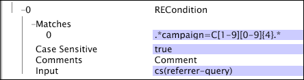

# Testomstandigheden{#test-operation-conditions}

{{eol}}

Informatie over de bewerkingsvoorwaarden van de test, zoals vergelijk, niet leeg, bereik, reguliere expressie en tekenreeksovereenkomst.

* [Vergelijken](../../../../home/c-dataset-const-proc/c-conditions/c-test-ops/c-test-op-con.md#section-fb2bdb3838504099b324b9838cdeeaac)
* [Niet leeg](../../../../home/c-dataset-const-proc/c-conditions/c-test-ops/c-test-op-con.md#section-1decb9d887894073a1b6b3d985729ac8)
* [Bereik](../../../../home/c-dataset-const-proc/c-conditions/c-test-ops/c-test-op-con.md#section-1db31583bb09418b8f49481a897b08a6)
* [Gewone uitdrukking](../../../../home/c-dataset-const-proc/c-conditions/c-test-ops/c-test-op-con.md#section-ae9c016502cb44128760c58f2d2d5297)
* [Tekenreeks afstemmen](../../../../home/c-dataset-const-proc/c-conditions/c-test-ops/c-test-op-con.md#section-f8d132085c6b4500bfbe4515b848142f)

## Vergelijken {#section-fb2bdb3838504099b324b9838cdeeaac}

De [!DNL Compare] De voorwaarde vergelijkt tekenreeks of numerieke waarden. Voor vergelijkingen van tekenreekswaarden kunt u opgeven of hoofdletters en kleine letters moeten worden gebruikt.

De parameters van de [!DNL Compare] De voorwaarde wordt beschreven in de volgende lijst:

<table id="table_05B1FBB2AED242D99081E62BE2FBEC60"> 
 <thead> 
  <tr> 
   <th colname="col1" class="entry"> Parameter </th> 
   <th colname="col2" class="entry"> Beschrijving </th> 
   <th colname="col3" class="entry"> Standaard </th> 
  </tr> 
 </thead>
 <tbody> 
  <tr> 
   <td colname="col1"> Hoofdlettergevoelig </td> 
   <td colname="col2">Waar of onwaar. Wordt alleen gebruikt als het type is  LEXISCH. Indien ingesteld op false, worden hoofdletters en kleine letters als gelijk beschouwd. </td> 
   <td colname="col3"> true </td> 
  </tr> 
  <tr> 
   <td colname="col1"> Opmerkingen </td> 
   <td colname="col2"> Optioneel. Opmerkingen over de voorwaarde. </td> 
   <td colname="col3"> Opmerkingen </td> 
  </tr> 
  <tr> 
   <td colname="col1"> Invoer A </td> 
   <td colname="col2"> De eerste van de twee waarden die moeten worden vergeleken. Deze waarde vertegenwoordigt de linkeroperand in de voorwaarde. </td> 
   <td colname="col3"> </td> 
  </tr> 
  <tr> 
   <td colname="col1"> Invoer B </td> 
   <td colname="col2"> De tweede van de twee waarden die moeten worden vergeleken. Deze waarde vertegenwoordigt de rechteroperand in de voorwaarde. </td> 
   <td colname="col3"> </td> 
  </tr> 
  <tr> 
   <td colname="col1"> Bewerking </td> 
   <td colname="col2"> 
De vergelijkingsbewerking. De beschikbare activiteiten (en hun betekenis) zijn als volgt: 
     <ul id="ul_74F3C298E9CC4FE89897BA0052A9EB9F"> 
      <li id="li_1605FA73474E404A84056D40E7082623"> = of == (Invoer A is gelijk aan Invoer B) </li> 
      <li id="li_F694A262ED7A4787B2A68B877339620C"> &lt;&gt; of != (Invoer A is niet gelijk aan Invoer B) </li> 
      <li id="li_1A75437E23B64BEB92297E1C771092B0"> &lt; (Invoer A is kleiner dan Invoer B) </li> 
      <li id="li_B80ED6BE9DEA41FE84BC6BA3B7759276"> &lt;= (Invoer A is kleiner dan of gelijk aan Invoer B) </li> 
      <li id="li_93148F34065F489E8E198DFB9F9F0E70"> &gt; (Invoer A is groter dan Invoer B) </li> 
      <li id="li_8A98EE9AED2445429805169040BB253D"> &gt;= (Invoer A is groter dan of gelijk aan Invoer B) </li> 
     </ul> 
 </td> 
   <td colname="col3"> = </td> 
  </tr> 
  <tr> 
   <td colname="col1"> Type </td> 
   <td colname="col2">Het type vergelijking dat moet worden gemaakt. Beschikbare typen zijn  LEXISCH,  NUMERIEK, en  DATETIME. Voor beschrijvingen van de typen raadpleegt u <a href="../../../../home/c-dataset-const-proc/c-conditions/c-test-ops/c-test-types.md#concept-a9fca97a2f03464cb0cbab8b5f809d0a"> Testtypes voor testbewerkingen</a>. </td> 
   <td colname="col3">  LEXISCH </td> 
  </tr> 
 </tbody> 
</table>

In dit voorbeeld wordt een [!DNL Compare] voorwaarde om de [!DNL Log Entry Condition]. Wanneer de gegevenswerkbankserver elke record met gebeurtenisgegevens leest, worden de numerieke waarden x-age en 55 vergeleken. Als voor een bepaalde logboekingang, x-leeftijd minder dan of gelijk aan 55 is, is de logboekingang inbegrepen in het proces van de datasetconstructie.

## Niet leeg {#section-1decb9d887894073a1b6b3d985729ac8}

De [!DNL Not Empty] De voorwaarde controleert een gebied om te zien of bevat een waarde of leeg is. Aan de voorwaarde wordt voldaan voor alle logbestandvermelding waarvan de waarde voor de [!DNL Input] veld is niet leeg.

De parameters van de [!DNL Not Empty] De voorwaarde wordt beschreven in de volgende lijst:

| Parameter | Beschrijving | Standaard |
|---|---|---|
| Opmerkingen | Optioneel. Opmerkingen over de voorwaarde. | Opmerkingen |
| Invoer | De naam van het veld van het logitem om te controleren op inhoud. |  |

In dit voorbeeld wordt als invoer-x-some-field getest of het veld niet leeg is. Aan de voorwaarde wordt voldaan als het veld is gevuld.

## Bereik {#section-1db31583bb09418b8f49481a897b08a6}

De [!DNL Range] De voorwaarde neemt een inputgebied en bepaalt of de waarde van dat gebied, met inbegrip van, binnen de bepaalde minimum (Min) en maximum (Max) parameterwaarden valt.

De parameters van de [!DNL Range] De voorwaarde wordt beschreven in de volgende lijst:

<table id="table_1587D8D333804FC28024C0DFC2F2D4D3"> 
 <thead> 
  <tr> 
   <th colname="col1" class="entry"> Parameter </th> 
   <th colname="col2" class="entry"> Beschrijving </th> 
   <th colname="col3" class="entry"> Standaard </th> 
  </tr> 
 </thead>
 <tbody> 
  <tr> 
   <td colname="col1"> Hoofdlettergevoelig </td> 
   <td colname="col2">Waar of onwaar. Wordt alleen gebruikt als de  Type is  LEXISCH. Indien ingesteld op false, worden hoofdletters en kleine letters als gelijk beschouwd. </td> 
   <td colname="col3"> true </td> 
  </tr> 
  <tr> 
   <td colname="col1"> Opmerkingen </td> 
   <td colname="col2"> Optioneel. Opmerkingen over de voorwaarde. </td> 
   <td colname="col3"> Opmerkingen </td> 
  </tr> 
  <tr> 
   <td colname="col1"> Invoer </td> 
   <td colname="col2"> De naam van het veld in het logbestand dat als invoer moet worden gebruikt. </td> 
   <td colname="col3"> </td> 
  </tr> 
  <tr> 
   <td colname="col1"> Min </td> 
   <td colname="col2"> 
Ondergrens van bereik. 
 
 De waarde van deze parameter moet een letterlijke waarde of een tekenreeks zijn, geen veldnaam. Als u een datum voor dit gebied gebruikt, moet u een tijdzone specificeren. Voor een lijst met ondersteunde afkortingen voor tijdzones raadpleegt u <a href="../../../../home/c-dataset-const-proc/c-time-zone.md#concept-9b540ec3e770490d94e9d5a985765477"> Tijdzonecodes</a>. 
 </td> 
   <td colname="col3"> </td> 
  </tr> 
  <tr> 
   <td colname="col1"> Max </td> 
   <td colname="col2"> 
Bovengrens van bereik. 
 
 
Opmerking: De waarde van deze parameter moet een letterlijke waarde of een tekenreeks zijn, geen veldnaam. Als u een datum voor dit gebied gebruikt, moet u een tijdzone specificeren. Voor een lijst met ondersteunde afkortingen voor tijdzones raadpleegt u <a href="../../../../home/c-dataset-const-proc/c-time-zone.md#concept-9b540ec3e770490d94e9d5a985765477"> Tijdzonecodes</a>. 
 
 </td> 
   <td colname="col3"> </td> 
  </tr> 
  <tr> 
   <td colname="col1"> Type </td> 
   <td colname="col2">Het type vergelijking dat moet worden gemaakt. Beschikbare typen zijn  LEXISCH,  NUMERIEK, en  DATETIME. Voor beschrijvingen van de typen raadpleegt u <a href="../../../../home/c-dataset-const-proc/c-conditions/c-test-ops/c-test-types.md#concept-a9fca97a2f03464cb0cbab8b5f809d0a"> Testtypes voor testbewerkingen</a>. </td> 
   <td colname="col3"> </td> 
  </tr> 
 </tbody> 
</table>

In dit voorbeeld wordt een [!DNL Range] voorwaarde om de [!DNL Log Entry Condition]. Terwijl de gegevenswerkbankserver elke [!DNL event data] De numerieke waarden x-age en 55 worden vergeleken. Als voor een bepaalde logboekingang, x-age minstens 55 is, is de logboekingang inbegrepen in het proces van de gegevenssetconstructie. In dit voorbeeld wordt dezelfde functie uitgevoerd als in [!DNL Compare] Voorbeeld. Zie [Vergelijken](../../../../home/c-dataset-const-proc/c-conditions/c-test-ops/c-test-op-con.md#section-fb2bdb3838504099b324b9838cdeeaac).

>[!NOTE]
>
>Als de parameter Min of Max leeg blijft, vervangt de server van de gegevenswerkbank de minimum of maximumwaarden van gehele getallen die beschikbaar zijn. De minimumwaarde is nul (0) en de maximumwaarde is oneindig.

## Gewone uitdrukking {#section-ae9c016502cb44128760c58f2d2d5297}

De [!DNL Regular Expression] Voor de voorwaardetest wordt gebruikgemaakt van reguliere expressiepatroon (zie [Reguliere expressies](../../../../home/c-dataset-const-proc/c-reg-exp.md#concept-070077baa419475094ef0469e92c5b9c)) om te bepalen of de waarde van het opgegeven invoerveld een tekenreeks bevat die overeenkomt met een van de patronen die in de parameter Matches zijn opgegeven.

Als de invoer een vector met tekenreeksen is, wordt alleen de eerste waarde in de vector gebruikt voor de test. De [!DNL Regular Expression] voorwaarde voert volledige koordvergelijkingen uit. Als u subtekenreeksen wilt identificeren, moet u toevoegen &quot;.&#42;&quot; naar de tekenreeks.

De parameters van de [!DNL Regular Expression] De voorwaarde wordt beschreven in de volgende lijst:

<table id="table_0BF5F89F87C9493B8DABA97620074FAD"> 
 <thead> 
  <tr> 
   <th colname="col1" class="entry"> Parameter </th> 
   <th colname="col2" class="entry"> Beschrijving </th> 
   <th colname="col3" class="entry"> Standaard </th> 
  </tr> 
 </thead>
 <tbody> 
  <tr> 
   <td colname="col1"> Hoofdlettergevoelig </td> 
   <td colname="col2"> Waar of onwaar. Indien ingesteld op false, worden hoofdletters en kleine letters als gelijk beschouwd. </td> 
   <td colname="col3"> true </td> 
  </tr> 
  <tr> 
   <td colname="col1"> Opmerkingen </td> 
   <td colname="col2"> Optioneel. Opmerkingen over de voorwaarde. </td> 
   <td colname="col3"> Opmerkingen </td> 
  </tr> 
  <tr> 
   <td colname="col1"> Invoer </td> 
   <td colname="col2"> De naam van het veld in het logbestand dat als invoer moet worden gebruikt. </td> 
   <td colname="col3"> </td> 
  </tr> 
  <tr> 
   <td colname="col1"> Overeenkomsten </td> 
   <td colname="col2"> 
Het reguliere-expressiepatroon (de reguliere-expressiepatroon) dat (die) moet (moeten) worden vergeleken met de waarde van het invoerveld. 
 
 <b> Een reguliere-expressiepatroon toevoegen</b> 
     <ol id="ol_6D6467FF74334DEA8E8625C3B155D11D"> 
      <li id="li_9E13A63558FF44749C2E49BD50B7F770">Klikken met rechtermuisknop  Overeenkomsten. </li> 
      <li id="li_195A2F3B6B9442F5B1DACDE0FC96CE5C">Klikken  Nieuw toevoegen &gt;  Gewone uitdrukking. </li> 
      <li id="li_225E98F8EF39426A9483B86EA2CFE6DF">Voer de gewenste reguliere expressie in het tekstvak in. </li> 
     </ol> 
 </td> 
   <td colname="col3"> </td> 
  </tr> 
 </tbody> 
</table>

In dit voorbeeld wordt het gebruik van het [!DNL Regular Expression] voorwaarde die overeenkomt met een gegevensveld dat is verzameld uit websiteverkeer. De voorwaarde retourneert alleen true als het veld cs(reference-query) een tekenreeks bevat die overeenkomt met de reguliere expressie `campaign=C[1-9][0-9]{4}`. Deze reguliere expressie komt overeen met elke tekenreeks die `campaign=C12345`. Het patroon komt echter niet overeen met de tekenreeks `campaign=C0123&` omdat het eerste teken na de `C` bevindt zich niet in het bereik `1-9`.

## Tekenreeks afstemmen {#section-f8d132085c6b4500bfbe4515b848142f}

De [!DNL String Match] voorwaarde test op gelijkheid van tekenreeks. Het neemt een gespecificeerd gebied als input en test de waarde van dat gebied in elke logboekingang tegen de koorden die in de parameter van de Gelijke van verrichting worden gespecificeerd. Als een van deze hoofdlettergevoelige overeenkomende tekenreeksen dezelfde is als de waarde in het opgegeven invoerveld, wordt de bewerking true geretourneerd. In het geval dat [!DNL StringCondition] bevat geen overeenkomende tekenreeksen. De voorwaarde retourneert false. Als de invoer een vector met tekenreeksen is, wordt alleen de eerste waarde (tekenreeks) in de vector gebruikt voor de test.

<table id="table_BD599BAA5DD54B278813B6C38AC8DE6B"> 
 <thead> 
  <tr> 
   <th colname="col1" class="entry"> Parameter </th> 
   <th colname="col2" class="entry"> Beschrijving </th> 
   <th colname="col3" class="entry"> Standaard </th> 
  </tr> 
 </thead>
 <tbody> 
  <tr> 
   <td colname="col1"> Hoofdlettergevoelig </td> 
   <td colname="col2"> Waar of onwaar. Indien ingesteld op false, worden hoofdletters en kleine letters als gelijk beschouwd. </td> 
   <td colname="col3"> true </td> 
  </tr> 
  <tr> 
   <td colname="col1"> Opmerkingen </td> 
   <td colname="col2"> Optioneel. Opmerkingen over de voorwaarde. </td> 
   <td colname="col3"> Opmerkingen </td> 
  </tr> 
  <tr> 
   <td colname="col1"> Invoer </td> 
   <td colname="col2"> De naam van het veld in het logbestand dat als invoer moet worden gebruikt. </td> 
   <td colname="col3"> </td> 
  </tr> 
  <tr> 
   <td colname="col1"> Overeenkomsten </td> 
   <td colname="col2"> 
De tekenreeks(en) die met de waarde van het invoerveld moet (moeten) worden vergeleken. 
 
 <b>Een tekenreeks toevoegen</b> 
     <ol id="ol_9E32218C771445D88357960475FAD6EB"> 
      <li id="li_A700747858D0470491783E9B3933DAFE">Klikken met rechtermuisknop  Overeenkomsten. </li> 
      <li id="li_9D1A2462EA404B0F84426176737CAFED">Klikken  Nieuw toevoegen &gt;  String. </li> 
      <li id="li_E84D2439B59548E5B1803C64A295A18E">Voer de gewenste tekenreeks in het tekstvak in. </li> 
     </ol> 
 </td> 
   <td colname="col3"> </td> 
  </tr> 
 </tbody> 
</table>

In dit voorbeeld worden gegevens uit websiteverkeer gebruikt om het gebruik van het [!DNL String Match] voorwaarde. De voorwaarde test of het inputgebied (cs-uri-stem) één van beide koorden aanpast die in de parameter van Gelijken worden gespecificeerd, en het slaagt als het gebied cs-uri-stem of het nauwkeurige koord is [!DNL /navigation/footer.asp] of de exacte tekenreeks [!DNL /navigation/header.asp].

