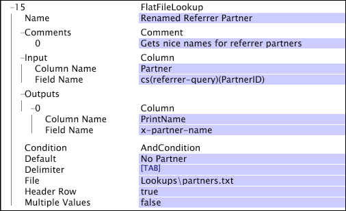

# Opzoektransformaties definiëren{#defining-lookup-transformations}

{{eol}}

Informatie over de transformaties die u kunt gebruiken om raadplegingsgegevens in de dataset op te nemen.

Merk op dat niet alle types tijdens beide fasen van het proces van de gegevenssetconstructie kunnen worden gebruikt.

* [Categoriseren](../../../../home/c-dataset-const-proc/c-data-trans/c-int-lookup-data/c-def-lookup-transf.md#section-8474376c14e54d14ae73749696ada468)
* [FlatFileLookup](../../../../home/c-dataset-const-proc/c-data-trans/c-int-lookup-data/c-def-lookup-transf.md#section-e09b2eeb96444a859b14f03cdaab31f2)
* [ODBCLookup](../../../../home/c-dataset-const-proc/c-data-trans/c-int-lookup-data/c-def-lookup-transf.md#section-4dcc3747e42e45c0a057e85f308a83cc)

## Categoriseren {#section-8474376c14e54d14ae73749696ada468}

De [!DNL Categorize] Voor transformatie wordt een opzoektabel met twee kolommen gebruikt, die bestaat uit patroon-tekenreeks/waardeparen. Tijdens deze transformatie leest de server van de gegevenswerkbank beurtelings elk verslag van gebeurtenisgegevens en vergelijkt de inhoud van een aangewezen gebied in het verslag met elk van de patroonkoorden die in de eerste kolom van de raadplegingslijst worden vermeld. Als het aangewezen gebied één van de patroonkoorden aanpast, schrijft de server van de gegevenswerkbank de waarde (gevonden in de tweede kolom) die met dat patroonkoord aan een aangewezen outputgebied in het verslag wordt geassocieerd.

De tekenreeksen in de eerste kolom van de opzoektabel kunnen optioneel beginnen met het teken ^ en/of eindigen in het $-teken om ervoor te zorgen dat de overeenkomst aan het begin en/of einde wordt geforceerd. Deze transformatie accepteert geen reguliere expressies voor het definiëren van overeenkomende voorwaarden in de eerste kolom. Als de invoerwaarde een vector van tekenreeksen is, wordt elke tekenreeks door de transformatie uitgevoerd en worden het resultaat of de resultaten aan een uitvoertekenreeksvector toegevoegd.

A [!DNL Categorize] de transformatie is doorgaans eenvoudiger en sneller dan het gebruik van een [!DNL Regular Expression] transformatie om hetzelfde te bereiken.

>[!NOTE]
>
>De subtekenreeks-test die wordt gebruikt in [!DNL Categorize] is hoofdlettergevoelig, tenzij anders aangegeven met de [!DNL Case Sensitive] parameter.

<table id="table_1773344FAAE34BD4919CC4414249FDEE"> 
 <thead> 
  <tr> 
   <th colname="col1" class="entry"> Parameter </th> 
   <th colname="col2" class="entry"> Beschrijving </th> 
   <th colname="col3" class="entry"> Standaard </th> 
  </tr> 
 </thead>
 <tbody> 
  <tr> 
   <td colname="col1"> Naam </td> 
   <td colname="col2"> Beschrijvende naam van de transformatie. U kunt hier elke naam invoeren. </td> 
   <td colname="col3"> </td> 
  </tr> 
  <tr> 
   <td colname="col1"> Hoofdlettergevoelig </td> 
   <td colname="col2"> Waar of onwaar. Geeft aan of de subtekenreekstest hoofdlettergevoelig is. </td> 
   <td colname="col3"> true </td> 
  </tr> 
  <tr> 
   <td colname="col1"> Opmerkingen </td> 
   <td colname="col2"> Optioneel. Opmerkingen over de transformatie. </td> 
   <td colname="col3"> </td> 
  </tr> 
  <tr> 
   <td colname="col1"> Voorwaarde </td> 
   <td colname="col2"> De omstandigheden waaronder deze transformatie wordt toegepast. </td> 
   <td colname="col3"> </td> 
  </tr> 
  <tr> 
   <td colname="col1"> Standaard </td> 
   <td colname="col2"> De standaardwaarde die moet worden gebruikt als de voorwaardetest slaagt en geen item in het categorisatiebestand overeenkomt met de invoer, of als het invoerveld niet is gedefinieerd in het opgegeven logbestandvermelding. </td> 
   <td colname="col3"> </td> 
  </tr> 
  <tr> 
   <td colname="col1"> Scheidingsteken </td> 
   <td colname="col2"> 
Tekenreeks die wordt gebruikt om de kolommen in het opzoekbestand te scheiden. Moet één teken lang zijn. 
 
 Als u de Ctrl-toets ingedrukt houdt en met de rechtermuisknop klikt in de parameter Scheidingsteken, wordt een  Invoegen wordt weergegeven. Dit menu bevat een lijst met speciale tekens die vaak als scheidingstekens worden gebruikt. 
 </td> 
   <td colname="col3"> </td> 
  </tr> 
  <tr> 
   <td colname="col1"> Meerdere waarden </td> 
   <td colname="col2"> Waar of onwaar. Indien waar (true), wanneer meerdere rijen in het bestand overeenkomen met de invoer, resulteert elke overeenkomst in een waarde die wordt toegevoegd aan de uitvoervector van tekenreeksen. Indien onwaar wordt alleen de eerste overeenkomende rij in het bestand gebruikt in de uitvoer. In het laatste geval, als de input een vector is, is de output ook een vector van gelijke lengte. Als de invoer een eenvoudige tekenreeks is, is de uitvoer ook een eenvoudige tekenreeks. </td> 
   <td colname="col3"> false </td> 
  </tr> 
  <tr> 
   <td colname="col1"> Bestand </td> 
   <td colname="col2"> Pad en bestandsnaam van het categorisatiebestand. Relatieve paden hebben betrekking op de installatiemap van de gegevenswerkbankserver. Dit bestand bevindt zich gewoonlijk in de map Lookups in de installatiemap van de gegevenswerkbank. </td> 
   <td colname="col3"> </td> 
  </tr> 
  <tr> 
   <td colname="col1"> Invoer </td> 
   <td colname="col2"> Het categorisatiebestand komt overeen met de subtekenreeksen ervan met de waarde in dit veld om de overeenkomende rij in het bestand te identificeren. </td> 
   <td colname="col3"> </td> 
  </tr> 
  <tr> 
   <td colname="col1"> Uitvoer </td> 
   <td colname="col2"> De naam van het veld dat aan het resultaat is gekoppeld. </td> 
   <td colname="col3"> </td> 
  </tr> 
 </tbody> 
</table>

**Overwegingen bij categoriseren**

* Wijzigingen in opzoekbestanden in [!DNL Categorize] transformaties die zijn gedefinieerd in het dialoogvenster [!DNL Transformation.cfg] of in een [!DNL Transformation Dataset Include] bestand moet opnieuw worden getransformeerd. Bestanden zoeken voor [!DNL Categorize] transformaties die zijn gedefinieerd in het dialoogvenster [!DNL Log Processing.cfg] of een [!DNL Log Processing Dataset Include] is niet onderworpen aan deze beperking. Voor informatie over het opnieuw verwerken van uw gegevens raadpleegt u [Opwerking en heromzetting](../../../../home/c-dataset-const-proc/c-reproc-retrans/c-unst-reproc-retrans.md).

* [!DNL Categorize] transformaties die zijn gedefinieerd in het dialoogvenster [!DNL Log Processing.cfg] of een [!DNL Log Processing Dataset Include] het bestand opnieuw laden wanneer de opzoekbestanden veranderen. Wijzigingen worden niet met terugwerkende kracht toegepast, maar zijn van toepassing op alle loggegevens die worden gelezen nadat de wijziging heeft plaatsgevonden.

In dit voorbeeld wordt het gebruik van het [!DNL Categorize] transformatie om opzoekgegevens te integreren met gebeurtenisgegevens die zijn verzameld uit websiteverkeer. Veronderstel dat een bepaalde website bedrijfssecties heeft, en er een vereiste is om vergelijkingen te kunnen bekijken en maken die op verkeersstroom en waarde worden gebaseerd die door de verschillende secties wordt geproduceerd. U kunt een opzoekbestand maken waarin de subtekenreeksen worden weergegeven die worden gebruikt om deze verschillende secties te identificeren.

Het opzoekbestand [!DNL Lookups\custommap.txt] bevat de volgende tabel:

| /products/ | Producten |
|---|---|
| ^/sport/ | Sport |
| ^/news/ | Nieuws |
| ... | ... |

In dit categorisatiebestand wordt alles met de tekenreeks &quot;/products/&quot; toegewezen aan de waarde &quot;Products&quot;, alles wat begint met &quot;/sport/&quot; aan de waarde &quot;Sports&quot; en alles wat begint met &quot;/news/&quot; aan de waarde &quot;News.&quot; De volgende categorisatietransformatie gebruikt de waarde in het cs-uri-stamveld als de tekenreeks waarin we naar een overeenkomende subtekenreeks zoeken. Het resultaat van de transformatie wordt in het veld x-customComap geplaatst.

Ervan uitgaande dat de parameter Meerdere waarden is ingesteld op false, levert het voorbeeld de volgende waarden op voor x-customComap, gezien de vermelde waarden voor cs-uri-stem.

| [!DNL cs-uri-stem] | [!DNL x-custommap] |
|---|---|
| [!DNL /sports/news/today.php] | Sport |
| [!DNL /sports/products/buy.php] | Producten |
| [!DNL /news/headlines.php] | Nieuws |
| [!DNL /news/products/subscribe.php] | Producten |

De uitvoer is gebaseerd op de volgorde van de subtekenreeksen in het opzoekbestand. Bijvoorbeeld de cs-uri-stem [!DNL /sports/products/buy.php] retourneert &quot;Producten.&quot; Hoewel de URI-stam begint met &quot;/sport/&quot;, wordt de tekenreeks &quot;/products/&quot; vermeld vóór &quot;/sport/&quot; in het opzoekbestand. Als de parameter Meerdere waarden is ingesteld op true, is er een extra waarde voor x-customComap, aangezien het laatste voorbeeld twee rijen in de opzoektabel zou overeenkomen: Producten en nieuws.

## FlatFileLookup {#section-e09b2eeb96444a859b14f03cdaab31f2}

De [!DNL FlatFileLookup] de transformatie gebruikt een raadplegingstabel die uit om het even welk aantal kolommen en rijen wordt samengesteld (hoewel, herinner eraan dat het in geheugen verblijft). Tijdens dit type transformatie leest de server van de gegevenswerkbank beurtelings elk verslag van gebeurtenisgegevens en vergelijkt de inhoud van een aangewezen gebied in het verslag met elk van de waarden in een aangewezen kolom van de raadplegingslijst. Als er een overeenkomst is, schrijft de server van de gegevenswerkbank één of meerdere waarden van de passende rij in de raadplegingslijst aan één of meerdere aangewezen outputgebieden in het verslag van gebeurtenisgegevens.

De opzoektabel die tijdens deze transformatie wordt gebruikt, wordt gevuld vanuit een plat bestand waarvan u de locatie opgeeft wanneer u de transformatie definieert.

<table id="table_772B8ABF3B44493F99069010DDB5F77A"> 
 <thead> 
  <tr> 
   <th colname="col1" class="entry"> Parameter </th> 
   <th colname="col2" class="entry"> Beschrijving </th> 
   <th colname="col3" class="entry"> Standaard </th> 
  </tr> 
 </thead>
 <tbody> 
  <tr> 
   <td colname="col1"> Naam </td> 
   <td colname="col2"> Beschrijvende naam van de transformatie. U kunt hier elke naam invoeren. </td> 
   <td colname="col3"> </td> 
  </tr> 
  <tr> 
   <td colname="col1"> Opmerkingen </td> 
   <td colname="col2"> Optioneel. Opmerkingen over de transformatie. </td> 
   <td colname="col3"> </td> 
  </tr> 
  <tr> 
   <td colname="col1"> Voorwaarde </td> 
   <td colname="col2"> De omstandigheden waaronder deze transformatie wordt toegepast. </td> 
   <td colname="col3"> </td> 
  </tr> 
  <tr> 
   <td colname="col1"> Standaard </td> 
   <td colname="col2"> De standaardwaarde die moet worden gebruikt als aan de voorwaarde is voldaan en als geen item in het opzoekbestand overeenkomt met de invoer. </td> 
   <td colname="col3"> </td> 
  </tr> 
  <tr> 
   <td colname="col1"> Scheidingsteken </td> 
   <td colname="col2"> 
Tekenreeks die wordt gebruikt om de kolommen in het opzoekbestand te scheiden. Moet één teken lang zijn. 
 
 Als u de Ctrl-toets ingedrukt houdt en met de rechtermuisknop klikt in de parameter Scheidingsteken, wordt een  Invoegen wordt weergegeven. Dit menu bevat een lijst met speciale tekens die vaak als scheidingstekens worden gebruikt. 
 </td> 
   <td colname="col3"> </td> 
  </tr> 
  <tr> 
   <td colname="col1"> Bestand </td> 
   <td colname="col2"> Pad en bestandsnaam van het opzoekbestand. Relatieve paden hebben betrekking op de installatiemap van de gegevenswerkbankserver. Dit bestand bevindt zich gewoonlijk in de map Lookups in de installatiemap van de gegevenswerkbank Server. </td> 
   <td colname="col3"> </td> 
  </tr> 
  <tr> 
   <td colname="col1"> Koptekstrij </td> 
   <td colname="col2"> Waar of onwaar. Geeft aan dat de eerste rij in de tabel een koptekstrij is die tijdens de verwerking moet worden genegeerd. </td> 
   <td colname="col3"> </td> 
  </tr> 
  <tr> 
   <td colname="col1"> Invoer </td> 
   <td colname="col2">  Kolomnaam is de naam van de kolom die wordt gebruikt voor het afstemmen van de invoer op de rij(en) in het bestand. Als Koptekstrij waar is, kan dit de naam van een kolom in het opzoekbestand zijn. Anders, moet dit het op nul-gebaseerde kolomaantal zijn om tegen te passen.  Veldnaam Dit is de naam van het veld waarmee de rij in het opzoekbestand wordt gezocht. </td> 
   <td colname="col3"> </td> 
  </tr> 
  <tr> 
   <td colname="col1"> Meerdere waarden </td> 
   <td colname="col2"> 
Waar of onwaar. Hiermee wordt bepaald of één waarde (een overeenkomende rij) of meerdere waarden moeten worden geretourneerd (één voor elke overeenkomende rij). 
 
 
Opmerking: Indien  Meerdere waarden is ingesteld op false, moet u ervoor zorgen dat er geen meerdere overeenkomsten zijn. Als er meerdere overeenkomsten zijn, is er geen garantie die overeenkomen. 
 
 </td> 
   <td colname="col3"> </td> 
  </tr> 
  <tr> 
   <td colname="col1"> Uitvoer </td> 
   <td colname="col2"> 
Een vector van kolomobjecten (resultaten) waarin elk object wordt gedefinieerd door kolom- en veldnamen. 
 
  Kolomnaam is de kolom waarvan de outputwaarde wordt verkregen. Indien  Koptekstrij is waar, kan dit de naam van een kolom in het raadplegingsdossier zijn. Anders, moet dit het op nul-gebaseerde kolomaantal zijn om tegen te passen. 
 
  Veldnaam Dit is de naam van het veld dat wordt gebruikt om de uitvoer vast te leggen. Dit kan een vector met resultaten zijn, één voor elke rij die wordt geïdentificeerd wanneer de parameter Meerdere waarden waar is. 
 </td> 
   <td colname="col3"> </td> 
  </tr> 
 </tbody> 
</table>

**Overwegingen voor[!DNL FlatFileLookup]**

* Het afstemmen van het invoerveld op het opzoekbestand is altijd hoofdlettergevoelig.
* Wijzigingen in opzoekbestanden in [!DNL FlatFileLookup] transformaties die zijn gedefinieerd in het dialoogvenster [!DNL Transformation.cfg] bestand of [!DNL Transformation Dataset Include] bestanden moeten opnieuw worden getransformeerd. Bestanden zoeken voor [!DNL FlatFileLookup] transformaties die zijn gedefinieerd in het dialoogvenster [!DNL Log Processing.cfg] bestand of [!DNL Log Processing Dataset Include] deze beperking geldt niet voor bestanden. Voor informatie over het opnieuw verwerken van uw gegevens raadpleegt u [Opwerking en heromzetting](../../../../home/c-dataset-const-proc/c-reproc-retrans/c-unst-reproc-retrans.md).

* [!DNL FlatFileLookup] transformaties in de [!DNL Log Processing.cfg] bestand of [!DNL Log Processing Dataset Include] bestanden hun opzoekbestanden opnieuw laden wanneer de opzoekbestanden veranderen. Wijzigingen worden niet met terugwerkende kracht toegepast, maar zijn van toepassing op alle loggegevens die worden gelezen nadat de wijziging heeft plaatsgevonden.

In dit voorbeeld wordt het gebruik van het [!DNL FlatFileLookup] transformatie om opzoekgegevens te integreren met gebeurtenisgegevens die zijn verzameld uit websiteverkeer. Veronderstel dat u websitepartners wilt isoleren die verkeer aan de website verpletteren en hun partner IDs in gebruikersvriendelijkere namen omzetten. U kunt dan de gebruikersvriendelijke namen gebruiken om uitgebreide dimensies en visualisaties tot stand te brengen die aan de bedrijfsverhouding duidelijker in kaart brengen dan de plaats-aan-plaats verhouding die voor het verpletteren van verkeer wordt gebruikt.

De voorbeeldtransformatie zoekt het cs(referentie-vraag) gebied naar het PartnerID naam-waarde paar, en, indien gevestigd, het raadplegingsdossier [!DNL Lookups\partners.txt] wordt gebruikt om de waarde PartnerID tegen de waarden in te vergelijken [!DNL Partner] kolom van de tabel. Als een rij wordt gevestigd, wordt de x-partner-naam van het outputgebied gegeven de naam van [!DNL PrintName] kolom van de geïdentificeerde rij.

Als de opzoektabel de volgende informatie bevat:

| ID | Partner | Gestart | PrintName |
|---|---|---|---|
| 1 | P154 | 21 aug. 1999 | Yahoo |
| 2 | P232 | 10 juli 2000 | Microsoft |
| 3 | P. 945 | 12 jan. 2001 | Amazon |

De volgende voorbeelden worden als volgt getransformeerd:

* Als cs(referrer) (PartnerID) P232 terugkeerde, zou het gebied x-partner-name de waarde &quot;Microsoft worden gegeven.&quot;
* Als cs(referrer) (PartnerID) P100 terugkeerde, het gebied x-partner-name de waarde &quot;Geen Partner.&quot;zou worden gegeven
* Als cs(referrer) (PartnerID) niets terugkeerde, zou het gebied x-partner-naam de waarde &quot;Geen Partner&quot;zoals gespecificeerd door de Standaardparameter worden gegeven.

## ODBCLookup {#section-4dcc3747e42e45c0a057e85f308a83cc}

De [!DNL ODBCLookup] transformatie werkt als een [!DNL FlatFileLookup] transformatie. Het enige verschil is dat de opzoektabel die tijdens deze transformatie wordt gebruikt, wordt gevuld vanuit een ODBC-database en niet uit een plat bestand.

>[!NOTE]
>
>[!DNL ODBCLookup] transformaties kunnen alleen worden uitgevoerd tijdens de transformatiefase van het constructieproces van de gegevensset. Indien mogelijk raadt Adobe u aan de [!DNL FlatFileLookup] transformatie in plaats van de [!DNL ODBCLookup] transformatie. [!DNL FlatFileLookup] transformaties zijn inherent betrouwbaarder omdat ze niet afhankelijk zijn van de beschikbaarheid van een extern systeem. Bovendien, is er minder risico dat de raadplegingslijst wordt gewijzigd als het in een vlak dossier verblijft dat u plaatselijk controleert.

<table id="table_B903DB291BCC4F44B09D54300216D288"> 
 <thead> 
  <tr> 
   <th colname="col1" class="entry"> Parameter </th> 
   <th colname="col2" class="entry"> Beschrijving </th> 
   <th colname="col3" class="entry"> Standaard </th> 
  </tr> 
 </thead>
 <tbody> 
  <tr> 
   <td colname="col1"> Naam </td> 
   <td colname="col2"> Beschrijvende naam van de transformatie. U kunt hier elke naam invoeren. </td> 
   <td colname="col3"> </td> 
  </tr> 
  <tr> 
   <td colname="col1"> Opmerkingen </td> 
   <td colname="col2"> Optioneel. Opmerkingen over de transformatie. </td> 
   <td colname="col3"> </td> 
  </tr> 
  <tr> 
   <td colname="col1"> Voorwaarde </td> 
   <td colname="col2"> De omstandigheden waaronder deze transformatie wordt toegepast. </td> 
   <td colname="col3"> </td> 
  </tr> 
  <tr> 
   <td colname="col1"> Naam gegevensbron </td> 
   <td colname="col2"> Een DSN, zoals verstrekt door een beheerder van de machine van de gegevenswerkbankserver waarop de dataset wordt verwerkt, die naar het gegevensbestand verwijst waarvan gegevens moeten worden geladen. </td> 
   <td colname="col3"> </td> 
  </tr> 
  <tr> 
   <td colname="col1"> Wachtwoord database </td> 
   <td colname="col2">Het wachtwoord dat moet worden gebruikt wanneer verbinding wordt gemaakt met de database. Als een wachtwoord voor DSN in is gevormd  Gegevensbronbeheerder, kan dit leeg worden gelaten. Om het even welk die wachtwoord hier wordt verstrekt treedt het wachtwoord met voeten voor DSN in  Gegevensbronbeheerder. </td> 
   <td colname="col3"> </td> 
  </tr> 
  <tr> 
   <td colname="col1"> Gebruikersnaam database </td> 
   <td colname="col2">De gebruikersnaam die moet worden gebruikt wanneer verbinding wordt gemaakt met de database. Als een gebruiker - identiteitskaart voor DSN in is gevormd  Gegevensbronbeheerder, kan dit leeg worden gelaten. Om het even welke die gebruikers - identiteitskaart hier wordt verstrekt treedt de gebruiker - identiteitskaart met voeten voor DSN in  Gegevensbronbeheerder. </td> 
   <td colname="col3"> </td> 
  </tr> 
  <tr> 
   <td colname="col1"> Standaard </td> 
   <td colname="col2"> De standaardwaarde die moet worden gebruikt als aan de voorwaarde is voldaan en geen item in het opzoekbestand overeenkomt met de invoer. </td> 
   <td colname="col3"> </td> 
  </tr> 
  <tr> 
   <td colname="col1"> Invoerkolom </td> 
   <td colname="col2">  Kolomnaam is de kolomnaam of SQL-expressie voor de gegevens die met de invoer worden vergeleken.  Veldnaam Dit is de naam van het veld met de gegevens die moeten worden opgezocht. </td> 
   <td colname="col3"> </td> 
  </tr> 
  <tr> 
   <td colname="col1"> Meerdere waarden </td> 
   <td colname="col2"> 
Waar of onwaar. Hiermee wordt bepaald of één waarde (een overeenkomende rij) of meerdere waarden moeten worden geretourneerd (één voor elke overeenkomende rij). 
 
 
Opmerking: Indien  Meerdere waarden is ingesteld op false, moet u ervoor zorgen dat er geen meerdere overeenkomsten zijn. Als er meerdere overeenkomsten zijn, is er geen garantie die overeenkomen. 
 
 </td> 
   <td colname="col3"> </td> 
  </tr> 
  <tr> 
   <td colname="col1"> Uitvoerkolommen </td> 
   <td colname="col2"> 
Een vector van kolomobjecten (resultaten) waarbij elk object wordt gedefinieerd door kolom- en veldnamen. 
 
  Kolomnaam is de naam van of SQL uitdrukking voor de kolom waarvan de outputwaarde wordt verkregen.  Veldnaam Dit is de naam van het veld dat wordt gebruikt om de uitvoer vast te leggen. 
 </td> 
   <td colname="col3"> </td> 
  </tr> 
  <tr> 
   <td colname="col1">  Tabel-id </td> 
   <td colname="col2"> An SQL expression that names the table or view from which data is to be loaded. Een typische lijstherkenningsteken is van de vorm SCHEMA.TABLE. </td> 
   <td colname="col3"> </td> 
  </tr> 
 </tbody> 
</table>

* De naam van de gegevensbron, [!DNL Database User ID], [!DNL Database Password]en de parameters van de Identifier van de Lijst zijn het zelfde als de parameters van de zelfde namen die voor ODBC gegevensbronnen worden beschreven. Zie [ODBC-gegevensbronnen](../../../../home/c-dataset-const-proc/c-log-proc-config-file/c-odbc-data-sources.md#concept-5f2cf635081d44beab826ef5ec8cf4e3).

* In tegenstelling tot ODBC-gegevensbronnen [!DNL ODBCLookup] voor transformaties is geen stijgende ID-kolom vereist. Zie [ODBC-gegevensbronnen](../../../../home/c-dataset-const-proc/c-log-proc-config-file/c-odbc-data-sources.md#concept-5f2cf635081d44beab826ef5ec8cf4e3). Dat is omdat de inhoud van de raadplegingslijst op geen enkele manier moet veranderen terwijl de dataset actief is. Wijzigingen in een opzoektabel of weergave kunnen pas worden gedetecteerd wanneer de tabel of weergave opnieuw wordt getransformeerd. Voor informatie over het opnieuw verwerken van uw gegevens raadpleegt u [Opwerking en heromzetting](../../../../home/c-dataset-const-proc/c-reproc-retrans/c-unst-reproc-retrans.md).

Veronderstel dat u verouderde DNS verslagen in de bijgewerkte verslagen wilt omzetten. Beide reeksen verslagen worden opgeslagen in een SQL gegevensbestand. Om deze taak uit te voeren, zou u een raadplegingslijst van verwijzingen voorzien die van het gegevensbestand wordt geproduceerd en de verouderde DNS verslagen vervangt.

Ons voorbeeldtransformatie zoekt de logboekingangen naar het s-dns gebied, en, indien gevestigd, wordt de raadplegingstabel VISUAL.LOOKUP gebruikt om de s-dns ingang met de ingangen in te vergelijken [!DNL OLDDNS] kolom van de tabel. Als een rij in de lijst wordt gevestigd, wordt het outputgebied s-dns gegeven de bijgewerkte DNS verslagingang van [!DNL NEWDNS] kolom van de geïdentificeerde rij.

