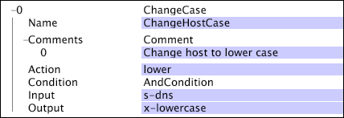

# WijzigenCase{#changecase}

De transformatie ChangeCase verandert het geval van het koord in de parameter van de Input zoals die door de parameter van de Actie wordt gespecificeerd.

| Parameter | Beschrijving | Standaard |
|---|---|---|
| Naam | Beschrijvende naam van de transformatie. U kunt om het even welke naam hier ingaan. |  |
| Actie | Boven of lager. Specificeert of het geval in bovenleer of onderaan moet worden veranderd. | lager |
| Opmerkingen | Optioneel. Opmerkingen over de transformatie. |  |
| Toestand | De omstandigheden waaronder deze transformatie wordt toegepast. |  |
| Invoer | De naam van het gebied van de logboekingang aan gebruik als input. |  |
| Uitvoer | De naam van het outputgebied. |  |

In dit voorbeeld, dat gebieden van gegevens gebruikt die van websiteverkeer worden verzameld, wordt het geval van het koord binnen het s-dns gebied veranderd in lager geval, en de nieuwe waarde is output op het nieuwe gebied, x-kleine letters-dns.

