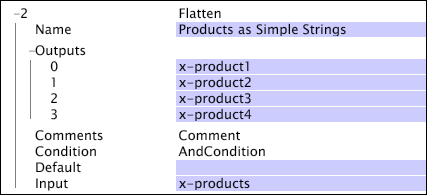

# afvlakken{#flatten}

De afvlakkende transformatie neemt een vector van koorden en brengt elke waarde in zijn eigen gebied in kaart.

| Parameter | Beschrijving | Standaard |
|---|---|---|
| Naam | Beschrijvende naam van de transformatie. U kunt om het even welke naam hier ingaan. |  |
| Opmerkingen | Optioneel. Opmerkingen over de transformatie. |  |
| Toestand | De omstandigheden waaronder deze transformatie wordt toegepast. |  |
| Standaard | De standaardwaarde aan gebruik als de voorwaarde wordt voldaan aan en de inputwaarde is niet beschikbaar voor de logboekingang. |  |
| Invoer | Een vector van koordwaarden om aan de namen van het outputgebied in kaart te brengen. |  |
| Resultaten | Een reeks namen van het outputgebied. |  |

Overwegingen voor [!DNL Flatten]

* Als de inputvector meer waarden bevat dan er bepaalde outputgebieden zijn, worden de extra inputwaarden eenvoudig gelaten vallen.
* Als de inputvector minder waarden bevat dan er bepaalde outputgebieden zijn, worden de extra outputgebieden gegeven de standaardwaarde (als bepaald) of een leeg koord als geen standaardwaarde wordt bepaald.

Hier, wordt de [!DNL Flatten] transformatie gebruikt om een vector van producten (x-producten) te nemen en hen te scheiden in vier gebieden (x-product1, ..., x-product4).

Als de inputwaarde de koorden B57481, C46355, en Z97123 bevatte, zouden de outputgebieden de hier getoonde waarden hebben:

* x-product1 = B57481
* x-product2 = C46355
* x-product3 = Z97123
* x-product4 = Leeg (Er zijn meer input dan output, en er is geen gespecificeerde standaardwaarde.)

