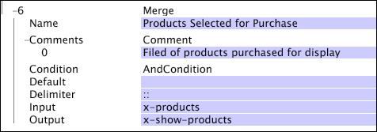

# Samenvoegen{#merge}

Bij de samenvoegtransformatie worden de waarden uit het invoerveld genomen (doorgaans een vector met tekenreeksen), gecombineerd tot één tekenreeks die door het opgegeven scheidingsteken wordt gescheiden, en wordt de resulterende tekenreeks in het opgegeven uitvoerveld geplaatst.

<table id="table_2458E008C9A14B31A774E6819D07E9BE"> 
 <thead> 
  <tr> 
   <th colname="col1" class="entry"> Parameter </th> 
   <th colname="col2" class="entry"> Beschrijving </th> 
   <th colname="col3" class="entry"> Standaard </th> 
  </tr> 
 </thead>
 <tbody> 
  <tr> 
   <td colname="col1"> Naam </td> 
   <td colname="col2"> Beschrijvende naam van de transformatie. U kunt hier elke naam invoeren. </td> 
   <td colname="col3"></td> 
  </tr> 
  <tr> 
   <td colname="col1"> Opmerkingen </td> 
   <td colname="col2"> Optioneel. Opmerkingen over de transformatie. </td> 
   <td colname="col3"></td> 
  </tr> 
  <tr> 
   <td colname="col1"> Voorwaarde </td> 
   <td colname="col2"> De omstandigheden waaronder deze transformatie wordt toegepast. </td> 
   <td colname="col3"></td> 
  </tr> 
  <tr> 
   <td colname="col1"> Standaard </td> 
   <td colname="col2"> De standaardwaarde die moet worden gebruikt als aan de voorwaarde is voldaan en de invoerwaarde niet beschikbaar is. </td> 
   <td colname="col3"></td> 
  </tr> 
  <tr> 
   <td colname="col1"> Scheidingsteken </td> 
   <td colname="col2"> 
Tekenreeks die wordt gebruikt om de afzonderlijke elementen van de invoertekenreeksvector te scheiden in de enkele uitvoertekenreeks. 
 
 Als u de sleutel van CTRL onderdrukt en binnen de parameter van Scheidingsteken met de rechtermuisknop klikt,  Tussenvoegsel verschijnt een menu. Dit menu bevat een lijst met speciale tekens die vaak als scheidingstekens worden gebruikt. 
 </td> 
   <td colname="col3"></td> 
  </tr> 
  <tr> 
   <td colname="col1"> Invoer </td> 
   <td colname="col2"> Een vector met tekenreekswaarden die worden gecombineerd om de uitvoertekenreeks te vormen. </td> 
   <td colname="col3"></td> 
  </tr> 
  <tr> 
   <td colname="col1"> Uitvoer </td> 
   <td colname="col2"> De naam van de uitvoertekenreeks. </td> 
   <td colname="col3"></td> 
  </tr> 
 </tbody> 
</table>

In dit voorbeeld wordt aangenomen dat een invoervector met tekenreeksen een set producten bevat die voor aankoop zijn geselecteerd. Deze producten worden in één uitvoertekenreeks geplaatst en worden gescheiden door &quot;::&quot; (twee dubbele punten).

Dus als het invoerveld x-products de tekenreekswaarden B57481, C46355 en Z97123 bevatte, zou de resulterende uitvoertekenreeks x-show-products B57481:C46355:Z97123 zijn.
