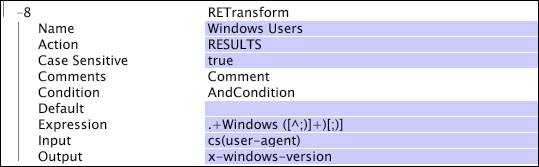

# RETransform{#retransform}

{{eol}}

De RETransform-transformatie (reguliere expressie) is een patroonovereenkomende transformatie die gebruikmaakt van reguliere expressies om een patroon op te geven dat moet worden gezocht naar en vastgelegd in de invoer en die de vastgelegde tekenreeks in een opgegeven uitvoerveld opslaat.

Reguliere expressies worden geëvalueerd op basis van de gehele invoertekenreeks. Als de invoer niet overeenkomt met het patroon dat is opgegeven in de reguliere expressie, worden geen gegevens vastgelegd. Voor een korte handleiding voor het gebruik van reguliere expressies raadpleegt u [Reguliere expressies](../../../../../home/c-dataset-const-proc/c-reg-exp.md#concept-070077baa419475094ef0469e92c5b9c).

>[!NOTE]
>
>De [!DNL RETransform] de transformatie werkt op ongeveer dezelfde manier als de [!DNL REMatch] transformatie (zie [REMatch](../../../../../home/c-dataset-const-proc/c-data-trans/c-transf-types/c-standard-transf/c-rematch.md#concept-7f0b1caad1df46aabef4448f88261a8e)). Hiermee wordt een uitvoerveld gemaakt voor elk onderpatroon van vastlegging in de reguliere expressie. Je kunt denken aan [!DNL RETransform] als een combinatie van [!DNL REMatch] en [!DNL Format] transformaties. Als de parameter Actie (zie Actie in de volgende lijst) aan &quot;RESULTATEN wordt geplaatst, dan [!DNL RETransform] werkt als een combinatie van [!DNL REMatch] en [!DNL Union] transformaties.

<table id="table_51B7342E6A5E4E31913BD0F6A6ACC424"> 
 <thead> 
  <tr> 
   <th colname="col1" class="entry"> Parameter </th> 
   <th colname="col2" class="entry"> Beschrijving </th> 
   <th colname="col3" class="entry"> Standaard </th> 
  </tr> 
 </thead>
 <tbody> 
  <tr> 
   <td colname="col1"> Naam </td> 
   <td colname="col2"> Beschrijvende naam van de transformatie. U kunt hier elke naam invoeren. </td> 
   <td colname="col3"></td> 
  </tr> 
  <tr> 
   <td colname="col1"> Opmerkingen </td> 
   <td colname="col2"> Optioneel. Opmerkingen over de transformatie. </td> 
   <td colname="col3"></td> 
  </tr> 
  <tr> 
   <td colname="col1"> Voorwaarde </td> 
   <td colname="col2"> De omstandigheden waaronder deze transformatie wordt toegepast. </td> 
   <td colname="col3"></td> 
  </tr> 
  <tr> 
   <td colname="col1"> Standaard </td> 
   <td colname="col2"> De standaardwaarde die moet worden gebruikt als aan de voorwaarde is voldaan en de invoerwaarde niet beschikbaar is of als de reguliere expressie niet overeenkomt met de invoerwaarde. </td> 
   <td colname="col3"></td> 
  </tr> 
  <tr> 
   <td colname="col1"> Handeling </td> 
   <td colname="col2"> 
Hiermee bepaalt u hoe het resultaat wordt verwerkt. Bij de standaardinstelling van RESULTATEN worden de overeenkomende patronen gebruikt en wordt een vector van tekenreeksen gemaakt op basis van de patronen die worden geëxtraheerd. 
 
 De handeling kan ook een opmaaktekenreeks zijn om een eenvoudige tekenreeks met een bepaalde indeling te maken. Met deze techniek geeft u het nummer op dat overeenkomt met de locatie van elk overeenkomend patroon tussen procentpunten. Het eerste overeenkomende patroon zou bijvoorbeeld %1% zijn en het derde overeenkomende patroon %3%. U zou andere karakters in het formatteren koord letterlijk specificeren. 
 </td> 
   <td colname="col3"> RESULTATEN </td> 
  </tr> 
  <tr> 
   <td colname="col1"> Uitdrukking </td> 
   <td colname="col2"> De reguliere expressie die wordt gebruikt voor overeenkomsten. </td> 
   <td colname="col3"></td> 
  </tr> 
  <tr> 
   <td colname="col1"> Invoer </td> 
   <td colname="col2"> Het veld waartegen de reguliere expressie wordt geëvalueerd. </td> 
   <td colname="col3"></td> 
  </tr> 
  <tr> 
   <td colname="col1"> Uitvoer </td> 
   <td colname="col2"> De naam van de uitvoertekenreeks. </td> 
   <td colname="col3"></td> 
  </tr> 
 </tbody> 
</table>

>[!NOTE]
>
>[!DNL RETransform] transformaties kunnen zeer traag zijn en kunnen een groot deel van de verwerkingstijd voor gegevens veroorzaken.

In dit voorbeeld wordt de versie van het Windows-besturingssysteem geïsoleerd die een websitebezoeker gebruikt en wordt van die waarde een veld-x-windows-versie gemaakt. In dit geval is de uitvoerwaarde gewoon het versienummer.

Als u de tekenreeks &quot;Version&quot; vóór het versienummer wilt opnemen voor leesbaarheid, wijzigt u de parameter Handeling van &quot;RESULTS&quot; in &quot;Versie %1%&quot;. Als u een letterlijk percentageteken (%) wilt opnemen in de uitvoer, laat u dit veld weglopen met een tweede procentteken, zoals in &quot;%%&quot;.
