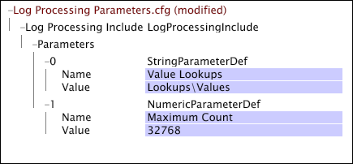

# Tekenreeks en numerieke parameters{#string-and-numeric-parameters}

Tekenreeks en numerieke parameters nemen als hun waarden tekenreeksen en getallen.

U kunt ze onderling gebruiken, maar numerieke parameters moeten worden gedefinieerd om een numerieke waarde te hebben. U kunt naar tekenreeks en numerieke parameters verwijzen wanneer u transformaties, voorwaarden en uitgebreide afmetingen definieert en u kunt naar meerdere parameters op dezelfde regel verwijzen.

U kunt niet naar tekenreeks en numerieke parameters verwijzen in [!DNL Input]- of [!DNL Output]-velden, maar u kunt een tekenreeksparameter gebruiken om een constant invoerveld te definiëren. Bovendien kunt u niet naar tekenreeks en numerieke parameters in decoders of decoderingsgroepen verwijzen.

In dit voorbeeld wordt een [!DNL Log Processing Dataset Include]-bestand getoond dat een tekenreeksparameter en een numerieke parameter definieert. De tekenreeksparameter, genaamd &quot;Value Lookups&quot;, definieert een bestandslocatie (Lookups\Values) ten opzichte van de installatiemap van de gegevenswerkbankserver.

