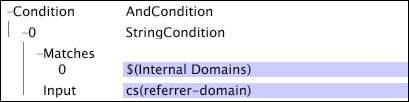

# Vectorparameters{#vector-parameters}

De vector parameters bevatten veelvoudige waarden voor één enkele variabele.

U kunt vectorparameters slechts als enig punt van een vector van verwijzingen voorzien. Dit voorbeeld toont een [!DNL Transformation Dataset Include] dossier dat een vectorparameter bepaalt. De vectorparameter, &quot;Interne Domeinen,&quot;bestaat uit drie waarden.

Merk op dat de vectorparameter het enige punt is dat voor de [!DNL Matches] vector in de [!DNL String Match] voorwaarde wordt vermeld.

Voor meer informatie over interne domeinen, zie de Montages van de [Configuratie voor de Gegevens](../../../../home/c-dataset-const-proc/c-config-web-data/c-config-web-data.md#concept-9a306b65483a484bb3f6f3c1d7e77519)van het Web. Voor informatie over de [!DNL String Match] aandoening, zie [Voorwaarden](../../../../home/c-dataset-const-proc/c-conditions/c-abt-cond.md).
