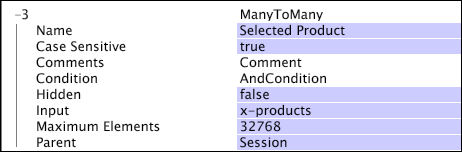

# Vele-aan-Vele Dimension{#many-to-many-dimensions}

Een vele-aan-vele dimensie heeft een vele-aan-vele verhouding met zijn oudertelbare dimensie.

U kunt een vele-aan-vele dimensie als vertegenwoordiging van een reeks waarden voor elk element in zijn ouderafmeting denken. Bijvoorbeeld, is de vele-aan-vele dimensieDoorzoekzin een zitting-vlakke dimensie (het heeft een ouder van Zitting). Het vertegenwoordigt de reeks onderzoeksuitdrukkingen verbonden aan elke zitting in de dimensie van de Zitting. Er kan één zoekfrase worden gebruikt in een willekeurig aantal sessies en één sessie kan nul of meer zoekzinnen bevatten. Daarom heeft de dimensie van de Woorden van het Onderzoek een vele-aan-vele verhouding met de dimensie van de Zitting.

Vele-aan-vele dimensies worden bepaald door de volgende parameters:

<table id="table_A6D495008DFF4DD28A3ECD718D775E54"> 
 <thead> 
  <tr> 
   <th colname="col1" class="entry"> Parameter </th> 
   <th colname="col2" class="entry"> Beschrijving </th> 
   <th colname="col3" class="entry"> Standaard </th> 
  </tr> 
 </thead>
 <tbody> 
  <tr> 
   <td colname="col1"> Naam </td> 
   <td colname="col2"> Beschrijvende naam van de dimensie zoals deze voor de gebruiker in de gegevenswerkbank wordt weergegeven. De naam van de dimensie mag geen afbreekstreepje (-) bevatten. </td> 
   <td colname="col3"> </td> 
  </tr> 
  <tr> 
   <td colname="col1"> Opmerkingen </td> 
   <td colname="col2"> Optioneel. Opmerkingen over de uitgebreide dimensie. </td> 
   <td colname="col3"> </td> 
  </tr> 
  <tr> 
   <td colname="col1"> Voorwaarde </td> 
   <td colname="col2"> De voorwaarden waaronder de relatie tussen de waarde van het bovenliggende veld en van het invoerveld moet worden gemaakt. </td> 
   <td colname="col3"> </td> 
  </tr> 
  <tr> 
   <td colname="col1"> Verborgen </td> 
   <td colname="col2"> Hiermee wordt bepaald of de dimensie wordt weergegeven in de interface van de gegevenswerkbank. Deze parameter is standaard ingesteld op false. Als de afmeting bijvoorbeeld alleen als basis van een metrische waarde moet worden gebruikt, kunt u deze parameter instellen op true om de afmeting te verbergen in de weergave op de werkbank. </td> 
   <td colname="col3"> false </td> 
  </tr> 
  <tr> 
   <td colname="col1"> Invoer </td> 
   <td colname="col2"> 
De waarde die gerelateerd is aan de bovenliggende dimensie (parent). Als dit veld een vector met tekenreeksen is, heeft elk element van de vector zijn eigen relatie met het bovenliggende element. 
 
 
Opmerking:  Als de inputwaarde voor elke logboekingang voor een element van de ouderafmeting leeg is, zal geen element van de vele-aan-vele afmeting op dat element van de ouderafmeting betrekking hebben. 
 
 </td> 
   <td colname="col3"> </td> 
  </tr> 
  <tr> 
   <td colname="col1"> Bovenliggend </td> 
   <td colname="col2"> De naam van de bovenliggende dimensie. Elke aftelbare dimensie kan een bovenliggende dimensie zijn. </td> 
   <td colname="col3"> </td> 
  </tr> 
 </tbody> 
</table>

Dit voorbeeld illustreert de definitie van een vele-aan-vele dimensie gebruikend gebeurtenisgegevens die van websiteverkeer worden verzameld. Deze vele-aan-vele dimensie, genoemd &quot;Geselecteerd Product,&quot;heeft zittingen betrekking op de producten die door de bezoeker tijdens die zitting worden gekocht. Het veld x-products bevat een vector met waarden, die elk zijn gekoppeld aan een paginaweergave en die op hun beurt aan een sessie is gekoppeld.

Door een dergelijke transformatie te maken, kunt u een visualisatie maken in de gegevenswerkbank die de relatie weergeeft tussen de geselecteerde productdimensie en het aantal sessies dat betrekking heeft op elk van de producten.
