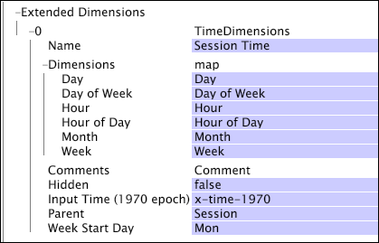

# Afmetingen tijd{#time-dimensions}

Een tijddimensie laat u toe om een reeks periodieke of absolute lokale tijddimensies (zoals Dag, Dag van Week, Uur van Dag, de Tijd van de Reservering, etc.) tot stand te brengen die op om het even welk timestamp gebied wordt gebaseerd dat u voor de parameter van de Tijd van de Input (1970 epoch) specificeert.

Wanneer het bepalen van tijdafmetingen, kunt u ook een dag buiten Maandag kiezen die als begin van een week moet worden gebruikt door de parameter van de Dag van het Begin van de Week te specificeren. U kunt meer dan één reeks tijddimensies in uw dataset bepalen zolang de afmetingen verschillende namen hebben.

De afmetingen van de tijd worden bepaald door de volgende parameters:

<table id="table_9734F6CD7ABA4661A2F9A5FB948A7282"> 
 <thead> 
  <tr> 
   <th colname="col1" class="entry"> Parameter </th> 
   <th colname="col2" class="entry"> Beschrijving </th> 
   <th colname="col3" class="entry"> Standaard </th> 
  </tr> 
 </thead>
 <tbody> 
  <tr> 
   <td colname="col1"> Naam </td> 
   <td colname="col2"> Beschrijvende naam van de afmeting aangezien het in gegevenswerkbank verschijnt. De afmetingsnaam kan geen koppelteken (-) omvatten. </td> 
   <td colname="col3"> </td> 
  </tr> 
  <tr> 
   <td colname="col1"> Opmerkingen </td> 
   <td colname="col2"> Optioneel. Opmerkingen over de uitgebreide dimensie. </td> 
   <td colname="col3"> </td> 
  </tr> 
  <tr> 
   <td colname="col1"> Afmetingen </td> 
   <td colname="col2"> 
U kunt afmetingsnamen voor om het even welke volgende periodes specificeren: 
 
 
     <ul id="ul_EB0837DD66BE4004A615A6029EEF4CD5"> 
      <li id="li_2E46E6DB004E443C8CC831DCEE743D60"> Dag </li> 
      <li id="li_F59A27779EBE4E2A84E0972EE8BCDFA7"> Weekdag </li> 
      <li id="li_7D74CD547ED1449091EF7B2E0E8C46DE"> Uur </li> 
      <li id="li_706AF9D385CB44C098DEBACA3BA2CD4B"> Uur van Dag </li> 
      <li id="li_76FBF69B25954885A0192D308A155E41"> Maand </li> 
      <li id="li_3C16955BE5C54291A25E25CD31259661"> Week </li> 
     </ul> 
 
 De namen die u hier ingaat zijn de namen die in afmetingsmenu's en in visualisaties in gegevenswerkbank verschijnen. Als u de naam van een lege tijddimensie verlaat, wordt de afmeting niet gecreeerd in de dataset. 
 </td> 
   <td colname="col3"> </td> 
  </tr> 
  <tr> 
   <td colname="col1"> Verborgen </td> 
   <td colname="col2"> Bepaalt of de afmeting in de interface van de gegevenswerkbank verschijnt. Door gebrek, wordt deze parameter geplaatst aan vals. Als, bijvoorbeeld, de afmeting slechts als basis van metrisch moet worden gebruikt, kunt u deze parameter aan waar plaatsen om de afmeting van de vertoning van de gegevenswerkbank te verbergen. </td> 
   <td colname="col3"> waar </td> 
  </tr> 
  <tr> 
   <td colname="col1"> Invoertijd (1970-poch) </td> 
   <td colname="col2"> 
De naam van het timestamp gebied aan gebruik als input. 
 
 
Opmerking:  De waarden van het gebied moeten het aantal seconden sinds 1 Januari, 1970, bij 00:00 vertegenwoordigen:01. Als de invoertijd geen geldige tijd is (1970 tot 2037), zal het transformatieproces ontbreken, en de server van de gegevenswerkbank zal een fout produceren. 
 
 </td> 
   <td colname="col3"> </td> 
  </tr> 
  <tr> 
   <td colname="col1"> Ouder </td> 
   <td colname="col2"> De naam van de ouderafmeting. Om het even welke telbare afmeting kan een ouderafmeting zijn. Voor Webgegevens, is de ouder Zitting. </td> 
   <td colname="col3"> </td> 
  </tr> 
  <tr> 
   <td colname="col1"> Weekstartdag </td> 
   <td colname="col2"> 
De dag voor gebruik als de eerste dag van een week. 
 
 Deze parameter beïnvloedt de Weekdimensie, de dimensie van de Dag van Week, en om het even welke rapporteringstijddimensies die in termen van weken worden bepaald. 
 </td> 
   <td colname="col3"> Mon </td> 
  </tr> 
 </tbody> 
</table>

Dit voorbeeld leidt tot een reeks tijddimensies die op het user-defined inputgebied x-time-1970 worden gebaseerd. De reeks tijddimensies wordt genoemd &quot;de Tijd van de Zitting.&quot; Omdat de ouder van elke afmeting de afmeting van de Zitting is, beantwoordt elk element van de tijddimensies aan de tijd waarin een zitting begon. De parameter van de Dag van het Begin van de Week specificeert dat elke week van de afmeting van de Week op Maandag begint.

