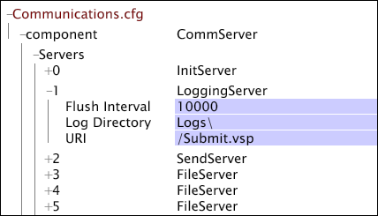

# Een Data Workbench Server File Server-eenheid configureren{#configuring-a-data-workbench-server-file-server-unit}

{{eol}}

Informatie over de eenheden van de het dossierserver van de Server van het Inzicht en het configuratieproces van de dossierserver.

<!--
c_abt_file_svr_units.xml
-->

U kunt de server van de gegevenswerkbank (InsightServer64.exe) vormen om als Eenheid van de Server van het Dossier (FSU) te lopen door de parameters in te vullen **[!UICONTROL Log Sources]** > **[!UICONTROL Log Server]** knooppunt van de [!DNL Log Processing.cfg] bestand. Wanneer de server van de gegevenswerkbank wordt gevormd om als FSU in werking te stellen, slaat het brondossiers op ( [!DNL .vsl] bestanden, tekstbestanden of XML-bestanden) die snel toegankelijk zijn voor meerdere verwerkingsservers (DPU&#39;s). Wanneer DPUs in een de servercluster van de gegevenswerkbank tot FSU toegang heeft om de logboekdossiers te lezen, verdelen zij de logboekdossiers onder hen en waarborgen dat het zelfde dossier niet meer dan eens wordt verwerkt.

>[!NOTE]
>
>Wanneer u een FSU instelt die een servercluster van een gegevenswerkbank aanbiedt dat uit vijf tot tien DPU&#39;s bestaat, moet u van de master server van de cluster de FSU maken.

Voor informatie over het installeren van een servercluster van de gegevenswerkbank, zie *Handleiding voor installatie en beheer van serverproducten*.

<!--
c_file_svr_config_proc.xml
-->

Als de locatie een externe locatie is, maakt de gegevenswerkbankservercomputer die de gegevens verwerkt, verbinding met de aangewezen externe computer om de logbestanden te lezen.

Op de gegevenswerkbankservercomputer die als FSU is aangewezen, kan de [!DNL Access Control.cfg] het dossier laat DPUs met FSU verbinden, en [!DNL Communications.cfg] de locatie van de externe gegevensbestanden in kaart brengen. De processtappen om FSU te vormen zijn als volgt:

1. In de [!DNL Log Processing.cfg] Geef het type gegevensbron en de locatie van de bron op in het bestand op de master werkbankserver. Zie [De gegevensbron opgeven](../../../home/c-dataset-const-proc/c-log-proc-config-file/c-ins-svr-file-svr-unit.md#section-d2b545db7ab142ffb4be32e040395383).

1. In de [!DNL Access Control.cfg] op FSU, geef de toestemmingen uit om DPUs toe te staan om met FSU te verbinden om de logboekgegevens te lezen. Zie [De machtigingen bewerken in de eenheid Bestandsserver](../../../home/c-dataset-const-proc/c-log-proc-config-file/c-ins-svr-file-svr-unit.md#section-b4a54b591b4e4435a728a67f194057ef).

1. In de [!DNL Communications.cfg] bestand op de FSU, de instellingen voor de [!DNL LoggingServer] en [!DNL FileServer] vermeldingen om de locatie van de logbestanden op te geven. Zie [De locatie van de logbestanden opgeven](../../../home/c-dataset-const-proc/c-log-proc-config-file/c-ins-svr-file-svr-unit.md#section-f9a649bf1b2544feb10ad8820384edb0).

1. Als u uw gegevenssetprofiel om op een cluster van de gegevenswerkbankserver vormt te lopen, moet u ook van de FSU van de cluster de server maken waar alle dimensies van het profiel worden geconstrueerd: (Alleen voor gegevensworkbench-serverclusters) In het dialoogvenster [!DNL Communications.cfg] en [!DNL cluster.cfg] bestanden op de FSU toe, voeg items toe voor een &quot;normalize server&quot; om van de FSU de server binnen de cluster te maken waar alle dimensies worden geconstrueerd. Zie [Een gecentraliseerde normalisatieserver maken voor een cluster](../../../home/c-dataset-const-proc/c-log-proc-config-file/c-ins-svr-file-svr-unit.md#section-2c1f57b683f94cc193bc069e886bba28).

Voor instructies om een datasetprofiel te vormen dat door een cluster van de gegevenswerkbench server moet worden verwerkt, zie *Handleiding voor installatie en beheer van serverproducten*.

>[!NOTE]
>
>In de volgende instructies wordt ervan uitgegaan dat alle logbestanden zich in de standaardmap bevinden. Als u logboeken in een andere folder wilt opslaan of veelvoudige logboekwegen tot stand brengen, contacteer de Raadplegende Diensten van de Adobe om uw specifieke configuratie te bespreken.

## De gegevensbron opgeven {#section-d2b545db7ab142ffb4be32e040395383}

Wanneer het specificeren van verre gegevensbronnen voor een dataset, moet u het type van gegevensbron en de plaats van de logboekdossiers op uw master server van de gegevenswerkbank specificeren.

**De gegevensbron en de locatie opgeven**

1. Open de [!DNL Log Processing.cfg] bestand. Zie [Het configuratiebestand voor logbestanden verwerken bewerken](../../../home/c-dataset-const-proc/c-log-proc-config-file/t-edit-log-proc-config-file.md#task-6a2fa1b735cb4eefad730f0a3a7858e5).

1. Voeg een [!DNL Sensor], logbestand of XML-gegevensbron. Zie [Logbestanden](../../../home/c-dataset-const-proc/c-log-proc-config-file/c-log-sources.md#concept-3d4fb817c057447d90f166b1183b461e).

1. Voltooi de parameter van de Wegen van het Logboek. Zie [Sensorbestanden](../../../home/c-dataset-const-proc/c-log-proc-config-file/c-log-sources.md#concept-b25f11c477b54032a15b6117b3bf9009), [Logbestanden](../../../home/c-dataset-const-proc/c-log-proc-config-file/c-log-sources.md#concept-3d4fb817c057447d90f166b1183b461e), of [XML-logbestanden](../../../home/c-dataset-const-proc/c-log-proc-config-file/c-log-sources.md#concept-c7b154e93748447b986e97f6ef688887). Geef een geldige URI op.

1. Voltooi de parameters van de Server van het Logboek die in de volgende lijst worden bepaald:

<table id="table_5881B8DEFF984BC7A620CEEA3A637912"> 
 <thead> 
  <tr> 
   <th colname="col1" class="entry"> Parameter </th> 
   <th colname="col2" class="entry"> Beschrijving </th> 
  </tr> 
 </thead>
 <tbody> 
  <tr> 
   <td colname="col1"> Naam </td> 
   <td colname="col2"> Naam die de externe bestandsserver identificeert. </td> 
  </tr> 
  <tr> 
   <td colname="col1"> Algemene naam SSL-server </td> 
   <td colname="col2"> 
  Algemene naam server vermeld op het SSL-certificaat van de bestandsserver. 
 
 Deze parameter is optioneel als  SSL gebruiken is ingesteld op false. 
 </td> 
  </tr> 
  <tr> 
   <td colname="col1"> Adres </td> 
   <td colname="col2"> 
Adres van de bestandsserver. Kan leeg laten als  Naam overeenkomsten  Algemene naam SSL-server. 
 
 Bijvoorbeeld:  visual.mijnbedrijf.com of 192.168.1.90. 
 </td> 
  </tr> 
  <tr> 
   <td colname="col1"> Poort </td> 
   <td colname="col2"> Poort waardoor de gegevenswerkbankservercomputer communiceert met de bestandsserver. </td> 
  </tr> 
  <tr> 
   <td colname="col1"> SSL-clientcertificaat </td> 
   <td colname="col2"> Naam van de  SSL-certificaat bestand voor de gegevenswerkbankserver ( server_cert.pem). </td> 
  </tr> 
  <tr> 
   <td colname="col1"> SSL gebruiken </td> 
   <td colname="col2"> Waar of onwaar. True geeft aan dat de bestandsserver  SSL. </td> 
  </tr> 
 </tbody> 
</table>

Als een volmachtsserver voor DPUs wordt vereist om met FSU te verbinden, moet u de volgende parameters voltooien:

| Parameter | Beschrijving |
|---|---|
| Proxyadres | Het adres van een proxyserver die de gegevenswerkbankserver moet gebruiken om toegang te krijgen tot de bestandsserver. |
| Proxywachtwoord | Optioneel. Het wachtwoord voor de proxyserver. |
| Proxypoort | De poort van de proxyserver. De standaardwaarde is 8080. |
| Gebruikersnaam proxy | Optioneel. De gebruikersnaam voor de proxyserver. |

Hieronder ziet u een voorbeeld van een definitie [!DNL Log Server] in de [!DNL Log Processing.cfg] bestand. Logbron #1 is een LogFile-bron die verwijst naar een map met de naam Logs (let op de URI die is opgegeven in de parameter Log Paths) op de computer met de naam FSU01.

## De machtigingen bewerken in de eenheid Bestandsserver {#section-b4a54b591b4e4435a728a67f194057ef}

In het vorige proces, vormde u een profiel voor een bepaalde dataset om logboekdossiers van FSU te lezen. Nu moet u de toestemmingen op FSU uitgeven om verbindingen van DPUs toe te staan die het profiel in werking stellen. In de volgende stappen doorloopt u het bewerken van het machtigingenbestand [!DNL Access Control.cfg].

**Machtigingen bewerken op de FSU**

1. Open de [!DNL Server Files Manager] voor de gegevenswerkbankservercomputer die u instelt als de FSU en klik op **[!UICONTROL Access Control]** om de inhoud te tonen.

   Voor informatie over het openen en werken met de [!DNL Server Files Manager], zie de *Gebruikershandleiding voor Data Workbench*.

1. In de [!DNL Server Files Manager] venster, klikt u op **[!UICONTROL Access Control]** om de inhoud te tonen. De [!DNL Access Control.cfg] bestand bevindt zich in deze map.

1. Klik met de rechtermuisknop op het vinkje in de kolom Servernaam voor [!DNL Access Control.cfg]en klik vervolgens op **[!UICONTROL Make Local]**. Er verschijnt een vinkje in het dialoogvenster [!DNL Temp] kolom voor [!DNL Access Control.cfg].

1. Klik met de rechtermuisknop op het nieuwe vinkje onder het pictogram [!DNL Temp] kolom en klik op **[!UICONTROL Open]** > **[!UICONTROL in Workstation]**.

1. In de [!DNL Access Control] venster, klikt u op **[!UICONTROL Access Control Groups]** om de inhoud te tonen.

1. Klik met de rechtermuisknop op het numerieke label voor het laatste [!DNL AccessGroup] in de lijst en klik op **[!UICONTROL Add new]** > **[!UICONTROL Group]**.

1. Voer een [!DNL Name] voor de nieuwe [!DNL AccessGroup]. Voorbeeld: Servers aansluiten.

1. Klikken met rechtermuisknop **[!UICONTROL Member]** onder de nieuwe [!DNL AccessGroup]en klik vervolgens op **[!UICONTROL Add new]** > **[!UICONTROL Member]**.

1. Ga het IP adres voor DPU van de server van de gegevenswerkbank in die met deze dossierserver verbindt.
1. Herhaal stap 4 en 5 voor andere DPU&#39;s van de server van de gegevenswerkbank die met dit FSU, met inbegrip van de serverDPUs van de gegevenswerkbank in een cluster verbinden die tot de logboekdossiers moet toegang hebben.
1. Klikken met rechtermuisknop **[!UICONTROL Read-Only Access]** onder de nieuwe [!DNL AccessGroup]en klik vervolgens op **[!UICONTROL Add new]** > **[!UICONTROL URI]**.

1. Voer de locatie van de opgeslagen logbestanden op de bestandsserver in. Gebruik slashes (/) in de padspecificatie. De standaardlocatie is /Logs/.
1. Klikken met rechtermuisknop **[!UICONTROL (modified)]** boven aan het venster klikt u op **[!UICONTROL Save]**.

1. In de [!DNL Server Files Manager] venster, klikt u met de rechtermuisknop op het vinkje voor [!DNL Access Control.cfg] in de [!DNL Temp] kolom, klik vervolgens op **[!UICONTROL Save to]** > **[!UICONTROL server name]** om de lokaal aangebrachte wijzigingen in de FSU van de gegevenswerkbankserver op te slaan.

## De locatie van de logbestanden opgeven {#section-f9a649bf1b2544feb10ad8820384edb0}

U moet de [!DNL Communications.cfg] op de FSU om de locatie van de logbestanden op te geven.

**De locatie van de logbestanden opgeven**

1. In de [!DNL Server Files Manager] venster, klikt u op **[!UICONTROL Components]** om de inhoud te tonen. De [!DNL Communications.cfg] bestand bevindt zich in deze map.

1. Klik met de rechtermuisknop op het vinkje in de kolom Servernaam voor [!DNL Communications.cfg]en klik vervolgens op **[!UICONTROL Make Local]**. Er verschijnt een vinkje in het dialoogvenster [!DNL Temp] kolom voor [!DNL Communications.cfg].

1. Klik met de rechtermuisknop op het nieuwe vinkje onder het pictogram [!DNL Temp] kolom en klik op **[!UICONTROL Open]** > **[!UICONTROL in Workstation.]**.

1. In de [!DNL Communications.cfg] venster, klikt u op **[!UICONTROL component]** om de inhoud te tonen.

1. In de [!DNL Communications.cfg] venster, klikt u op **[!UICONTROL Servers]** om de inhoud te tonen. Er kunnen verschillende servers worden weergegeven: Bestandsservers, Logging Servers, Init Servers, Statusservers, Send Servers of Replicate Servers.

1. (Voor [!DNL Sensor] alleen logbronnen) Zoek de [!DNL LoggingServer], waarbij [!DNL Sensor] schrijft zijn logboekdossiers die door de server van de gegevenswerkbank moeten worden verwerkt, dan klik zijn aantal om het menu te bekijken. Geef de parameter van de Folder van het Logboek uit om op de gewenste plaats van de logboekdossiers te wijzen. De standaardlogmap is de map Logs in de installatiemap van de gegevenswerkbankserver.

   Wijzig geen andere parameters voor de [!DNL LoggingServer].

   

1. Zoek naar FileServer die de plaats van logboekdossiers specificeert. Onder Servers kunnen meerdere bestandsservers worden vermeld, zodat u de inhoud voor veel van deze servers (door op het servernummer te klikken) mogelijk moet bekijken om de gewenste server te vinden.
1. Bewerk de [!DNL Local Path] en de parameters van URI voor FileServer om op de plaats van de logboekdossiers te wijzen. In het volgende voorbeeld wordt getoond dat de logbestanden zich in de map Logs in de installatiemap van de gegevenswerkbankserver bevinden:

   

   >[!NOTE]
   >
   >Als de [!DNL Local Path] en de parameters van URI worden bevolkt zoals getoond, kunt u tot de logboekdossiers op FSU van om het even welke server van de gegevenswerkbank toegang hebben door te klikken [!DNL Logs] in de [!DNL Server Files Manager].

1. Klikken met rechtermuisknop **[!UICONTROL (modified)]** boven aan het configuratievenster klikt u op **[!UICONTROL Save]**.

1. In de [!DNL Server Files Manager] venster, klikt u met de rechtermuisknop op het vinkje voor [!DNL Communications.cfg] in de [!DNL Temp] kolom, klik vervolgens op **[!UICONTROL Save to]** > *&lt;**[!UICONTROL server name]**>* om de lokaal aangebrachte wijzigingen in de FSU van de gegevenswerkbankserver op te slaan.

## Een gecentraliseerde normalisatieserver maken voor een cluster {#section-2c1f57b683f94cc193bc069e886bba28}

Als u uw gegevenssetprofiel om op een cluster van de gegevenswerkbankserver vormt te lopen, dan zou u FSU van de cluster de server moeten maken waar alle afmetingen van het profiel worden geconstrueerd.

Adobe raadt ten zeerste aan dat de FSU van het cluster fungeert als de master server van het cluster en de gecentraliseerde normalisatieserver.

Als u van de FSU de gecentraliseerde normalisatieserver wilt maken, moet u de [!DNL Communications.cfg] en [!DNL Cluster.cfg] op de FSU.

**De FSU tot de gecentraliseerde normalisatieserver maken**

1. Voeg een [!DNL NormalizeServer] toegang tot de [!DNL Communications.cfg] op de FSU.

   >[!NOTE]
   >
   >Als u het volledige releasepakket hebt geïnstalleerd voor de gegevenswerkbankserver v5.0 of hoger, [!DNL Communications.cfg] bestand op uw FSU moet een [!DNL NormalizeServer] invoer al. U kunt de onderstaande stappen volgen om te bevestigen dat de invoer bestaat.

   1. Open de [!DNL Communications.cfg] bestand in gegevenswerkbank, zoals beschreven in [De locatie van de logbestanden opgeven](#section-f9a649bf1b2544feb10ad8820384edb0).

   1. Klikken **[!UICONTROL component]** om de inhoud te tonen.
   1. Klikken met rechtermuisknop **[!UICONTROL Servers]** en klik op **[!UICONTROL Add New]** > **[!UICONTROL Centralized Normalization Server]**.

   1. In de URI-parameter voor de [!DNL NormalizeServer], type [!DNL /Cluster/].

      

   1. Klikken met rechtermuisknop **[!UICONTROL (modified)]** boven aan het venster en klik op **[!UICONTROL Save]**.

   1. In de [!DNL Server Files Manager] venster, klikt u met de rechtermuisknop op het vinkje voor [!DNL Communications.cfg] in de [!DNL Temp] kolom, klik vervolgens op **[!UICONTROL Save to]** > *&lt;**[!UICONTROL server]**>* naam om de lokaal aangebrachte wijzigingen in de FSU van de gegevenswerkbankserver op te slaan.

1. Definieer de gecentraliseerde normalisatieserver in de [!DNL Cluster.cfg] bestand op de master server in de servercluster van de gegevenswerkbank.

   >[!NOTE]
   >
   >Als FSU waarop u opstelling uw gecentraliseerde normalisatieserver niet de master Server van de gegevenswerkbank in uw cluster is, moet u de IP adressen van DPUs in de cluster aan de cluster toevoegen [!DNL Cluster Servers] toegangsgroep in de FSU&#39;s [!DNL Access Control.cfg] bestand. Voor instructies om servers toe te voegen aan de [!DNL Cluster Servers] groep, zie het Dossier van de Controle van de Toegang voor een sectie van de Cluster bijwerken in *De Gids van de Installatie en van het Beleid van de Producten van de server.*

   1. Open de [!DNL Profile Manager] binnen uw gegevenssetprofiel, dan klik **[!UICONTROL Dataset]** om de inhoud te tonen. De [!DNL Cluster.cfg] bestand bevindt zich in deze map.

   1. Klik met de rechtermuisknop op het vinkje naast [!DNL Cluster.cfg]en klik vervolgens op **[!UICONTROL Make Local]**. Er wordt een vinkje voor dit bestand weergegeven in het dialoogvenster [!DNL User] kolom.

   1. Klik met de rechtermuisknop op het nieuwe vinkje en klik op **[!UICONTROL Open]** > **[!UICONTROL in Notepad]**.

   1. Voeg de tekst toe die is gemarkeerd in het volgende bestandsfragment:

      [!DNL Cluster = ClusterConfig:]

      [!DNL Normalize Server = serverInfo:]

      [!DNL Address = string:]

      [!DNL Port = int: 80]

      [!DNL SSL Server Common Name = string: server common name]

      [!DNL Use SSL = bool: false]

      >[!NOTE]
      >
      >Wanneer u de gemeenschappelijke naam van FSU voor de SSL parameter van de Naam van de Server Gemeenschappelijke gebruikt, gebruikt FSU zijn [!DNL .address] bestand om de algemene naam op te lossen. Voor informatie over de [!DNL .address] bestand, zie de *Handleiding voor installatie en beheer van serverproducten*.

   1. Sla het bestand op.
   1. In de [!DNL Profile Manager], klikt u met de rechtermuisknop op het vinkje voor [!DNL Cluster.cfg] in de [!DNL User] kolom, klik vervolgens op **[!UICONTROL Save to]** > ***[!UICONTROL dataset profile name]*** om de plaatselijk aangebrachte veranderingen in het datasetprofiel te bewaren.
