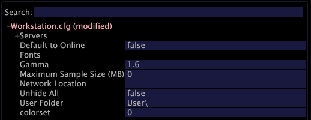

# Configuratieoptie{#configuration-option}

De optie van de Configuratie opent uw dossier Insight.cfg, dat uw verbindingen aan diverse servers controleert.

**Om het Insight.cfg- dossier uit te geven**

1. In het [!DNL Insight.cfg] venster, wijzig de parameters zoals gewenst. Voor gedetailleerde beschrijvingen van de parameters in het [!DNL Insight.cfg] dossier, zie de Parameters [van de Configuratie van het](../../../home/c-get-started/c-insght-config-param.md#concept-14da97d0756348e885c08ca9e866074b)Inzicht.
1. Om uw configuratiemontages te bewaren, klik **[!UICONTROL Insight.cfg (modified)]** bij de bovenkant van het venster met de rechtermuisknop aan en klik **[!UICONTROL Save as Insight.cfg]**.

**Om nieuwe servers toe te voegen**

1. Klik in het [!DNL Insight.cfg] venster met de rechtermuisknop **[!UICONTROL Servers]** en klik op **[!UICONTROL Add new child]** > **[!UICONTROL Server]**.

   

1. Voltooi of wijzig de serverparameters om de Werkbank van Gegevens van toegang tot de gewenste server te voorzien. Voor gedetailleerde beschrijvingen van de parameters in het [!DNL Insight.cfg] dossier, zie de Parameters [van de Configuratie van het](../../../home/c-get-started/c-insght-config-param.md#concept-14da97d0756348e885c08ca9e866074b)Inzicht.
1. Herhaal Stap 1 en Stap 2 voor elke server waaraan u een verbinding wilt vormen.
1. Om uw configuratiemontages te bewaren, klik **[!UICONTROL Insight.cfg (modified)]** bij de bovenkant van het venster met de rechtermuisknop aan en klik **[!UICONTROL Save as Insight.cfg]**.

De werkbank van gegevens probeert om met de server(s) te verbinden gebruikend de montages die u hebt gespecificeerd. Als een verbinding wordt gevestigd, verschijnt een groene knoop in [!DNL Servers Manager] zoals hieronder getoond. Als de Werkbank van Gegevens niet met de server kan verbinden, verschijnt een rode knoop.

