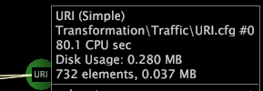

# Prestatiegegevens weergeven{#display-performance-data}

Informatie over het weergeven van prestatiegegevens voor een transformatie of uitgebreide dimensie.

* Klik met de rechtermuisknop in de afhankelijkheidskaart en klik op **[!UICONTROL Show Performance Data]**. Als deze optie is ingeschakeld, wordt een X links van [!DNL Show Performance Data] weergegeven. Wanneer u met de rechtermuisknop op een transformatie- of uitgebreid dimensiknooppunt klikt, wordt de volgende informatie over de prestaties weergegeven:

   * Aantal CPU-seconden dat vereist is om de transformatie uit te voeren of de uitgebreide dimensie te maken
   * De hoeveelheid geheugen die nodig is om de uitgebreide dimensie op te slaan
   * Aantal elementen in de uitgebreide dimensie
   * Hoeveelheid geheugen dat nodig is om de lijst met elementnamen op te slaan in de uitgebreide dimensie

