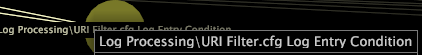

# Details van knooppunt weergeven{#view-node-details}

Informatie over het weergeven van identificatiegegevens over een profielcomponent.

* Klik met de rechtermuisknop op het gewenste knooppunt en bekijk de identificatiegegevens boven in het venster. De identificerende informatie die u ziet, is afhankelijk van het type component.

**Logbron**

De naam van de logbron en de naam van het bestand waarin de logbron is gedefinieerd.

**Veld**

De naam van het veld.

**Transformatie**

Het type en de naam van de transformatie, de naam van het bestand waarin de transformatie is gedefinieerd en het transformatienummer in het bestand.

>[!NOTE]
>
>De informatie van prestaties voor de transformatie wordt getoond slechts als [!DNL Show Performance Data] optie voor de gebiedsdeelkaart wordt toegelaten. Zie [Prestatiegegevens weergeven](../../../../../home/c-get-started/c-admin-intrf/c-dataset-mgrs/c-dep-maps/c-disp-perf-data.md#concept-974e2bac3e184f0dab530e63aa4f5ecb) voor meer informatie.

**Uitgebreide Dimension**

De naam en het type van de uitgebreide dimensie, de naam van het dossier waarin de afmeting wordt bepaald, en het aantal van de afmeting in het dossier.

>[!NOTE]
>
>De informatie van prestaties voor de uitgebreide afmeting wordt getoond slechts als de [!DNL Show Performance Data] optie voor de gebiedsdeelkaart wordt toegelaten. Zie [Prestatiegegevens weergeven](../../../../../home/c-get-started/c-admin-intrf/c-dataset-mgrs/c-dep-maps/c-disp-perf-data.md#concept-974e2bac3e184f0dab530e63aa4f5ecb) voor meer informatie.

**Metrisch**

De naam van de metrische waarde.

**Afgeleide Dimension**

De naam van de afgeleide dimensie.

**Filter**

Indien bepaald in de dataset, de weg van het configuratiedossier waarin de filter en de naam van de filter wordt bepaald.

**Werkruimten en rapporten**

Het pad van de werkruimte of het rapport in de werkruimte of map Report van het profiel.

**Menuopties**

Het pad van het menu-item in de map Menu van het profiel.

**Invoer of uitvoer voor een profielcomponent weergeven**

* Klik met de rechtermuisknop op het gewenste knooppunt en klik op **[!UICONTROL Inputs]** of **[!UICONTROL Outputs]**. Er wordt een lijst met invoer of uitvoer weergegeven.
