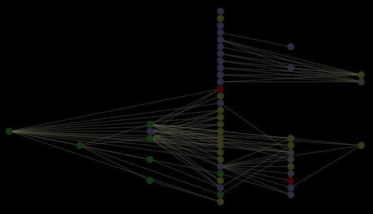

# Werkruimten en visualisaties{#workspaces-and-visualizations}

{{eol}}

Conceptuele informatie over werkruimten en visualisaties.

In de volgende afbeelding ziet u een afhankelijkheidskaart waarvan de knooppunten de werkruimten, rapporten, menuopties en algemene lagen vertegenwoordigen die in het profiel zijn gedefinieerd. Deze optie werkt alleen als de optie [!DNL Query Model] weergaveoptie is ingeschakeld.

>[!NOTE]
>
>Als de [!DNL Query Model] de weergaveoptie is niet ingeschakeld wanneer u [!DNL Workspaces and Visualizations] verschijnt er een foutbericht.

* Een grijze knoop vertegenwoordigt een werkruimte of een rapport.
* Een geel-groene knoop vertegenwoordigt een menuoptie.
* Een rood knooppunt vertegenwoordigt een werkruimte, rapport, menuoptie of globe laag met een verbroken of cirkelvormige afhankelijkheid of een andere fout.

>[!NOTE]
>
>Omdat de gebiedsdeelkaart wordt ontworpen om acyclische gebiedsdelen aan te passen, kunnen de knopen betrokken bij cirkelgebiedsdelen niet behoorlijk op de kaart tonen. U kunt naar kringafhankelijkheden zoeken door &quot;kringafhankelijkheden&quot; te typen in het dialoogvenster [!DNL Search] tekstvak. Voor meer informatie over de [!DNL Search] functie, zie [Zoeken binnen een kaart](../../../../../home/c-get-started/c-admin-intrf/c-dataset-mgrs/c-dep-maps/t-srch-map.md#task-a1e7065a538d46c78a7d28676d880dfb).

Voor beschrijvingen van andere knooppunten op de kaart raadpleegt u [Componenten van querymodel](../../../../../home/c-get-started/c-admin-intrf/c-dataset-mgrs/c-dep-maps/c-qry-mod-comp.md#concept-32c6dadd32f74179b026c7e96d47710f).
