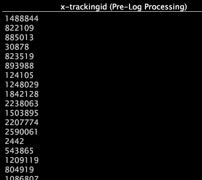

# Veldviewer{#field-viewer}

Een gebiedskijker is een lijst die de waarden van één of meerdere gegevensgebieden bevat.

De gebieden de waarvan waardenvertoning input of output van de het logboekbronnen van een dataset, transformaties, of uitgebreide afmetingen is. De naam van het gebied wordt getoond in de kolomrubriek, en elke rij bevat de waarde van het gebied voor één enkele rij van brongegevens. Omdat de gebiedskijkers u toelaten om de waarden van een gebied te zien, zijn zij nuttig in het schrijven van en het testen van [regelmatige uitdrukkingen](../../../../../home/c-dataset-const-proc/c-reg-exp.md#concept-070077baa419475094ef0469e92c5b9c).

U kunt een gebiedskijker als callout van een [!DNL Transformation Dependency] kaart of als standalone visualisatie van het [!DNL Admin] menu openen:

* Het creëren van een gebiedskijker van een [!DNL Transformation Dependency] kaart. Wanneer u een gebiedskijker van een [!DNL Transformation Dependency] kaart opent, is de kijker bevolkt automatisch gebaseerd op de logboekbron, de transformatie, of de afmeting die u met de rechtermuisknop aanklikt. Voor een logboekbron of een transformatie, zijn de gebieden in de kijker input of output van de logboekbron of transformatie. Voor een afmeting, zijn de gebieden input van de afmeting. U kunt gebieden toevoegen en verwijderen zoals gewenst.

* Het creëren van een gebiedskijker als standalone visualisatie. Wanneer u een gebiedskijker als standalone visualisatie opent, kunt u een [!DNL Log Processing Field Viewer] of een [!DNL Transformation Field Viewer]creëren. De kijker is leeg, en u moet de gewenste gebieden aan de kijker toevoegen. Voor een [!DNL Log Processing Field Viewer], kunt u gebieden van het [!DNL Log Processing.cfg] dossier of om het even welk [!DNL Log Processing Dataset Include] dossier toevoegen. Voor een [!DNL Transformation Field Viewer], kunt u gebieden van het [!DNL Transformation.cfg] dossier of om het even welk [!DNL Transformation Dataset Include] dossier toevoegen.

>[!NOTE]
>
>De kijkers van het gebied zijn geen lijstvisualisaties; daarom hebben zij niet de eigenschappen verbonden aan lijsten.

Voor informatie over het toevoegen van en het verwijderen van gebieden en het filtreren binnen een gebiedskijker, zie [Administratieve Interfaces](../../../../../home/c-get-started/c-admin-intrf/c-admin-intrf.md#concept-855c1a91e1a948969fab592adca15f74).
