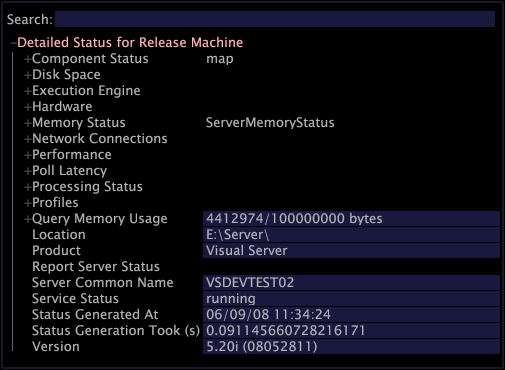

# Gedetailleerde statusinterface{#detailed-status-interface}

{{eol}}

De gedetailleerde interface van de Status is nuttig voor het oplossen van problemenfouten of andere kwesties met de servercomputers van de Data Workbench.

Dit omvat alle [!DNL Transform] profielen die op die computers worden uitgevoerd, of [!DNL Report] computers die cliënten van de server van de Data Workbench zijn. U hebt toegang tot [!DNL Master Server] en [!DNL Query Server Detailed Status] interfaces door [!DNL Admin] -menu. Om toegang te krijgen tot [!DNL Detailed Status] interface voor andere computers, in [!DNL Servers Manager], klikt u met de rechtermuisknop op het knooppunt van de server waarvan u de status wilt weergeven en klikt u op **[!UICONTROL Detailed Status]**. Zie [Serverbeheer](../../../home/c-get-started/c-admin-intrf/c-svrs-mgr.md#concept-2dfff1ca5bce470a8ee854ed57cbe5ba).

Voor meer informatie over de server van de Data Workbench, zie *Handleiding voor installatie en beheer van serverproducten*.

>[!NOTE]
>
>De informatie bijwerken in een [!DNL Detailed Status] interface, klikt u met de rechtermuisknop op de **[!UICONTROL Detailed Status]** kop en klik op **[!UICONTROL Refresh]**.

In de volgende tabel worden de taken weergegeven die u kunt voltooien met de opdracht [!DNL Detailed Status] interface.

<table id="table_E685F31DCDB343F49FFA1019F2E8DA85"> 
 <thead> 
  <tr> 
   <th colname="col1" class="entry"> Deze taak uitvoeren... </th> 
   <th colname="col2" class="entry"> Doe dit... </th> 
  </tr> 
 </thead>
 <tbody> 
  <tr> 
   <td colname="col1"> 
Om elke computercomponent en zijn huidige status te tonen 
 </td> 
   <td colname="col2"> 
Klikken  Componentstatus. 
 </td> 
  </tr> 
  <tr> 
   <td colname="col1"> 
Om te tonen hoeveel geheugen op de computer wordt gebruikt 
 </td> 
   <td colname="col2"> 
Klikken  Geheugenstatus &gt;  Adresruimte laden. 
 
Voor meer informatie over het controleren van de lading van de adresruimte, zie <i>Handleiding voor installatie en beheer van serverproducten</i>. 
 </td> 
  </tr> 
  <tr> 
   <td colname="col1"> 
Om te bepalen of de computer wordt gevormd om de /3GB Schakelaar te gebruiken 
 </td> 
   <td colname="col2"> 
Klikken  Geheugenstatus &gt;  Procesadresruimte. 
 
Als de  Totaal het gebied toont meer dat 300000 KB, uw computer wordt gevormd om de /3GB Schakelaar te gebruiken. 
 
Voor meer informatie over de /3GB Schakelaar, zie <i>Handleiding voor installatie en beheer van serverproducten</i>. 
 </td> 
  </tr> 
  <tr> 
   <td colname="col1"> 
Om de hoeveelheid schijfruimte en geheugen te controleren die wordt gebruikt om elke dimensie evenals die op te slaan die wordt gebruikt om de namen van zijn elementen op te slaan 
 </td> 
   <td colname="col2"> 
Klikken  Prestaties &gt;  Dimension &gt;  Schijfgebruik &gt; <i>&lt; profielnaam&gt; </i>of  Prestaties &gt;  Dimension &gt;  Geheugenverbruik &gt; <i>&lt; profielnaam&gt;</i>. 
 
De  Schijfgebruik de velden bevatten de naam en de hoeveelheid schijfruimte (in MB) die nodig is om elke dimensie op te slaan. De aantallen van het grote schijfgebruik kunnen vraagtijden negatief beïnvloeden omdat de server van de Data Workbench door alle gegevens moet lezen om verwante vragen te voltooien. Het verminderen van het schijfgebruik voor een afmeting kan de tijd verminderen het neemt om verwante vragen te voltooien. 
 
De  Geheugenverbruik in de velden geeft u het aantal elementen in elke dimensie op en de hoeveelheid geheugen die nodig is om de lijst met elementnamen op te slaan. Grote aantallen elementen kunnen de hoeveelheid geheugen die tijdens een vraag wordt gebruikt negatief beïnvloeden omdat de server van de Data Workbench door elk element moet lezen. Het verminderen van het aantal elementen in een dimensie kan de tijd verminderen het neemt om verwante vragen te voltooien. 
 
Voorbeeld: <code>+&nbsp;Performance
      &nbsp;&nbsp;&nbsp;&nbsp;&nbsp;-&nbsp;Dimensions&nbsp;
      &nbsp;&nbsp;&nbsp;&nbsp;&nbsp;&nbsp;&nbsp;&nbsp;&nbsp;&nbsp;-&nbsp;Disk&nbsp;Usage
      &nbsp;&nbsp;&nbsp;&nbsp;&nbsp;&nbsp;&nbsp;&nbsp;&nbsp;&nbsp;&nbsp;&nbsp;&nbsp;&nbsp;&nbsp;&nbsp;&nbsp;&nbsp;&nbsp;-&nbsp;ProfileName
      &nbsp;&nbsp;&nbsp;&nbsp;&nbsp;&nbsp;&nbsp;&nbsp;&nbsp;&nbsp;&nbsp;&nbsp;&nbsp;&nbsp;&nbsp;&nbsp;&nbsp;&nbsp;&nbsp;&nbsp;&nbsp;&nbsp;&nbsp;&nbsp;&nbsp;-&nbsp;DimensionName&nbsp;1.386&nbsp;MB
      &nbsp;&nbsp;&nbsp;&nbsp;&nbsp;&nbsp;&nbsp;&nbsp;&nbsp;&nbsp;&nbsp;&nbsp;&nbsp;&nbsp;&nbsp;&nbsp;&nbsp;&nbsp;&nbsp;&nbsp;&nbsp;&nbsp;&nbsp;&nbsp;&nbsp;&nbsp;.&nbsp;.&nbsp;.
      &nbsp;&nbsp;&nbsp;&nbsp;&nbsp;&nbsp;&nbsp;&nbsp;&nbsp;&nbsp;-&nbsp;Memory&nbsp;Usage
      &nbsp;&nbsp;&nbsp;&nbsp;&nbsp;&nbsp;&nbsp;&nbsp;&nbsp;&nbsp;&nbsp;&nbsp;&nbsp;&nbsp;&nbsp;&nbsp;&nbsp;&nbsp;&nbsp;-&nbsp;ProfileName
      &nbsp;&nbsp;&nbsp;&nbsp;&nbsp;&nbsp;&nbsp;&nbsp;&nbsp;&nbsp;&nbsp;&nbsp;&nbsp;&nbsp;&nbsp;&nbsp;&nbsp;&nbsp;&nbsp;&nbsp;&nbsp;&nbsp;&nbsp;&nbsp;&nbsp;-&nbsp;DimensionName&nbsp;21&nbsp;elements,&nbsp;0.001&nbsp;MB
      &nbsp;&nbsp;&nbsp;&nbsp;&nbsp;&nbsp;&nbsp;&nbsp;&nbsp;&nbsp;&nbsp;&nbsp;&nbsp;&nbsp;&nbsp;&nbsp;&nbsp;&nbsp;&nbsp;&nbsp;&nbsp;&nbsp;&nbsp;&nbsp;&nbsp;&nbsp;.&nbsp;.&nbsp;.</code> 
 </td> 
  </tr> 
  <tr> 
   <td colname="col1"> 
Om het CPU-gebruik voor de fasen binnen de verwerking en transformatie van logbestanden te controleren 
 </td> 
   <td colname="col2"> 
Klikken  Prestaties &gt;  CPU-verbruik &gt;  Logverwerking &gt; <i>&lt; profielnaam&gt;</i> of  Prestaties &gt;  CPU-verbruik &gt;  Transformatie &gt; &lt; profielnaam&gt;. 
 
Elk van deze reeksen gebieden voorziet u van het Gebruik van cpu (in seconden) voor elk van de stadia binnen de Verwerking en de Transformatie van het Logboek. 
 
Voorbeeld: <code>+&nbsp;Performance
      &nbsp;&nbsp;&nbsp;&nbsp;&nbsp;-&nbsp;CPU&nbsp;Usage&nbsp;
      &nbsp;&nbsp;&nbsp;&nbsp;&nbsp;&nbsp;&nbsp;&nbsp;&nbsp;&nbsp;-&nbsp;Log&nbsp;Processing
      &nbsp;&nbsp;&nbsp;&nbsp;&nbsp;&nbsp;&nbsp;&nbsp;&nbsp;&nbsp;&nbsp;&nbsp;&nbsp;&nbsp;&nbsp;-&nbsp;ProfileName&nbsp;158.9&nbsp;sec
      &nbsp;&nbsp;&nbsp;&nbsp;&nbsp;&nbsp;&nbsp;&nbsp;&nbsp;&nbsp;&nbsp;&nbsp;&nbsp;&nbsp;&nbsp;&nbsp;&nbsp;&nbsp;&nbsp;&nbsp;-&nbsp;Built-in&nbsp;158.1&nbsp;sec
      &nbsp;&nbsp;&nbsp;&nbsp;&nbsp;&nbsp;&nbsp;&nbsp;&nbsp;&nbsp;&nbsp;&nbsp;&nbsp;&nbsp;&nbsp;&nbsp;&nbsp;&nbsp;&nbsp;&nbsp;&nbsp;&nbsp;&nbsp;&nbsp;&nbsp;-&nbsp;StageName&nbsp;13.0&nbsp;sec
      &nbsp;&nbsp;&nbsp;&nbsp;&nbsp;&nbsp;&nbsp;&nbsp;&nbsp;&nbsp;&nbsp;&nbsp;&nbsp;&nbsp;&nbsp;&nbsp;&nbsp;&nbsp;&nbsp;&nbsp;.&nbsp;.&nbsp;.
      &nbsp;&nbsp;&nbsp;&nbsp;&nbsp;&nbsp;&nbsp;&nbsp;&nbsp;&nbsp;&nbsp;&nbsp;&nbsp;&nbsp;&nbsp;&nbsp;&nbsp;&nbsp;&nbsp;&nbsp;-&nbsp;Log&nbsp;Processing\ProfileName&nbsp;0.8&nbsp;sec
      &nbsp;&nbsp;&nbsp;&nbsp;&nbsp;&nbsp;&nbsp;&nbsp;&nbsp;&nbsp;&nbsp;&nbsp;&nbsp;&nbsp;&nbsp;&nbsp;&nbsp;&nbsp;&nbsp;&nbsp;&nbsp;&nbsp;&nbsp;&nbsp;&nbsp;-&nbsp;StageName&nbsp;0.8&nbsp;sec</code> 
 
De tijd die het neemt om een vraag te voltooien is gewoonlijk evenredig aan de totale grootte van al uw dimensies. Na het herzien van de grootte van elke afmeting, kunt u beoordelen of een bepaalde afmeting nuttig genoeg is en vaak genoeg gebruikt om de prestatieskosten van de afmeting te rechtvaardigen. Als dit niet het geval is, kunt u de dimensie in het dialoogvenster  Profielbeheer.
Een afmeting de waarvan lijst van elementnamen te groot (namelijk meer dan 128 MB) is kan "uit geheugen"fouten veroorzaken zelfs als het totale gebruik van de adresruimte niet dichtbij de grens is. 
 
Ook, als u een de servercluster van de Data Workbench maar gebruikt geen gecentraliseerde normalisatie gebruikt, heeft een afmeting de waarvan lijst van elementennamen groot is een significante invloed op verzendt geheugenbegrotingen. Voor meer informatie over gecentraliseerde normalisatie, zie <i>Configuratie-handleiding voor gegevensset</i>. Als de hoeveelheid geheugen die wordt vereist om alle lijsten van samengevoegde elementennamen op te slaan meer dan 100 MB over alle servers in de cluster is, zou u "Send geheugenbegroting kunnen ontvangen overschrijden"fouten zelfs wanneer de vraagactiviteit licht is. Bijvoorbeeld, als u een vier-server cluster met meer dan 25 MB op elke server hebt die wordt gebruikt om de lijsten van elementennamen op te slaan, zou u fouten kunnen ontvangen. 
 </td> 
  </tr> 
  <tr> 
   <td colname="col1"> 
Om de tijd te controleren die in de Verwerking en de Transformatie van het Logboek wordt doorgebracht 
 </td> 
   <td colname="col2"> 
Klikken  Prestaties &gt;  CPU-verbruik &gt;  Logverwerking &gt; <i>&lt; profielnaam&gt;</i> of  Prestaties &gt;  CPU-verbruik &gt;  Transformatie &gt; <i>&lt; profielnaam&gt;</i>. 
 
Door de velden in deze secties te bekijken, kunt u filters en transformaties identificeren die een negatief effect kunnen hebben op de hoeveelheid tijd die nodig is voor logverwerking en -transformatie. Vervolgens kunt u ontwerpbeslissingen nemen over afzonderlijke filters en transformaties met lange verwerkingstijd. 
 </td> 
  </tr> 
  <tr> 
   <td colname="col1"> 
Om schijfruimtegebruik te controleren en vraagsnelheid te verhogen 
 </td> 
   <td colname="col2"> 
Klikken  Prestaties &gt;  Logverwerkingsvelden &gt; <i>&lt; profielnaam&gt;</i>. 
 
Elk regelitem in deze sectie komt overeen met een parameter in het dialoogvenster  Logverwerking.cfg bestand. Door deze velden te bekijken, kunt u zien hoeveel geheugen elke parameter gebruikt. Vervolgens kunt u ontwerpbeslissingen nemen met betrekking tot afzonderlijke items die vrij groot zijn. 
 </td> 
  </tr> 
  <tr> 
   <td colname="col1"> 
De verstreken tijd van vorige opwerking of transformatie bepalen 
 </td> 
   <td colname="col2"> 
Klikken  Verwerkingsstatus &gt; <i>&lt; profielnaam&gt;</i> &gt;  Historie van verwerkingsmodus. 
 
 
     <ul id="ul_B7CC0DF54E004C72B220F928CF223F8E"> 
      <li id="li_2707D8C0D52A44C8BADA4D9AFB5EB2BC">Echt - tijd dat de server van de Data Workbench voor het maken van vragen beschikbaar was. </li> 
      <li id="li_3A3B490D70864A259780FC9FFC9AC15E">Snelle Invoer - deze tijd plus de Snelle tijd van de Fusie is de totale tijd nodig voor de verwerking van de dataset. </li> 
      <li id="li_B754C6DECD924170A15721EA4C942E3D">Snel samenvoegen - totale tijd die nodig is voor het transformeren van de gegevensset. </li> 
     </ul> 
 </td> 
  </tr> 
  <tr> 
   <td colname="col1"> 
Problemen met 's middags diagnosticeren 
 </td> 
   <td colname="col2"> 
Klikken  Verwerkingsstatus &gt; <i>&lt; profielnaam&gt;</i> &gt;  Vanaf het tijdstip &gt;  Bronnen per. 
 
Door de tijden voor elke bron te controleren, kunt u bepalen welke bron(nen) de algemene evaluatie negatief kan beïnvloeden. Vervolgens kunt u de problemen met die specifieke bronnen aanpakken. 
 </td> 
  </tr> 
  <tr> 
   <td colname="col1"> 
Om te schatten hoe lang een lopende vraag duurt te voltooien 
 </td> 
   <td colname="col2"> 
Klikken  Uitvoerengine. 
 
De  Tijdstip gegevenswissing in het veld wordt een schatting gegeven van de tijd die een query nodig heeft om te voltooien. 
 </td> 
  </tr> 
  <tr> 
   <td colname="col1"> 
Alle profielen weergeven die op deze computer beschikbaar zijn en gegevens over de status weergeven 
 </td> 
   <td colname="col2"> 
Klikken  Profielen. 
 </td> 
  </tr> 
  <tr> 
   <td colname="col1"> 
De replicatiestatus weergeven 
 </td> 
   <td colname="col2"> 
Klikken  Componentstatus. 
 
Controleer de status van de component Replicate. Als de Replicatie loopt, O.K. toont. Als de component Replicate is mislukt, wordt een foutbericht weergegeven. 
 </td> 
  </tr> 
  <tr> 
   <td colname="col1"> 
Naar weergave  Rapportserver status van  Rapport computer die met de server van de Data Workbench verbindt 
 </td> 
   <td colname="col2"> 
Klikken  Serverstatus rapporteren. 
 
Deze sectie van het  Gedetailleerde status interface bevat een kopie van de  Server.cfg rapporteren bestand, informatie over het aantal rapporten dat wordt uitgevoerd (huidig segment) en informatie over de meest recente fout (laatste fout). 
 
Voor stappen om de  Server.cfg rapporteren bestand, zie de <i>Data Workbench Report Guide</i>. 
 
 
Opmerking: Als de  Serverstatus rapporteren wordt niet weergegeven in het dialoogvenster  Gedetailleerde status interface, kunt u de server van de Data Workbench aan vertoning moeten vormen  Serverstatus rapporteren. Zie voor stappen de <i>Data Workbench Report Guide</i>. 
 
 </td> 
  </tr> 
  <tr> 
   <td colname="col1"> 
Informatie over geheugengebruik voor Transformatie weergeven 
 </td> 
   <td colname="col2"> 
Klikken  Verwerkingsstatus &gt;  Transformeren. 
 
Voor meer informatie over Transformatie, zie <i>Handleiding voor installatie en beheer van serverproducten</i> en de <i>Configuratie-handleiding voor gegevensset</i>. 
 </td> 
  </tr> 
  <tr> 
   <td colname="col1"> 
Als u de  Gedetailleerde status interface als  *.cfg bestand dat kan worden geopend in een teksteditor, zoals Kladblok, of dat kan worden gedistribueerd aan anderen 
 </td> 
   <td colname="col2"> 
Klik met de rechtermuisknop op de knop  Gedetailleerde status kop en klik op  Kopie opslaan als. 
 
Opmerking:  
Klik met de rechtermuisknop op de knop  Gedetailleerde status koptekst en klikken  Opslaan tot <i>servernaam</i>/Status/ werkt niet in het dialoogvenster  Gedetailleerde status interface. Het volgende foutbericht wordt weergegeven: 
 
Kan /Status/ niet opslaan. 403 Verboden 
 
 </td> 
  </tr> 
  <tr> 
   <td colname="col1"> 
Naar weergave  Rijen per logbron metrisch 
 </td> 
   <td colname="col2"> 
Als Rijen per bron van het Logboek metrisch in Gedetailleerde Status moet worden gemeld, dan zou de beheerder van de Data Workbench "Van het Bron Logboek identiteitskaart"moeten bepalen en een unieke naam in het Logboek van het Profiel van de Douane Verwerking.cfg verstrekken. 
 </td> 
  </tr> 
 </tbody> 
</table>
