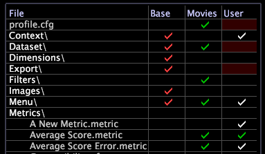

# Profielbeheer{#profile-manager}

{{eol}}

De map en bestandsnamen die in de implementatie zijn opgenomen, worden links in Profielbeheer weergegeven.

De profielen waaruit de toepassing bestaat, worden weergegeven als afzonderlijke kolommen in het dialoogvenster [!DNL Profile Manager]. Deze profielen bevatten meerdere overgeërfde profielen en één werkprofiel.

>[!NOTE]
>
>Uw werkprofiel (of een datasetprofiel of een rol-specifiek profiel) is het profiel dat u laadt wanneer u Data Workbench opent.

De vinkjes (en de kleuren ervan) geven de profielmap(pen) aan op de Data Workbench-server en de Data Workbench-computer waarin elk bestand zich bevindt, of meerdere kopieën van een bestand bestaan en of deze meerdere kopieën dezelfde datum en tijd hebben als gewijzigd. Deze bestanden worden tijdens het downloaden van profielen gesynchroniseerd tussen de Data Workbench-server en de Data Workbench-computers.

Hier volgt een voorbeeld [!DNL Profile Manager] voor een HBX uitvoering:

Van de [!DNL Profile Manager] kunt u alle andere beheerprogramma&#39;s openen (bijvoorbeeld de [!DNL Dimensions Manager] of [!DNL Reports Manager]), die slechts bepaalde delen van [!DNL Profile Manager]. U kunt ook nieuwe profielmanagers tot stand brengen. Zie [Nieuwe profielmanagers maken](../../../../home/c-get-started/c-intf-anlys-ftrs/c-cstm-prof-files-mgrs/c-new-prof-mgrs.md#concept-0021e006523e4d538aaa16322731d9d3).

Een vinkje naast een bestandsnaam in een bepaalde kolom geeft aan dat een bestand met die naam zich in de map bevindt die in die kolom (profiel) staat. Als u naar rechts gaat in het dialoogvenster [!DNL Profile Manager], hebben de bestanden voorrang op de bestanden aan de linkerkant, dat wil zeggen dat elk overgeërfd profiel is gebaseerd op de profielen aan de linkerkant in het dialoogvenster [!DNL Profile Manager]. Als u bijvoorbeeld een bestand hebt met dezelfde naam en op dezelfde locatie in het dialoogvenster [!DNL Base] profiel (kolom) en in de [!DNL User] profiel (kolom), het bestand in het dialoogvenster [!DNL User] wordt gebruikt in plaats van het bestand in het dialoogvenster [!DNL Base] profiel.

## Zoeken naar profielen {#section-91f873f1d7ed4fd6a5f3c3ac08cfa623}

In Data Workbench 5.5 is een zoekveld toegevoegd voor het zoeken naar de vereiste profielen in het dialoogvenster [!DNL Profile Manager].

De volgende typen kolommen worden weergegeven in de [!DNL Profile Manager]:

* De *overgenomen profielnaam* kolommen bevatten vinkjes voor bestanden die zich in elke profielmap bevinden. Geërfde profielen omvatten interne profielen die door Adobe worden verstrekt evenals om het even welke bedrijf-specifieke of rol-specifieke profielen die u creeert en handhaaft. In het bovenstaande voorbeeld omvatten de interne profielen Basis, Verkeer, Waarde, Marketing, enzovoort. De interne [!DNL Base] profiel, dat de basisbouwstenen en configuratieinformatie bevat nodig om uw toepassing van de Adobe in werking te stellen, wordt voorzien van elke implementatie. De andere interne profielen bevatten elementen (werkruimten, metriek, afgeleide dimensies, etc.) met betrekking tot bepaalde soorten informatie, zoals Webverkeer of marketing. Adobe biedt alleen profielen die geschikt zijn voor het type gegevens dat u analyseert en voor uw branche.

   >[!NOTE]
   >
   >Intern profiel (opgegeven door Adobe) kan standaard niet worden gewijzigd. Alle aanpassing moet in uw dataset of rol-specifieke profielen of andere profielen voorkomen die u creeert. Als u een nieuwe toepassing maakt en een intern profiel moet wijzigen, moet u de parameter Interne profielen wijzigen wijzigen in het dialoogvenster [!DNL Insight.cfg] bestand. Zie [Configuratieparameters van Insight](../../../../home/c-get-started/c-insght-config-param.md#concept-14da97d0756348e885c08ca9e866074b) voor meer informatie . Neem voordat u dit doet contact op met de Adobe Consulting Services.

* De *naam van werkprofiel* Deze kolom, die altijd de op één na laatste kolom is, bevat vinkjes voor bestanden die zich in de map van het huidige werkprofiel bevinden. In het bovenstaande voorbeeld is het werkprofiel Dataset. Uw werkprofiel is of een datasetprofiel of een rol-specifiek profiel. De bestanden in deze map hebben voorrang op bestanden met dezelfde naam in een overgenomen profielmap.
* De [!DNL User] De kolom, die altijd de laatste kolom is, bevat vinkjes voor bestanden en mappen die zich als lokale bestanden in de map Gebruiker\*profielnaam* bevinden. De mappenstructuur van de map Gebruiker bootst de structuur van het werkprofiel na en elke map Gebruiker\*profile name* bevat lokale kopieën van de werkruimten, metriek, afmetingen en configuratiebestanden voor dat specifieke profiel. Deze lokale kopieën hebben voorrang op bestanden met dezelfde namen in een overgeërfde map of werkprofielmap. De bestanden in het dialoogvenster [!DNL User] Er is een kolom gemaakt en alleen opgeslagen in de map Gebruiker\*profielnaam*, of deze bevindt zich in een intern profiel of in een werkprofiel en in de map Gebruiker\*profielnaam*. De bestanden in elke map kunnen al dan niet identiek zijn en hebben mogelijk dezelfde datum en tijd als gewijzigd.

   >[!NOTE]
   >
   >
   >    
   >    
   >    * Om te vermijden veranderend slechts plaatselijk uw dataset, negeert de server van de Data Workbench de lokale exemplaren van [!DNL profile.cfg] en bestanden in de mappen DataSet of Export in de map User\*profile name*. Genegeerde bestanden worden aangeduid met een rode achtergrond in het dialoogvenster [!DNL User] en een waarschuwing &quot;Genegeerd in de gebruikerslijst&quot; in het contextmenu. Als u de wijzigingen die u aanbrengt in uw lokale kopieën van deze bestanden wilt implementeren, moet u deze opslaan in uw werkprofiel zodat ze kunnen worden gesynchroniseerd met de Data Workbench-server. Ga voor stappen om bestanden op te slaan naar uw werkprofiel naar [Bestanden publiceren naar uw werkprofiel](../../../../home/c-get-started/c-admin-intrf/c-prof-mgr/t-pub-files-wkg-prof.md#task-a0106e010c834d16bd60eef4721b6af9).
   >    
   >    * Een afbreekstreepje (-) in plaats van een vinkje in een kolom geeft een leeg (nulbyte) bestand aan. Data Workbench behandelt bestanden met een lengte van nul bytes als niet bestaand, zodat u deze kunt gebruiken om bestanden die in een profiel aan de linkerkant zijn opgenomen, te verbergen. Zie [Bestanden verbergen met lege bestanden (nulbyte)](../../../../home/c-get-started/c-admin-intrf/c-prof-mgr/c-empty-files.md#concept-e776fac9e5904bed8c13b9d5eb17c491).

## Bestandsversies bepalen {#section-225d732246b94cbe87acdfa9c881d6af}

Zoals vermeld in het vorige gedeelte, worden de vinkjes in het [!DNL Profile Manager] zijn van kleur-gecodeerd zodat u gemakkelijk kunt identificeren waar een dossier verblijft en of de veelvoudige exemplaren van een dossier op verschillende tijden werden gewijzigd.

Als een bestand of samengevouwen map precies hetzelfde is als het bestand of de map aan de linkerkant, heeft het bestand of de map dezelfde kleurcontrole als het bestand of de map in die kolom (profiel). Als deze verschilt van een bestand of map tot aan de linkerkant, of als het bestand of de map alleen in het dialoogvenster [!DNL User] is, is het vinkje wit.

De [!DNL Profile Manager] in het bovenstaande voorbeeld wordt het volgende aangegeven:

* Een wit vinkje voor de [!DNL A New Metric.metric] wordt alleen weergegeven in het dialoogvenster [!DNL User] kolom, die erop wijst dat u slechts een lokaal exemplaar van dat dossier-het niet gepubliceerd (of geupload) aan de server van de Data Workbench voor andere gebruikers van de Data Workbench om hebt toegang.

* Markeringen controleren voor de [!DNL Average Score.metric] de bestandsnaam wordt weergegeven in de films en [!DNL User] kolommen. Het vinkje in het [!DNL User] dezelfde kleur heeft als het vinkje in de kolom Films. Dit geeft aan dat de lokale kopie van het bestand dezelfde datum en tijd heeft als het bestand in de map Films.

* Markeringen controleren voor de [!DNL Average Score Error.metric] de bestandsnaam wordt weergegeven in de films en [!DNL User] kolommen. Het vinkje in het [!DNL User] is wit, wat aangeeft dat de lokale kopie van het bestand een andere datum of tijd heeft als gewijzigd dan het bestand in de map Films.

