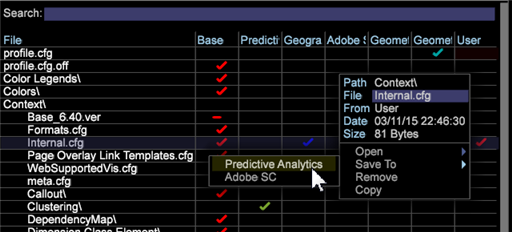

# Profielen vergrendelen in het werkstation{#locking-profiles-in-the-workstation}

{{eol}}

Het bestand Internal.cfg dat in Profielbeheer wordt toegepast, voorkomt dat gebruikers uw aangepaste profielen wijzigen met de managers Profiel, Dimension, Rapporten, Werkruimten, Metriek en Filters.

U kunt voorkomen dat profielbestanden worden gewijzigd en overschreven wanneer u de beheerprogramma&#39;s gebruikt door de **[!DNL Internal.cfg]** naar uw aangepaste profiel in Profielbeheer. Met dit configuratiebestand wordt voorkomen dat gebruikers meerdere bestanden overschrijven wanneer ze in de beheerprogramma&#39;s werken (die via het **Beheer** > **Profiel** ).

**Profielen vergrendelen in Profielbeheer**

1. Klik met de rechtermuisknop in de werkruimte **Beheer** > **Profielbeheer**.

1. In de **Profielbeheer**, klikt u met de rechtermuisknop **[!DNL Context > Internal.cfg]** en **Lokaal maken**.

1. Klik met de rechtermuisknop op het vinkje in **Gebruiker** kolom en opslaan naar een `<custom profile>`.

**Opmerking**: Alleen wijzigingen in profielbestanden door de beheerders zijn niet mogelijk bij het opslaan van het dialoogvenster **[!DNL Internal.cfg]** naar een aangepast profiel in Profielbeheer. U kunt werkruimten nog steeds vanaf de werkbalk op de server opslaan met de opdracht **Opslaan op server** gebruiken.
