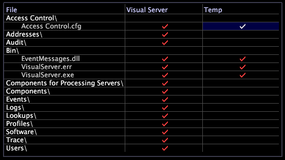

# Serverbestandsbeheer{#server-files-manager}

Met de Server Files Manager kunt u vanaf elke geoorloofde Data Workbench op afstand de servercomputers van de Data Workbench beheren en beheren door toegang te verlenen tot alle mappen en bestanden in de installatiemap van het product, inclusief configuratie- en opzoekbestanden.

U kunt tot [!DNL Server Files Manager] toegang hebben gebruikend [!DNL Admin] menu evenals door de knoop van de servercomputer van de Data Workbench in [!DNL Servers Manager] met de rechtermuisknop aan te klikken en **[!UICONTROL Server Files]** te klikken.

>[!NOTE]
>
>U kunt nieuwe serverbestandsbeheerders maken die geselecteerde mappen weergeven. Zie [Nieuwe serverbestandsbeheer maken](../../../home/c-get-started/c-intf-anlys-ftrs/c-cstm-prof-files-mgrs/c-new-svr-files-mgrs.md#concept-6e8f63273109443699a8f61b1a2ea816).

De linkerkolom van [!DNL Server Files Manager] maakt een lijst van dossier en omslagnamen. De vinkjes in het midden en in de rechterkolom geven aan waar in de bestandsstructuur deze mappen en bestanden zich bevinden.

Als een bestand zich in de installatiemap van het product bevindt, bevat de kolom *servernaam* (bijvoorbeeld Data Workbench-server) een vinkje. Als een dossier op de computer van de gebruiker van de Data Workbench in *de installatiemap* \ Temp verblijft, bevat [!DNL Temp] kolom een vinkje. De kleur van de vinkjes geeft aan of de bestanden die zich op verschillende locaties bevinden, tegelijkertijd zijn gewijzigd.

* Een rood vinkje in de kolom van de servernaam wijst erop dat de omslag of het dossier op de de servercomputer van de Data Workbench verblijft.
* Een rood vinkje in de kolom [!DNL Temp] geeft aan dat de lokale kopie van het bestand of de map dezelfde datum en tijd als het bestand of de map op de servercomputer van de Data Workbench heeft.
* Een wit vinkje in de [!DNL Temp] kolom wijst erop dat het dossier of de omslag in *de installatiemap van de Data Workbench* \ Temp een verschillende Gewijzigde datum en tijd dan het dossier of de omslag op de servercomputer van de Data Workbench hebben.

In de volgende afbeelding ziet u de [!DNL Server Files Manager] met zowel rode als witte vinkjes:

**Mappen en bestanden beheren met de opdracht[!DNL Server Files Manager]**

U kunt [!DNL Server Files Manager] gebruiken om folders en dossiers op een de servercomputer van de Data Workbench te manipuleren.

De volgende lijst maakt een lijst van de taken die kunnen worden voltooid gebruikend [!DNL Server Files Manager]:

<table id="table_D217AE5A878542EC8B604812A61819C3"> 
 <thead> 
  <tr> 
   <th colname="col1" class="entry"> Deze taak uitvoeren... </th> 
   <th colname="col2" class="entry"> Doe dit... </th> 
  </tr> 
 </thead>
 <tbody> 
  <tr> 
   <td colname="col1"> 
De bestanden in een map weergeven 
 </td> 
   <td colname="col2"> 
Klik op de mapnaam om de inhoud ervan weer te geven. 
 </td> 
  </tr> 
  <tr> 
   <td colname="col1"> 
De inhoud van een map verbergen 
 </td> 
   <td colname="col2"> 
Klik op de mapnaam. 
 </td> 
  </tr> 
  <tr> 
   <td colname="col1"> 
Details over een map weergeven 
 </td> 
   <td colname="col2"> 
Klik met de rechtermuisknop op de cel naast de map in de servernaam of de kolom  Temp. U ziet de volgende informatie: 
 
    <ul id="ul_2DA5C8D0E95F4BCC8F7E25D05F00EB02"> 
     <li id="li_3FDECC14D62543B183C3509C338DF432">Pad. Het pad van de map. </li> 
     <li id="li_9CF3989FD9E2427995F070E043FAD02C">Dir. De naam van de map. </li> 
     <li id="li_68AAA11907404D0BBF407ECD7CA2E467">Van. De locatie van de directory, Extern of Temperatuur. </li> 
     <li id="li_CB4AEEC89E424868B758465EC0B701B5">Datum (alleen kolom Temperatuur). Aanmaakdatum of de datum van de laatste revisie van de lokale kopie. </li> 
    </ul> </td> 
  </tr> 
  <tr> 
   <td colname="col1"> 
Details over een bestand weergeven 
 </td> 
   <td colname="col2"> 
Klik met de rechtermuisknop op het vinkje naast het bestand in de servernaam of de kolom  Temperatuur. U ziet de volgende informatie: 
 
 
     <ul id="ul_C4E6CB86D1774D739B5ECF48AF8DB628"> 
      <li id="li_7A6D39CF8C064FDDAB87F8D4E50FA832">Pad. Het pad van het bestand. </li> 
      <li id="li_9C735B6F0A2541F1992B845359C3685A">Bestand. De naam van het bestand. </li> 
      <li id="li_3EB903E4F4C44A6093732C588F0125EF">Van. De locatie van de directory, Extern of Temperatuur. </li> 
      <li id="li_C1FED4F98F854D5892DBAD9F9E1D47B8">Datum. Datum van de laatste revisie van het bestand. </li> 
      <li id="li_7477C727C62F4406BB2026063E41F2AE">Grootte. De grootte van het bestand. </li> 
     </ul> 
 </td> 
  </tr> 
  <tr> 
   <td colname="col1"> 
Een map downloaden naar uw lokale computer 
 </td> 
   <td colname="col2"> 
Klik met de rechtermuisknop op het vinkje in de kolom <i>servernaam</i> voor deze map en klik op  Directory lokaal maken. Een vinkje voor de directory verschijnt in de kolom  Temperatuur. 
 </td> 
  </tr> 
  <tr> 
   <td colname="col1"> 
Een bestand downloaden naar uw lokale computer 
 </td> 
   <td colname="col2"> 
Klik met de rechtermuisknop op het vinkje in de kolom <i>servernaam</i> voor dit bestand en klik op  Lokaal maken. Een vinkje voor het bestand wordt weergegeven in de kolom  Temperatuur. 
 </td> 
  </tr> 
  <tr> 
   <td colname="col1"> 
Het laatste gedeelte van een logbestand downloaden naar uw lokale computer 
 </td> 
   <td colname="col2"> 
Als u wilt voorkomen dat een volledig logbestand moet worden gedownload (met name wanneer u weet dat het foutbericht zich bijna aan het einde van het bestand bevindt), klikt u met de rechtermuisknop op het vinkje in de kolom Servernaam voor het bestand, klikt u op  Tail en selecteert u de grootte van het gedeelte dat u wilt downloaden. Een vinkje voor het bestand wordt weergegeven in de kolom  Temperatuur. Het lokale bestand bevat alleen de hoeveelheid gegevens die u hebt opgegeven, vanaf het einde van het bestand. 
 </td> 
  </tr> 
  <tr> 
   <td colname="col1"> 
Een directory openen 
 </td> 
   <td colname="col2"> 
Klik met de rechtermuisknop op het vinkje voor de map in de kolom  Temp en klik  Openen &gt;  map. 
 </td> 
  </tr> 
  <tr> 
   <td colname="col1"> 
Een bestand openen 
 </td> 
   <td colname="col2"> 
Klik met de rechtermuisknop op het vinkje voor het bestand in de kolom  Temp, klik op  Openen en klik vervolgens in  Data Workbench,  in Kladblok of  map. 
 </td> 
  </tr> 
  <tr> 
   <td colname="col1"> 
Een lokale kopie van een map opslaan op de Data Workbench-server 
 </td> 
   <td colname="col2"> 
Klik met de rechtermuisknop op het vinkje voor de map in de kolom  Temp en klik  Map opslaan naar &gt; <i>&lt; profielnaam</i>. 
 </td> 
  </tr> 
  <tr> 
   <td colname="col1"> 
Een lokale kopie van een bestand opslaan op de Data Workbench-server 
 </td> 
   <td colname="col2"> 
Klik met de rechtermuisknop op het vinkje voor het bestand in de kolom  Temp en klik op  Opslaan naar &gt; <i>&lt; profielnaam</i>. 
 </td> 
  </tr> 
  <tr> 
   <td colname="col1"> 
Een lokale kopie van een map of bestand verwijderen 
 </td> 
   <td colname="col2"> 
Klik met de rechtermuisknop op het vinkje voor de map of het bestand in de kolom  Temp en klik op  Verwijderen. 
 </td> 
  </tr> 
  <tr> 
   <td colname="col1"> 
Een bestand kopiëren en plakken als e-mailbijlage in Microsoft Outlook 
 </td> 
   <td colname="col2"> 
Klik met de rechtermuisknop op het vinkje voor het bestand in de kolom  Temperatuur en klik op  Kopiëren. Druk in de tekst van de e-mail op Ctrl+v om het bestand bij te voegen. 
 </td> 
  </tr> 
 </tbody> 
</table>
