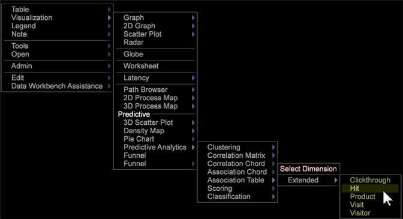
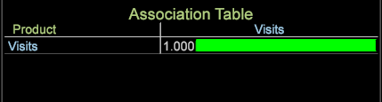

# Visualisatie van de Associatietabel{#association-table-visualization}

De visualisatie van de Lijst van de Vereniging laat u metriek met metriek, afmetingen, en afmetingselementen associëren gebruikend het V algoritme van Cramer.

De lijst van de Vereniging vergelijkt waarden met de berekening van V van Cramer eerder dan het gebruiken van de correlatiecoëfficiënt van Pearson zoals gebruikt in de [Matrijs](https://docs.adobe.com/content/help/en/data-workbench/using/client/analysis-visualizations/correlation-analysis/c-correlation-analysis.html) van de Correlatie en de visualisaties van het [Koord](https://docs.adobe.com/content/help/en/data-workbench/using/client/analysis-visualizations/c-chord-visualization.html) van de Correlatie (deze kunnen metriek slechts vergelijken, terwijl de de Lijst van de Vereniging en [het Koord](../../../home/c-get-started/c-analysis-vis/associations-chord.md#concept-51d0bda998474dd5946cc2a9b8393445) van de Vereniging metriek, afmetingen, en elementen kunnen vergelijken).

## Bouw een Lijst van de Vereniging {#section-87ed12ccc1af4196a1b6534e621c4cbb}

De lijst van de Vereniging vergelijkt metriek over een telbare of niet-telbare dimensie. De lijst kan worden gewijzigd om verenigingen binnen de visualisatie te benadrukken door kleur te plukken of het terug te geven als tekstkaart, warmtekaart, of allebei.

1. Open een Associatietabel.

   Klik met de rechtermuisknop [!DNL Visualization] > [!DNL Predictive Analytics] > [!DNL Association Table].

   

1. Selecteer een uitgebreide afmeting-een Clickthrough, Hit, Product, Bezoek, of de afmeting van de Bezoeker. Een lijst van de Vereniging zal met de uitgebreide die afmeting openen in de hoek wordt geïdentificeerd en zijn bijbehorende metrisch die in zowel de rij als de kolom wordt geplaatst.

   

   De lijst van Verenigingen gebruikt V van Cramer als symmetrische correlatie, resulterend in geselecteerde metriek, afmetingen, en elementenwaarden die in zowel de kolommen als de rijen van een Lijst van de Vereniging worden weerspiegeld. Bijvoorbeeld, die gebruikt het **Product** **[!UICONTROL Visits]** uitgebreide afmeting metrisch als bijbehorende metrisch in zowel de rij als de kolom van de lijst, resulterend in een perfecte maar nutteloze vergelijking (1.00) omdat de vergeleken waarden identiek zijn.

1. Voeg meer waarden aan de Lijst van de Vereniging toe.

   Klik in een kolom of rij met de rechtermuisknop aan en selecteer **toevoegen Metrisch** of **toevoegen Dimensie**. U kunt metriek en afmetingen van een paneel van de **Vinder** ook slepen. De elementen van de afmeting kunnen ook van een open lijst aan de lijstvisualisatie worden gesleept en worden gelaten vallen.

   

   >[!NOTE]
   >
   >Er is een grens van tien rijen en kolommen toegestaan in de Lijst van de Vereniging.

