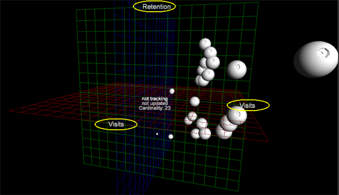

# 3D-verstrooiingspunten{#d-scatter-plots}

Een 3D-spreidingsgrafiek geeft de elementen van een gegevensdimensie (zoals dagen of Referral-site) weer op een driedimensionaal raster waar de x-, y- en z-as verschillende metriek vertegenwoordigen.

Net als bij [Spreidingspal 2D](https://experienceleague.adobe.com/docs/data-workbench/using/client/t-open-ins.html#Scatter_Plots) is deze visualisatie handig wanneer u probeert de relatie te begrijpen tussen grote aantallen ongelijksoortige items die verschillende meetwaarden gebruiken.

**U kunt als volgt de visualisatie voor 3D-spreidingspunten gebruiken:**

1. Open een nieuwe werkruimte.

   Nadat u een nieuwe werkruimte hebt geopend, moet u mogelijk **Toevoegen** > **Tijdelijk ontgrendelen** klikken.
1. Klik met de rechtermuisknop en selecteer **Visualisatie** > **3D-verstrooiingsperceel**.

   Er wordt een menu geopend met **[!UICONTROL Dimensions]**.

1. Selecteer een dimensie voor de vraag.

   Met het 3D-spotje worden de standaardmeetgegevens voor die dimensie geopend.

   

   Als u het menu **[!UICONTROL Days]** selecteert, wordt het volgende 3D-diagram met deze standaardwaarden weergegeven op de volgende assen: **[!UICONTROL x=Visits]**, **[!UICONTROL y=Retention]** en **[!UICONTROL z=Visits]**.

1. Metriek wijzigen. Klik met de rechtermuisknop op het metrische label in de x-, y- of z-as en selecteer **[!UICONTROL Change Metric]**. Selecteer vervolgens een andere metrische waarde voor de geselecteerde as.

   

   >[!IMPORTANT]
   >
   >
   >    
   >    
   >    * Sleep metrisch aan één van de drie asetiketten en laat vallen het om de geselecteerde as in gelaten vallen metrisch te veranderen.
   >    * Sleep metrisch overal anders op visualisatie en laat vallen het om straal metrisch voor die as te veranderen.
   >    * Sleep een dimensie naar een willekeurige locatie op de visualisatie en zet deze neer om de dimensie voor de visualisatie te wijzigen.

1. Wijzig de Straal. Klik met de rechtermuisknop op de titel boven aan de pagina (na de geselecteerde dimensie) en selecteer **[!UICONTROL Change Radius Metric]**.

   De straalmetrische waarde bepaalt de grootte van het geplot punt dat op de metrische selectie wordt gebaseerd. De relatieve positie van punten verandert niet in het verstrooiingsperceel, maar de uitgezette puntgrootten binnen de visualisatie nemen toe op basis van de metrische waarde.

   

1. Pas **[!UICONTROL Orthographic Camera]** toe. Met deze optie kunt u de uitgezette punten identificeren in verhouding tot hun werkelijke perspectief op basis van de meetstraal om driedimensionale vervorming te voorkomen.

   Wanneer het 3D-spreidingspad voor het eerst wordt weergegeven, wordt het weergegeven in een driedimensionale draaiende projectie, die enige vervorming veroorzaakt voor punten die dichter bij het perspectief worden geplaatst, of in een virtuele &quot;camera&quot;. (De plots die zich dichter bij de camera bevinden, worden veel groter weergegeven dan de punten die verder van de camera worden geroteerd.)

   U voorkomt deze perspectiefvervorming door met de rechtermuisknop op de titel te klikken en een optie in het menu te selecteren. **[!UICONTROL Orthographic Camera]** Hierdoor kunt u de driedimensionale objecten in tweedimensionale dimensies weergeven. Hierdoor worden de uitgezette punten als vlak weergegeven en worden de punten ten opzichte van de straal weergegeven, waarbij de driedimensionale verschuivingen worden verminderd.

1. Selecteer punten in het spreidingsperceel.

   * **Een punt of groep punten** verwijderen: Klik op het punt.
   * **Een ander punt of een groep punten aan de selectie** toevoegen:  **Ctrl** +  **** Klikpunt of  **Ctrl** +  **** slepen over meerdere punten.

   * **Een punt of groep punten uit de selectie** verwijderen:  **Houd Shift**  ingedrukt en  **** klik met het  **muispunt of houd** **Shift** ****  ingedrukt ensleep over verschillende punten.

<!--  -->
