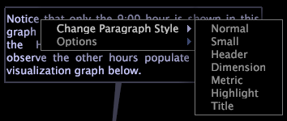

# Tekstannotaties{#text-annotations}

Tekstannotaties zijn vensters waarin u willekeurige tekst kunt invoeren om beschrijvende informatie of opmerkingen aan een werkruimte toe te voegen.

U verplaatst of bewerkt tekstannotaties binnen een werkruimte op dezelfde manier als andere typen visualisatie. U kunt ook de vormgeving van de tekst opmaken, de tekst een naam geven, bewerken of de tekstannotatie opslaan die u aan een werkruimte toevoegt. Tekstannotaties kunnen ook worden geëxporteerd naar Microsoft Excel en worden gegenereerd en gedistribueerd door [!DNL Report].

Voor meer informatie over [!DNL Reports], zie *de Gids van het Rapport van het Inzicht*.

## Tekst {#section-8ecc44e0eeb24c5990050102013c0aed} toevoegen of bewerken

* Klik in de tekst om de bewerkingsmodus te activeren en te beginnen met typen.

   >[!NOTE]
   >
   >Tekstannotaties ondersteunen basisbewerkingsfuncties, zoals knippen (Ctrl+X), kopiëren (Ctrl+c), plakken (Ctrl+v), Ongedaan maken (Ctrl+z), Opnieuw (Ctrl+Shift+z), Sectie selecteren (klikken+slepen) en Alles selecteren (Ctrl+a). Zie [Werken met tekst in Windows](../../../../home/c-get-started/c-wk-win-wksp/c-work-text-win.md#concept-f1222434bf954767808e94b955945c8d).

## Opmaak toepassen op alinea&#39;s {#section-27744c1589134aa3918aa8787429c0dc}

1. Klik in de tekst met de rechtermuisknop op de alinea die u wilt opmaken.
1. Klik op **[!UICONTROL Change Paragraph Style]** > *&lt;**[!UICONTROL text style]**>*.

## Opmaak toepassen op selecties {#section-4032ecbcc0064e5c96504c15b6f481bf}

1. Klik en sleep in de tekst om de tekst te selecteren die u wilt opmaken.
1. Klik met de rechtermuisknop op de selectie en klik op **[!UICONTROL Change Selection Style]** > *&lt;**[!UICONTROL text style]**>*.

## Instellingen voor tekstomloop wijzigen {#section-56948687d47349fc8ba21e108fd13cc1}

Met deze optie bepaalt u of en hoe de tekst in de annotatie om de visualisaties in de werkruimte loopt.

* Klik met de rechtermuisknop in de tekst, klik op **[!UICONTROL Options]** > **[!UICONTROL Word Wrap]** en klik vervolgens op de gewenste optie:

   * **Geen:** deze optie verwijdert tekstterugloop uit deze aantekening.
   * **Beide kanten:** Deze optie staat de tekst binnen de annotatie toe om rond beide kanten van visualisaties in de werkruimte te lopen.
   * **Beste zijde: met** deze optie kan de tekst in de annotatie slechts om één zijde van de visualisaties in de werkruimte lopen.

## Kolominstellingen wijzigen {#section-5cd3f3d63cf64119a2fcec371e33b734}

Met deze optie bepaalt u het aantal kolommen waarin de tekst in de annotatie moet worden weergegeven.

* Klik met de rechtermuisknop in de tekst, klik op **[!UICONTROL Options]** > **[!UICONTROL Columns]** en klik vervolgens op de gewenste optie:

   * **Automatisch: met** deze optie selecteert u de meest geschikte kolomindeling voor de breedte en lengte van de tekst.
   * **1-4:Met** deze opties kunt u de tekst weergeven in één, twee, drie of vier kolommen.

## Exporteren naar Microsoft Excel {#section-b239057b822348849fd17a83c3a03c22}

Zie [Venstergegevens exporteren](../../../../home/c-get-started/c-wk-win-wksp/c-exp-win-data.md#concept-8df61d64ed434cc5a499023c44197349) voor informatie over het exporteren van vensters.
