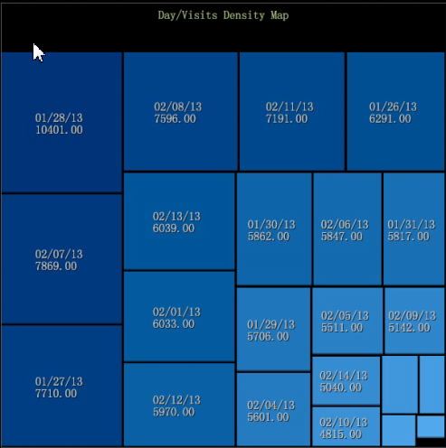

# Dichtheid-kaart{#density-map}

De visualisatie van de dichtheidskaart toont elementen als in de schaduw gestelde rechthoeken binnen een vierkante kaart.

De grootte van de rechthoeken is afhankelijk van elementenwaarden, waar de grotere waarden door rechthoeken van groter gebied worden vertegenwoordigd. Gelijkaardig aan een cirkelgrafiek, staat deze visualisatie u toe om snel te zien welke elementen het grootste percentage van de geselecteerde afmeting vormen.

Om een dichtheidskaart te creëren:

1. Open een nieuwe werkruimte.

   Na het openen van een nieuwe werkruimte, kunt u moeten klikken **toevoegt** > **tijdelijk opent**.
1. Klik op **[!UICONTROL Visualization]** > **[!UICONTROL Density Map]**.

1. Selecteer een **[!UICONTROL Dimension]** optie in het menu.

   Bijvoorbeeld, selecteer **[!UICONTROL Time]** > **[!UICONTROL Days]**.

   In tegenstelling, zou het selecteren van **[!UICONTROL Time]** **[!UICONTROL Hours]** > u meer elementen met kleinere waarden geven die als kleinere rechthoeken tonen.

   >[!NOTE]
   >
   >U zult een afmeting met veelvoudige elementen per uw behoeften willen plukken. De huidige grens is 200 van de grootste elementen voor elke afmeting.

1. U kunt afmetingsmeningen veranderen door **[!UICONTROL Visualization]** > te openen **[!UICONTROL Table]** en over elementen van de lijst te selecteren aan vertoning in de kaart.

   

   De kaart zal aan selecties van de lijst antwoorden.

1. Het verbergen over kleine elementen zal hun naam en waarde in tekst tonen die dichtbij de muiscurseur verschijnt.
1. De elementen van het masker door met de rechtermuisknop aan te klikken en te selecteren **[!UICONTROL Mask]**, dan kies een optie.

   

   Om alle gemaskeerde knopen te tonen, selecteer **[!UICONTROL Unhide All]**.

1. De elementen van de schijnwerper door met de rechtermuisknop aan te klikken en te selecteren **[!UICONTROL Spotlight]**, dan kies een optie. Met Spotlight kunt u elementen in een bereik markeren en dimmen.
1. Voeg een kleurenlegende aan de werkruimte toe. U kunt waarden in de kaart identificeren gebruikend de kleurenlegende.

   U kunt een kleurenlegende aan de werkruimte toevoegen en de knopen zullen kleur veranderen die op de extra afmeting van gegevens wordt gebaseerd.
1. Verander de afmeting of metrisch door de kaarttitel met de rechtermuisknop aan te klikken en van het menu te selecteren.

   

1. Voeg callouts toe door een cel met de rechtermuisknop aan te klikken en te selecteren **[!UICONTROL Add Callout]**. U kunt uit verschillende types of visualisaties van het menu selecteren.

   

1. Zoals in alle visualisaties, kunt u boven de titelbar voor basisbevelen aan Sluiten met de rechtermuisknop aanklikken, sparen, de Uitvoer naar Microsoft Excel, Orde, Exemplaar, minimaliseren, en Zonder grenzen om een visualisatie zonder een grens te tonen.

   

1. De kaart van de Dichtheid laat u veelvoudige elementen selecteren en schrappen gelijkend op andere visualisaties:

* Klik met de linkermuisknop om een element te selecteren.
* CTRL + klik om veelvoudige elementen te selecteren.
* Verschuiving + klik om een element te schrappen.
* Klik binnen geselecteerde elementen met de rechtermuisknop aan om een menu te openen. Dan kies **[!UICONTROL Deselect]** of **[!UICONTROL Deselect All]** om geselecteerde elementen te ontruimen.

## Extra opties {#section-d77defb012424de4a7ced8e5c93115bc}

Klik de Kaart van de Dichtheid met de rechtermuisknop aan om een menu met deze opties te openen:

<table id="table_3ADA85031C834792BFD041E186962A41"> 
 <thead> 
  <tr> 
   <th colname="col1" class="entry"> Optie </th> 
   <th colname="col2" class="entry"> Beschrijving </th> 
  </tr>
 </thead>
 <tbody> 
  <tr> 
   <td colname="col1"> Oproepen toevoegen </td> 
   <td colname="col2">Voeg een tekst of grafisch als callout in de visualisatie toe om een element verder te identificeren of te beschrijven. 
U kunt een leeg Metrische Legende, Lijst, de Grafiek van de Lijn, of het Plot van de Scatter ook selecteren dat op het geselecteerde element in de Kaart van de Dichtheid wordt gebaseerd. U kunt metriek en afmetingen aan deze lege visualisaties dan toevoegen zoals nodig. 
 </td> 
  </tr> 
  <tr> 
   <td colname="col1"> Masker </td> 
   <td colname="col2">Met maskerende opties kunt u geselecteerde elementen verbergen. Klik met de rechtermuisknop aan om de opties van het Masker te tonen. 
 Verberg dit element-kies deze optie om één enkel element te maskeren dat u hebt geselecteerd. 
 
 De huid selecteerde-kiest deze optie om veelvoudige elementen te maskeren die u hebt geselecteerd. 
 
 Bovenkant weergeven— Verkies deze optie om slechts de hoogste 100, 50, 25, of 10 hoogste elementen te tonen die op de waarden in de Kaart van de Dichtheid worden gebaseerd. 
 
 Toon bodem-kies deze optie om slechts de bodem 100, 50, 25, of 10 hoogste elementen te tonen die op de waarden in de Kaart van de Dichtheid worden gebaseerd. 
 </td> 
  </tr> 
  <tr> 
   <td colname="col1"> Spotlight </td> 
   <td colname="col2"> Met Spotlight kunt u elementen in een bereik markeren en dimmen. Klik met de rechtermuisknop om een menu met opties te openen. 
 Bovenkant weergeven— Verkies deze optie om slechts de hoogste 100, 50, 25, of 10 hoogste elementen te benadrukken die op waarden in de Kaart van de Dichtheid worden gebaseerd. 
 
 Toon bodem-kies deze optie om slechts de bodem 100, 50, 25, of 10 hoogste elementen te benadrukken die op waarden in de Kaart van de Dichtheid worden gebaseerd. 
 </td> 
  </tr> 
  <tr> 
   <td colname="col1"> 
Deselecteren 
 
Alles deselecteren 
 </td> 
   <td colname="col2"> 
 Selecteer deze bevelen om het huidige element te schrappen, indien geselecteerd, of schrap alle elementen die worden geselecteerd. 
 </td> 
  </tr> 
 </tbody> 
</table>

