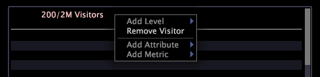

# Detail tabel{#detail-table}

Met detailtabellen kunt u aanvullende informatie over een subset gegevens weergeven. Deze informatie wordt gedefinieerd door de selecties die u in andere visualisaties maakt.

De extra informatie die u ziet is een steekproef van alle beschikbare gegevens.

In de volgende tabel worden de elementen van een detailtabel beschreven.

<table id="table_C88C7F7F5AEA4820B908923E45CC0A62"> 
 <thead> 
  <tr> 
   <th colname="col1" class="entry"> Element </th> 
   <th colname="col02" class="entry"> Kleur </th> 
   <th colname="col2" class="entry"> Beschrijving </th> 
  </tr> 
 </thead>
 <tbody> 
  <tr> 
   <td colname="col1"> 
Niveau 
 </td> 
   <td colname="col02"> 
Roze 
 </td> 
   <td colname="col2"> 
Om het even welke telbare afmeting waarvoor u gedetailleerde attributen en metrische informatie wilt bekijken. Het niveau wordt voorafgegaan door het aantal elementen dat wordt weergegeven uit het aantal beschikbare elementen, bijvoorbeeld 6/444 geeft aan dat 6 elementen worden weergegeven uit een mogelijk 444. In het bovenstaande voorbeeld geven de niveau-bezoekers aan dat alle opgegeven details zijn gebaseerd op bezoekers. In de Level Page Views wordt aangegeven dat alle details zijn gebaseerd op de paginaweergave. Het tegelijkertijd bekijken van meerdere niveaus is nuttig wanneer u gegevens wilt analyseren die verschillende telbare ouders hebben. 
 </td> 
  </tr> 
  <tr> 
   <td colname="col1"> 
Kenmerk 
 </td> 
   <td colname="col02"> 
Groen 
 </td> 
   <td colname="col2"> 
Elke dimensie die een-op-een-op-een met het niveau is, zoals Stad voor bezoekers. In elke rij wordt het element weergegeven dat betrekking heeft op elk element van het niveau dat u hebt geselecteerd. In het bovenstaande voorbeeld geven de kenmerken Domein en Stad het domein en de stad voor elk van de voorbeeldbezoekers weer. 
 </td> 
  </tr> 
  <tr> 
   <td colname="col1"> 
Metrisch 
 </td> 
   <td colname="col02"> 
Blauw 
 </td> 
   <td colname="col2"> 
Metrische details over het niveau dat u hebt geselecteerd. In het bovenstaande voorbeeld wordt met het niveau ingesteld op Bezoekers het aantal paginaweergaven voor een individuele bezoeker weergegeven in de weergave Metrische pagina, terwijl het niveau Paginaweergaven het detailniveau voor elk van deze paginaweergaven bevat. 
 </td> 
  </tr> 
 </tbody> 
</table>

Stel dat u werkt met websitegegevens en wilt weten welke pagina&#39;s bezoekers in bepaalde steden en bepaalde domeinen gedurende een bepaald tijdsbestek hebben bezocht.

Eerst moet u een visualisatie creëren die het tijdkader toont waarin u geinteresseerd bent, dan moet u dat tijdkader selecteren. Nu kunt u een detaillijst toevoegen om de gewenste details voor een steekproefaantal bezoekers in de dataset te bekijken.

Voer de volgende stappen uit om de hierboven beschreven details weer te geven:

1. Klik met de rechtermuisknop in de tabel met details en klik op **[!UICONTROL Add Level]** > **[!UICONTROL Visitor]**.
1. Klik met de rechtermuisknop in de tabel met details en klik op **[!UICONTROL Add Level]** > **[!UICONTROL Page View]**.
1. Klik met de rechtermuisknop op de niveaukop **[!UICONTROL Visitors]** en klik op **[!UICONTROL Add Attribute]** > **[!UICONTROL Geography]** > **[!UICONTROL Domain]**.
1. Klik met de rechtermuisknop in de kop Bezoekersniveau en klik op **[!UICONTROL Add Attribute]** > **[!UICONTROL Geography]** > **[!UICONTROL City]**.
1. Klik met de rechtermuisknop in de kop Bezoekersniveau en klik op **[!UICONTROL Add Metric]** > **[!UICONTROL Page Views]**.
1. Klik met de rechtermuisknop in de kop Pagina-weergaven en klik op **[!UICONTROL Add Attribute]** > **[!UICONTROL Page]** > **[!UICONTROL Page]**.

In de volgende voorbeeldwerkruimte ziet u de verwante details voor een willekeurige sampling van zes bezoekers van de site tijdens de opgegeven tijdsperiode.

## Een niveau {#section-f948d3361fd84906ac4d9ebce520bfd0} toevoegen

* Klik met de rechtermuisknop in de tabel met details en klik op **[!UICONTROL Add Level]** > *&lt;**[!UICONTROL dimension name]***.

## Een niveau {#section-a8c820e0b656451e98e5ea75373edefc} verwijderen

* Klik met de rechtermuisknop op de kop van het bestaande niveau en klik op **[!UICONTROL Remove Level]** > *&lt;**[!UICONTROL dimension name]***.

## Kenmerken en meetgegevens toevoegen {#section-cdda2df3c9a448d5b9770686c8b8efb3}

* Klik met de rechtermuisknop op een kenmerk of metrische kop en klik op **[!UICONTROL Add Attribute]** > *&lt;**[!UICONTROL attribute name]**>* of **[!UICONTROL Add Metric]** > *&lt;**[!UICONTROL metric name]***.

## Kenmerken en meetgegevens verwijderen {#section-4002ac957a2846678f9940270987d651}

* Klik met de rechtermuisknop op de kolom die u wilt verwijderen en klik op **[!UICONTROL Remove Attribute]** > *&lt;**[!UICONTROL attribute name]*** of **[!UICONTROL Remove Metric]** > *&lt;**[!UICONTROL metric name]**>*.

## Exporteren naar Microsoft Excel {#section-a9eaba63c88a4598836a34669ba8cac1}

Zie [Venstergegevens exporteren](../../../home/c-get-started/c-wk-win-wksp/c-exp-win-data.md#concept-8df61d64ed434cc5a499023c44197349) voor informatie over het exporteren van vensters.
