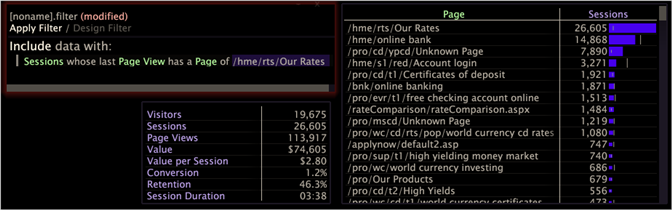

# Werken met filtervoorwaarden{#working-with-filter-conditions}

{{eol}}

Informatie over het werken met filtervoorwaarden, zoals het maken van een nieuw filter en het toevoegen van een voorwaarde aan een nieuw filter.

## Een filter maken {#section-70ba51ae625e493fa3ca70b93ffba406}

* Open een filtereditor in uw werkruimte door met de rechtermuisknop te klikken **[!UICONTROL Add Visualization]** > **[!UICONTROL Filter Editor]**.

   -of-

* Als er al een filtereditor is geopend en een filter is geladen, klikt u met de rechtermuisknop op de naam van het huidige filter en klikt u op **[!UICONTROL New Blank Filter]**.

## Een voorwaarde toevoegen aan een nieuw filter {#section-50986db80f1148c489630a8a63fe9f28}

1. Maak een nieuw filter. Zorg ervoor dat Ontwerpfilter is gemarkeerd (in tegenstelling tot Filter toepassen) om aan te geven dat u in de ontwerpfiltermodus werkt.
1. Klik met de rechtermuisknop in het gemarkeerde gebied **[!UICONTROL Right-click to build filter]** en selecteer een van de volgende opties:

   * Als u een insluitingsfilter wilt maken, klikt u op **[!UICONTROL Include group with]**.
   * Als u een uitsluitingsfilter wilt maken, klikt u op **[!UICONTROL Exclude group with]**.

1. Selecteer het type voorwaarde dat u aan het filter wilt toevoegen.

   In de volgende tabel vindt u een beschrijving van de beschikbare typen filtervoorwaarden:

<table id="table_3B35B57FF32349F09E91E8256FF1672A"> 
 <thead> 
  <tr> 
   <th colname="col1" class="entry"> Type voorwaarde </th> 
   <th colname="col2" class="entry"> Beschrijving </th> 
  </tr>
 </thead>
 <tbody> 
  <tr> 
   <td colname="col1"> 
werkruimte selecteren 
 </td> 
   <td colname="col2"> 
Definieert een filtervoorwaarde op basis van de selecties in de werkruimte. Deze optie is alleen beschikbaar als een of meer selecties in de werkruimte staan. 
 
Als u meer informatie over de selectie wilt weergeven, klikt u met de rechtermuisknop op de voorwaarde en klikt u op  Details weergeven. Er verschijnt een bijschrift voor de voorwaarde. 
 
Als u een andere selectie maakt in de werkruimte, kunt u de selectie toevoegen als een subvoorwaarde van de eerste selectie. De selecties worden gegroepeerd als logische AND's. Daarom moeten de gegevens die door de voorwaarde worden omvat of uitgesloten aan alle werkruimteselecties voldoen. 
 </td> 
  </tr> 
  <tr> 
   <td colname="col1"> 
ten minste één 
 </td> 
   <td colname="col2">Definieert een filtervoorwaarde op basis van het bestaan van ten minste één (willekeurig) element van een dimensie die u kiest. Als u de voorwaarde wilt bewerken, klikt u met de rechtermuisknop op de voorwaarde en klikt u op  Wijzigen voorwaarde aan. Klik op een van de beschikbare afmetingen. </td> 
  </tr> 
  <tr> 
   <td colname="col1"> 
formule 
 </td> 
   <td colname="col2"> 
Definieert een filtervoorwaarde op basis van de formule die u invoert. Het filter werkt alleen als u de juiste syntaxis gebruikt. 
 
 
Opmerking: Voor informatie over de syntaxis voor het definiëren van filters raadpleegt u <a href="../../../../home/c-get-started/c-qry-lang-syntx/c-syntx-fltr-exp.md#concept-72f2563f809747a2a3cff7ec72462a15"> Syntaxis voor filterexpressies</a>. 
 
 </td> 
  </tr> 
  <tr> 
   <td colname="col1"> 
metrische waarde 
 </td> 
   <td colname="col2"> 
Definieert een filtervoorwaarde op basis van een door u opgegeven metrische waarde. 
 
Voer de volgende stappen uit om de voorwaarde te definiëren: 
     <ul id="ul_B69D31258A36460E94535709239CD165"> 
      <li id="li_51317A681E654DD7A9D997DF9F2F22BA">Klikken met rechtermuisknop  [kies niveau] &gt;  Niveau wijzigen om het niveau en metrisch van een lijst van afmetingen in uw dataset te selecteren. </li> 
      <li id="li_975E56C335824FDCB988344952DE2E9F">Klikken met rechtermuisknop  [kies metrisch] &gt;  Metrisch wijzigen om metrisch van een lijst van metriek in uw dataset te selecteren. </li> 
      <li id="li_D00B3AF3D8DE472C9D0E9EABBBCAAF61">Klik met de rechtermuisknop op kleiner dan en klik op  Vergelijking wijzigen om een van de beschikbare vergelijkingsvoorwaarden te selecteren (minder dan, meer dan, exact, ten minste of ten hoogste). </li> 
      <li id="li_3334CE0A0950448590E5442AB243F46B">Typ de gewenste waarde voor metrisch. </li> 
     </ul> 
 </td> 
  </tr> 
  <tr> 
   <td colname="col1"> 
first/last 
 </td> 
   <td colname="col2"> 
Definieert een filter waarmee u een niveau met een opgegeven dimensie kunt opnemen of uitsluiten. U kunt bijvoorbeeld een eerste/laatste filter opgeven dat moet worden opgenomen (of uitgesloten): 
 
Sessies waarvan de laatste paginaweergave een pagina bevat van  /hme/rts/Onze tarieven. 
 
Een eerste/laatste voorwaarde definiëren: 
     <ul id="ul_5AD916DA093844B8AC70127B1EB9BFC8"> 
      <li id="li_AB9FF22ADC8843A79856FED60B9478FA">Kies  Inclusief groep met of  Groep uitsluiten met &gt;  first/last als een nieuwe voorwaarde in de Filtereditor. </li> 
      <li id="li_92F536FCC2A74DDE97F66C6C45ACC3DC">Klikken met rechtermuisknop  [kies container] &gt;  Container wijzigen om de container te selecteren. </li> 
      <li id="li_1E5DBE04ABC74D84B7C0EF6886CDB5DC">Klikken met rechtermuisknop  first of  last om het niveau te bepalen. </li> 
      <li id="li_8B73EBF5D06E4513B5F0376EB2805D1C">Klik met de rechtermuisknop om een dimensie op te geven en typ een waarde in het beschikbare veld. </li> 
      <li id="li_A9E02EF6C6004DDF9B00EB853B6E54EE">Klikken  Toepassen. </li> 
     </ul> 
 </td> 
  </tr> 
 </tbody> 
</table>

Het filter in dit voorbeeld definieert een eerste/laatste filter voor gebruikers wier laatste paginaweergave [!DNL /hme/rts/Our Rates]:

1. (Optioneel) Als u meer voorwaarden aan het filter wilt toevoegen, klikt u met de rechtermuisknop in het gebied van het venster waar u het filter maakt en selecteert u het type filter (zie Stap 2) en de voorwaardenregel (zie Stap 3).

   >[!NOTE]
   >
   >De veelvoudige integratievoorwaarden worden gegroepeerd als logische ORs. Daarom moeten de gegevens die door het filter worden opgenomen, ten minste aan een van de vastgestelde opnemingsvoorwaarden voldoen. De veelvoudige uitsluitingsvoorwaarden worden ook gegroepeerd als logische ORs. Om te worden uitgesloten, moeten de gegevens ten minste aan een van de uitsluitingsvoorwaarden voldoen.

Het filter in dit voorbeeld definieert een subset van gegevens die bestaat uit filmviewers (gebruikers) die een heleboel films hebben beoordeeld maar geen enkele film een hoge score hebben gegeven (4 of 5). Dit filter (op de juiste manier zeer moeilijk te gebruiken) bestaat uit twee voorwaarden:

* **Een voorwaarde voor metrische waarde:** De voorwaarde omvat gebruikers die minstens 500 films hebben beoordeeld.
* **Een voorwaarde voor het selecteren van de werkruimte:** De voorwaarde sluit gebruikers uit die een film een score van 4 of 5 hebben gegeven. De callout vertelt u dat 4 en 5 de elementen waren die van de dimensie van de Score werden geselecteerd.

## Filtervoorwaarde verwijderen {#section-3092e0d7ac624885b8fe24616279de13}

>[!NOTE]
>
>U kunt voorwaarden alleen verwijderen wanneer u in de ontwerpfiltermodus werkt. Als u een filter op uw werkruimte hebt toegepast, moet u de Filter van het Ontwerp klikken om op de wijze van de Filter van het Ontwerp terug te komen alvorens u één of meerdere voorwaarden van de filter kunt schrappen.

* Klik op de knop **x** links van de voorwaarde om deze te verwijderen.

## Een beschrijving van een voorwaarde bewerken {#section-5015fd2c88ed4b6a95be7f0d53be2db0}

U kunt beschrijvingen toevoegen aan elk van de voorwaarden die u aan een filter toevoegt. U kunt de beschrijvingen naar wens bewerken of verwijderen.

>[!NOTE]
>
>Beschrijvingen van voorwaarden worden alleen weergegeven wanneer u in de ontwerpfiltermodus werkt.

* Klik met de rechtermuisknop op de voorwaarde en klik op **[!UICONTROL Edit description]**.

   * Als u een beschrijving wilt toevoegen of bewerken, typt u de beschrijving in het dialoogvenster [!DNL Edit condition description] veld. De beschrijving wordt tussen aanhalingstekens boven de voorwaarde weergegeven in het venster van de filtereditor.

      

* Als u een beschrijving wilt verwijderen, klikt u op **[!UICONTROL Remove description]**. De voorwaarde blijft in het venster van de filterredacteur.
