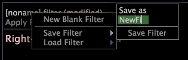

# Filters opslaan en laden{#save-and-load-filters}

Stappen voor het opslaan en laden van filters.

1. Klik met de rechtermuisknop op de naam van het filter (of **\[[!UICONTROL noname]\]** als het filter nieuw is) en klik op **[!UICONTROL Save Filter]**.
1. Voer in het label **[!UICONTROL Save As]** de gewenste naam voor het filter in.

   

1. Klik op **[!UICONTROL Save Filter]**.

   Nadat u het filter hebt opgeslagen, kunt u het laden voor gebruik in andere werkruimten. Zie hieronder hoe u een bestaand filter laadt of ernaar verwijst met de naam in een [!DNL Metric Editor]. Zie [Afgeleide metriek maken en bewerken](../../../../home/c-get-started/c-admin-intrf/c-prof-mgr/c-drvd-mtrcs.md#concept-e41723b342a849309874b26232224a40).

   >[!NOTE]
   >
   >Als u wilt dat alle gebruikers van een profiel de filters gebruiken die u opslaat, moet u deze naar het juiste profiel uploaden met de [!DNL Profile Manager]. Zie [Bestanden publiceren naar uw werkprofiel](../../../../home/c-get-started/c-admin-intrf/c-prof-mgr/t-pub-files-wkg-prof.md#task-a0106e010c834d16bd60eef4721b6af9).

**Een bestaand filter laden**

* Klik met de rechtermuisknop op de naam van het filter en klik op **[!UICONTROL Load Filter]** > **[!UICONTROL `<filter name>`]**.
