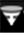

# Trechter-functies{#funnel-features}

{{eol}}

De Trechter-visualisatie bevat functies voor het bouwen van een trechter met meerdere dimensies, onbewerkte bezoekersaantallen, bezoekerspercentage bij elke stap en een apart bereik.

Hier zijn de basiskenmerken van de trechter visualisatie.

<table id="table_49A08740CEE74D64B6F9C37CD91F1AE5"> 
 <tbody> 
  <tr> 
   <td colname="col01">  </td> 
   <td colname="col1"> Eerste element </td> 
   <td colname="col2"> Eerste trede in het proces. </td> 
  </tr> 
  <tr> 
   <td colname="col01">  </td> 
   <td colname="col1"> Derde element </td> 
   <td colname="col2">De derde trede van de trechter in het proces. 

Opmerking: De geselecteerde elementen hoeven niet van dezelfde dimensie te zijn. 

</td> 
  </tr> 
  <tr> 
   <td colname="col01">  </td> 
   <td colname="col1"> Percentage doorvlucht </td> 
   <td colname="col2"> Percentage dat het gedefinieerde pad heeft voltooid dat in drie bereiken wordt weergegeven. </td> 
  </tr> 
  <tr> 
   <td colname="col01">  </td> 
   <td colname="col1"> Fallout Browser </td> 
   <td colname="col2">Uitvalpijl. Klik met de rechtermuisknop en selecteer  Padbrowser toevoegen om te zien welke andere padbezoekers hebben genomen. </td> 
  </tr> 
  <tr> 
   <td colname="col01">  </td> 
   <td colname="col1"> Percentage uitval </td> 
   <td colname="col2">Percentages die drie falloutbereik beschrijven voor gebruikers die het pad niet hebben voltooid. 
Percentages worden weergegeven in drie bereiken: 

 Het percentage uitval van de vorige stap. 

 Het percentage uitval van de eerste stap in de trechter. 

 Het percentage uitvalgevallen op basis van het totale aantal bezoekers. 
</td> 
  </tr> 
 </tbody> 
</table>

## Trechter-stappen {#section-96a6732558dd4740b73541844f06d3ef}

De schijven in een trechter vertegenwoordigen de stappen in de navigatie, de kegels vertegenwoordigen de doorval van de ene stap naar de volgende en de pijlen geven de uitval aan. Als u op een kegel klikt, selecteert u de gebruikers die op dat punt zijn gevallen en neemt u deze op in het huidige werkruimtefilter. Als u op een pijl klikt, selecteert u de bezoekers die zijn uitgevallen.

>[!NOTE]
>
>De taalvisualisatie heeft een limiet van acht stappen die kunnen worden toegepast.

## Aanvullende functies en functionaliteit van de trechter {#section-22a3582db8114ca8bce77f50bbbf296a}

* **De clip en het niveau van de trechter aanpassen**. Selecteer de optie Kanaal in het menu Visualisatie. Nadat de trechter is gemaakt, kunt u met de rechtermuisknop op de titel klikken om de clip en het niveau aan te passen aan elke meetbare metrische waarde in het systeem.

   

* **Meer elementen slepen**. Voeg meer elementen aan uw trechter toe door deze vanuit de Dimension-tabel naar de trechter te slepen met behulp van de `<Ctrl>` + `<Alt>` toetsen. U kunt meerdere stappen tegelijk slepen vanuit de Dimension-tabel door meerdere items te selecteren (met `<Ctrl>` + klik) en sleep hen dan aan de visualisatie van de Trechter gebruikend `<Ctrl>` + `<Alt>` toetsen..
* **Een stap verwijderen**: Elementen verwijderen door met de rechtermuisknop op de stap in de visualisatie te klikken en op **Ja**.

   

* **De stappen die u naar de trechter hebt gesleept opnieuw rangschikken**. Klik gewoon op de stap om deze te selecteren en sleep deze naar een andere positie om de stappen opnieuw te rangschikken.
* **Een padbrowser openen**. U kunt meer details zien over waar de klanten door of uit het proces door vallen [Een padbrowser toevoegen](../../../../home/c-get-started/c-analysis-vis/c-funnel-visualization/c-path-browser-funnel.md#concept-b0cedf7a28ae422696ded1258c9a4119) gebruiken.

* **Meer stappen toevoegen**. U kunt maximaal acht stappen toevoegen aan elke trechter-visualisatie.
* **De metrische waarde wijzigen**. Metrisch kan worden veranderd zodat tellen de stappen bezoeken of wat andere metrisch bij elke stap. De beschikbare opties variëren per dataset.
* **Weergeven in een tabelweergave**. Klik met de rechtermuisknop op de titel om het menu Trechter visualisatie weer te geven en klik op **[!UICONTROL Show Tabular View]**. In de tabelweergave kunt u **[!UICONTROL Show Graph View]** om terug te keren naar de grafische weergave van de trechter. Als u de tabelweergave wilt openen, klikt u met de rechtermuisknop op de titel en selecteert u Tabelweergave tonen in het menu.

* **Reeksen vergelijken**. Een efficiënte manier om twee vergelijkbare reeksen te vergelijken is om hun twee visualisaties naast elkaar weer te geven. U kunt zowel de tabelweergave als de grafiekweergave naast elkaar weergeven met de functie Dupliceren. Klik met de rechtermuisknop op de titel om deze te openen en selecteer Dupliceren in het menu.
