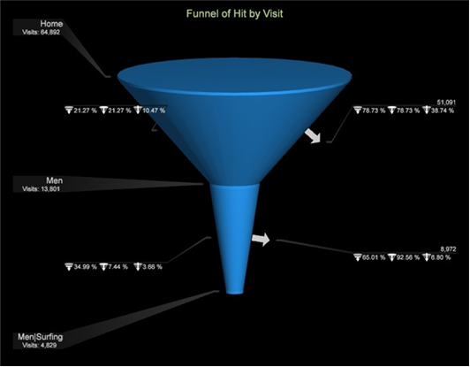

# Trechter visualisatie{#funnel-visualization}

Met de Trechter-visualisatie kunt u bepalen waar klanten een marketingcampagne verlaten of van een gedefinieerd conversiepad afwijken tijdens het werken met uw website- of kanaalcampagne.

De trechter visualisatie identificeert het omzetten paginameningen in aankopen, en laat u zien waar klanten uit het proces vallen. Door de zichtbaarheid bij elke stap in de beslissingen van de klant te verzamelen, kunt u begrijpen waar ze worden afgeschrikt, welk pad ze meestal volgen en wanneer klanten uw site verlaten en waar ze naartoe gaan.

Dankzij een goed begrip van klantnavigatie kunnen architecten webpagina&#39;s ontwerpen en als doel instellen op basis van trendmatige interesse en kunnen marketers de acties en interacties van klanten beter interpreteren tegen specifieke campagnes.

## Informatie over de trechter {#section-bf0ee36bb8ce47ec910ca23629e7c53a}

De Trechter visualisatie is veel als Browser van de Weg in het bouwen van een weg om de opeenvolging van klappen van uw bezoeker te analyseren, om te identificeren wie uit valt (die de weg verlaten) of door (wie de weg volgde) valt. Het identificeert ook waar de bezoekers na elke stap langs de campagneweg gingen, en waar zij navigeerden nadat zij uit of door de bepaalde stappen vielen.

Naast webgegevens kunt u trechter-analyse uitvoeren voor alle typen gegevens over meerdere kanalen die door het platform worden ondersteund. Om het even welk gegevenselement van om het even welke bron kan in de visualisatie van de Trechter worden vertegenwoordigd.

De Trechter visualisatie verstrekt diverse niveaus van gegevens:

* **[!UICONTROL Funnel by Visit]**. Deze trechter is gebaseerd op een interactie &quot;per bezoek&quot;.
* **[!UICONTROL Funnel by Visitor]**. Deze trechter is gebaseerd op een interactie &quot;per bezoeker&quot;. In deze weergave worden de gegevens weergegeven op basis van het bezoek dat door de bezoeker is georganiseerd.
* De **Afmeting** en **Afmeting Niveau**. De afmetingen van de trechter kunnen worden gewijzigd door Clickthrough, Hit, Product, Bezoek of het Niveau van de Bezoeker te kiezen.

* **Cijfers**. U kunt de onderliggende metriek van de Trechter van Bezoekingen veranderen die worden gebruikt om het trechter aan om het even welke metrisch in uw profiel te bouwen. De visualisatie van de Trechter staat u toe om in uw gegevens te boor en de patronen van bezoekers met veelvoudige basislijnmetriek te analyseren.

>[!NOTE]
>
>In de Trechter visualisatie, kunt u om het even welke afmeting op het telbare niveau toepassen. Dit is in tegenstelling tot Browser van de Weg en de Kaarten van het Proces die uw keus van metriek beperken. De analisten hebben veelvoudige keuzen wanneer het toepassen van metrisch in de visualisatie van de Trechter.
