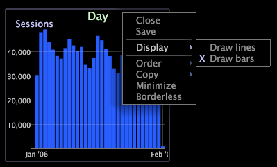

# Een grafiekweergave wijzigen{#change-a-graph-display}

Door gebrek, de vertoningsbars van grafiekvisualisaties, maar u kunt de bars gemakkelijk tonen als lijnen en vice versa.

Beide vertoningstypes worden getoond in het volgende voorbeeld.

**Om het vertoningstype te selecteren**

Klik het afmetingsetiket bij de bodem van de grafiek met de rechtermuisknop aan en klik **[!UICONTROL Display]** > **[!UICONTROL Draw lines]** of **[!UICONTROL Display]** > **[!UICONTROL Draw bars]**. Een X verschijnt links van de actieve vertoningswijze.

**De Bekleding van de gradiënt op een Grafiek**

U kunt een **Verloopbekleding** van het menu met de rechtermuisknop aanklikken en selecteren aan betere elementen van de meningsgrafiek.

* **Geen verloopbedekking**. Selecteer om bars zonder toegepaste gradiëntbekleding te tonen.
* **Achtergrond van links**. Selecteer om gradatie van kleuren over alle bars van links naar rechts te tonen.
* **Achtergrond van rechts**. Selecteer om gradatie van kleuren over alle bars van rechts naar links te tonen.
* **Cilinder**. Selecteer om gradatie van kleuren van het centrum van elke bar aan de rand van elke bar te tonen.

