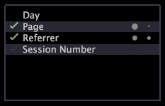

# Analyse met instructies{#guided-analysis}

Een geleide analyse visualisatie verstrekt aanwijzingen voor verdere analyse die op de selecties wordt gebaseerd die u in een werkruimte maakt.

Deze visualisatie helpt u identificeren welke dimensies u van meer informatie kunnen voorzien, namelijk die die het sterkst met uw selecties gecorreleerd zijn. De geleide analyse visualisatie in uw toepassing van de Adobe toont de dimensies relevant voor uw dataset, zoals in het volgende [!DNL Site] geleide analysenvisualisatie.

>[!NOTE]
>
>Als een afmetingsnaam in rood toont, wordt het niet bepaald in uw dataset.

Wanneer u een selectie maakt in een werkruimte, worden in de visualisatie met instructies links vinkjes weergegeven en rechts van de afmetingen punten die aangeven welke de meest relevante informatie bieden:

* **Controleer de** prijsaanduiding van de dimensies waarvan de waarden statistisch significant van de benchmark verschillen (dat wil zeggen, het verschil tussen de selectie en de benchmark is niet te wijten aan toeval).
* **De** cijfers geven de mate aan waarin de selectie afwijkt van de benchmark. De eerste punt geeft de U-statistiek aan en de tweede punt geeft de V-statistiek aan. Zie [De statistische maatregelen begrijpen](../../../../home/c-get-started/c-analysis-vis/c-guided-analysis/c-stat-measures.md#concept-ba2c7f417f384dc0a3438fcb6e268708). Hoe lichter en groter de stippen, hoe groter het verschil en des te relevanter de informatie voor de dimensie op basis van uw selectie (dat wil zeggen: heldere, grotere stippen zijn nuttiger informatie).
