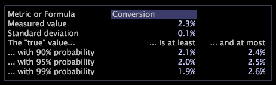

# Vertrouwelijke legenen{#confidence-legends}

Vertrouwen legends helpen u om de waarschijnlijkheid te bepalen dat de aantallen u ziet toe te schrijven aan toeval zijn en de mogelijke afwijkingen in de gegevens te begrijpen.

Zelfs als u geen steekproefgegevens bent, kunt u niet de aantallen van een specifieke tijdspanne of een ondergroep aan andere tijdsperioden of ondergroepen met volledig vertrouwen extrapoleren. De vertrouwenslegende laat u de waarschijnlijkheid onderzoeken dat de aantallen binnen een bepaalde waaier vallen.

Als je denkt aan echte-wereldgegevens als een groot experiment, dan impliceert de echte wereld nog steeds kans, zelfs als je werkt met exacte getallen. Bijvoorbeeld, betekent het weten van het aantal mensen die een transactie tussen 8 AM en 12 PM op één Dinsdag voltooiden niet dat het nauwkeurige zelfde aantal dit op de volgende Dinsdag zal doen.

De volgende vertrouwenslegende vertoningenvertrouwensdetails over metrisch Conversie, terwijl de volgende lijst meer informatie over wat verstrekt elk gegevenspunt betekent.

<table id="table_387F22C7EF4E4DE9AD810D3D9204676F"> 
 <thead> 
  <tr> 
   <th colname="col1" class="entry"> Veld </th> 
   <th colname="col2" class="entry"> Beschrijving </th> 
  </tr> 
 </thead>
 <tbody> 
  <tr> 
   <td colname="col1"> 
Metrische of formule 
 </td> 
   <td colname="col2"> 
De metrische naam of metrische uitdrukking waarvoor u vertrouwensinformatie wilt bekijken. Om het even welke selecties die u in uw werkruimte maakt worden weerspiegeld in de legende. Dit voorbeeld toont details over metrische Omzetting. 
 
Voor informatie over syntaxisregels voor het ingaan van een uitdrukking, zie de Syntaxis <a href="../../../../home/c-get-started/c-qry-lang-syntx/c-qry-lang-syntx.md#concept-15d1d3f5164a47d49468c5acb7299d9f"> van de Taal van de</a>Vraag. 
 </td> 
  </tr> 
  <tr> 
   <td colname="col1"> 
Gemeten waarde 
 </td> 
   <td colname="col2"> 
De waarde van de daadwerkelijk verzamelde gegevens. In dit voorbeeld, is de omrekeningskoers voor de huidige selectie 2.3%. 
 </td> 
  </tr> 
  <tr> 
   <td colname="col1"> 
Standaardafwijking 
 </td> 
   <td colname="col2"> 
de standaardafwijking van de gemeten waarde. In dit voorbeeld, is de standaardafwijking van de omrekeningskoers voor de huidige selectie 0.1%. 
 </td> 
  </tr> 
  <tr> 
   <td colname="col1"> 
De "ware" waarde 
 </td> 
   <td colname="col2"> 
De waarschijnlijkheid dat de gemeten waarde binnen de waaier valt die voor elke waarschijnlijkheid wordt vermeld. In dit voorbeeld, als dit "real-world experiment"opnieuw en opnieuw werd herhaald, kon u 90% zeker zijn dat de Gemeten Waarde tussen 2.1% en 2.4% zou liggen. 
 </td> 
  </tr> 
 </tbody> 
</table>

>[!NOTE]
>
>Bij het analyseren van de resultaten van eventuele berekeningen moet u rekening houden met de volgende voorbehouden: >
>* De cijfers zijn schattingen. Als u de zelfde berekeningen met een verschillende dataset herhaalde zou u een verschillend resultaat krijgen. Dit is gekend als willekeurige variatie.
>* De extrapolaties naar hogere waarschijnlijkheden hangen van een veronderstelling van normaliteit af die niet correct voor alle metriek is. Daarom zijn de waarden voor 99% waarschijnlijkheid minder betrouwbaar dan de waarden voor 90% waarschijnlijkheid.
>
>
Als u meer nauwkeurige aantallen nodig hebt, zou u een deskundige in statistieken moeten raadplegen.

## Metriek of formules wijzigen {#section-7f09ff84c3514f26b78d29294e1f03d9}

* In de vertrouwenslegende, klik op het **[!UICONTROL Metric or Formula]** gebied en typ gewenste metrisch of uitdrukking. Voor de regels van de uitdrukkingssyntaxis, zie de Syntaxis van de Taal van de [Vraag](../../../../home/c-get-started/c-qry-lang-syntx/c-qry-lang-syntx.md#concept-15d1d3f5164a47d49468c5acb7299d9f).

## Exporteren naar Microsoft Excel {#section-f36e2db7273740b7af278f8a2b79d564}

Voor informatie over het uitvoeren van vensters, zie het [Uitvoeren van de Gegevens](../../../../home/c-get-started/c-wk-win-wksp/c-exp-win-data.md#concept-8df61d64ed434cc5a499023c44197349)van het Venster.
