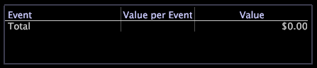

# Waarde legendes{#value-legends}

Een waarde legende toont bepaalde waardegebeurtenissen.

De waarde legende wordt gevormd slechts in HBX en [!DNL Site] toepassingen, maar zij kunnen voor andere toepassingen worden gevormd. Voor meer informatie, contacteer de Raadplegende Diensten van Adobe.

In HBX en [!DNL Site], wordt een waardegebeurtenis gedefinieerd als een zitting die bedrijfswaarde produceerde. Bijvoorbeeld, zouden de verslagen van gebeurtenisgegevens verbonden aan bepaalde paginameningen (bijvoorbeeld, een orde dank-u pagina of een pagina van de toepassingsvoltooiing) waardegebeurtenissen aan een bedrijfsorganisatie kunnen vertegenwoordigen.

Met waardegebeurtenissen, kunt u de hoeveelheid waarde meten en volgen die door de website wordt geproduceerd. Je kunt de bedrijfswaarde in dollars voor elke gebeurtenis beoordelen en vragen beantwoorden zoals:

* Wat is de meest rendabele weg door de website?
* Welke referentie of campagne heeft de meeste waarde geproduceerd?

Voor elke gebeurtenis, toont de legende de de eenheidswaarde van de gebeurtenis (waarde per gebeurtenis) en de totale waarde die door de gebeurtenis wordt geproduceerd. U gebruikt de legende om waardegebeurtenissen te bepalen en te veranderen en eenheidswaarden aan hen toe te wijzen.

De volgende lijst maakt een lijst van de metriek met betrekking tot waardegebeurtenissen.

| Metrisch | Beschrijving |
|---|---|
| Omzetting | Het percentage van zittingen dat bedrijfswaarde produceerde |
| Waarde | De totale gegenereerde bedrijfswaarde in dollars |
| Gem. Waarde | De gemiddelde bedrijfswaarde die, in dollars, per zitting wordt geproduceerd |

U kunt gemakkelijk om het even wat bepalen dat de bezoekers in de website als waardegebeurtenis doen: het posten van een verzoek van de klantendienst, het voltooien van een toepassing, het bekijken van een stuk van inhoud, of het voltooien van een aankoop. Elke waardegebeurtenis beantwoordt aan een gebruiker die tot een bepaalde pagina of een reeks pagina&#39;s op de website toegang heeft, en met een bedrijfswaarde in dollars geassocieerd. Bijvoorbeeld, zou u kunnen veronderstellen dat elke gebruiker die de &quot;Dank u voor het kopen&quot;pagina bereikt een bijdragemarge van $20 gemiddeld bereikt. U zou een waardegebeurtenis voor die pagina bepalen die een waarde van $20 heeft.

## Nieuwe waardegebeurtenissen definiëren {#section-2ea4d168336e4d2e98b22b636ed43853}

**Om een nieuwe waardegebeurtenis in HBX te bepalen of[!DNL Site]**

Wanneer u een waardegebeurtenis creeert, sleept u websitepagina&#39;s die waarde van een visualisatie aan een waardelegende vertegenwoordigen.

1. Open een waardelegende.

   

1. Voeg waardegebeurtenissen aan de legenda van proceskaarten, de paginatabellen van URI, of de meningen van de paginahiërarchie toe:

   * Van een proceskaart, sleep knopen van de proceskaart aan de legende.
   * Van een de paginatabel van URI, druk Ctrl+Alt en sleep een pagina van de lijst aan de legende.
   * Van een mening van de paginahiërarchie, klik links van een knoop (omslag, pagina, of groep) en sleep het op de legende.
   

   Uw muiswijzer toont het woord &quot;Neen&quot;tot uw muis de legende bereikt.

1. In de waarde legende, wijs een bedrijfswaarde aan elke zitting toe waarvoor de gebeurtenis voorkomt:

   1. In de [!DNL Value per Event] kolom, klik de cel die aan de pagina beantwoordt u als waardegebeurtenis hebt toegevoegd.
   1. Typ het dollarbedrag om voor de waarde van die gebeurtenis toe te wijzen en te drukken binnengaan.
   

   Door gebrek, verschijnt URL van de pagina u als waardegebeurtenis bepaalde in de waardelegende. Indien gewenst, kunt u dit URL in de legende tweemaal klikken om binnen te gaan geef wijze uit en noem de gebeurtenis anders. U kunt de waarde van een bepaalde gebeurtenis op elk ogenblik ook uitgeven. De server van de Werkbank van Gegevens berekent automatisch waarde gebeurtenis-gebaseerde metriek zoals gemiddelde waarde en omzetting opnieuw.

Nadat u minstens één waardegebeurtenis hebt bepaald, wordt de dimensie van het Segment van de Waarde beschikbaar voor gebruik. Deze dimensie vertegenwoordigt de totale waarde die een bezoeker in alle zittingen heeft geproduceerd.

## Waardegebeurtenissen verwijderen {#section-25cd90a859384ca183c0fc0998f888cf}

* Klik de gewenste gebeurtenis met de rechtermuisknop aan en klik **[!UICONTROL Delete Event]**.

   

>[!NOTE]
>
>De server van de Werkbank van Gegevens berekent metriek over de volledige reeks gegevens toegankelijk voor het profiel u gebruikt. Door gebrek, [!DNL Data Workbench Server] berekent de metriek zoals Waarde, de Gebeurtenissen van de Waarde, Gemiddelde Waarde, en Omzetting over alle gegevens in de analysedataset, zelfs als het gegeven niet uit de zelfde logische bron is.

## Exporteren naar Microsoft Excel {#section-feaa7a8eb8124fafbc74169bebaed6d8}

Voor informatie over het uitvoeren van vensters, zie het [Uitvoeren van de Gegevens](../../../../home/c-get-started/c-wk-win-wksp/c-exp-win-data.md#concept-8df61d64ed434cc5a499023c44197349)van het Venster.
