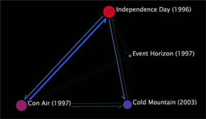

# Procesoverzicht{#process-map}

De kaarten van het proces laten u toe om de stroom van activiteit tussen elementen van een afmeting te analyseren.

U creeert proceskaarten door de elementen van een afmeting te slepen en te laten vallen op een lege tweedimensionale (2D) of driedimensionale (3D) kaart. De elementen worden knopen op de kaart. De knopen zijn cirkels in 2D proceskaarten en bars in 3D proceskaarten.

>[!NOTE]
>
>Een proceskaart krijgt zijn naam van zijn gebruik in het analyseren van de stroom van activiteit tussen de stappen in een proces. In dit type van analyse, vertegenwoordigt elk element op de kaart een stap in het proces.

In tegenstelling tot wegbrowsers, kunnen de proceskaarten zo weinig of zo vele elementen zonodig voor uw analyse tonen. U kiest de elementen van belang en sleept en laat vallen hen op de kaart. Ook in tegenstelling tot wegbrowsers, tonen de proceskaarten de stroom van activiteit in beide richtingen tussen één element en één of meerdere andere elementen.

>[!NOTE]
>
>Voor deze kaarten om het meest effectief te werken, zou u een kleurenlegende in de werkruimte moeten openen. Voor informatie over het gebruiken van kleurenlegenden met proceskaarten, zie de [Activerende Verbindingen](../../../../home/c-get-started/c-analysis-vis/c-proc-maps/c-act-color-lnks.md#concept-2c9b9f67f2bd4cd7a5431fa21c094edc)van de Kleur. Voor meer informatie over kleurenlegenden, zie de Legenda van de [Kleur](../../../../home/c-get-started/c-analysis-vis/c-legends/c-color-leg.md#concept-f84d51dc0d6547f981d0642fc2d01358).

Elke proceskaart heeft een bijbehorende basisafmeting, groepsafmeting, niveauafmeting, en metrisch, die sleutels verstrekken om de gegevens te interpreteren die in de proceskaart worden getoond.

De standaardmontages voor de afmetingen en metrisch van een proceskaart hangen van de toepassing van de Werkbank van Gegevens af die u gebruikt. Voor informatie over de afmetingen en de metriek beschikbaar aan u voor uw proceskaarten, zie de toepassingsgids voor uw toepassing van de Werkbank van Gegevens.

* **Basisdimensie:** Wanneer u sleept en een element op een proceskaart laat vallen, sleept u en laat vallen een element van de basisdimensie.
* **Niveaudimensie:** Elke dimensie in uw dataset heeft een bijbehorende niveaudimensie (die ook als ouder wordt bedoeld). De niveaudimensie voor uw proceskaart zou het zelfde als de niveaudimensie (of ouder) voor de de basisdimensie van uw proceskaart moeten zijn. Bijvoorbeeld, als u een pagina (een element van de dimensie van de Pagina) aan de kaart sleept, zou de overeenkomstige niveaudimensie de Mening van de Pagina zijn.
* **Groepsdimensie:** De groepsdimensie bepaalt hoe de elementen van de niveaudimensie worden gegroepeerd om de verbindingen tussen knopen te vormen. Voor proceskaarten, is de groepsdimensie belangrijk om drie belangrijke redenen:

   * Een verbinding tussen twee knopen kan niet meer dan één element van een groepsdimensie overspannen. Om dit te begrijpen, overweeg een voorbeeld gebruikend Webgegevens. Veronderstel dat de basis, het niveau, en de groepsdimensies voor uw proceskaart Pagina, de Mening van de Pagina, en Zitting, respectievelijk zijn. Een verbinding van pagina A aan pagina B vertelt u dat, tijdens om het even welke enige zitting, een paginamening van pagina A voorafgaand aan een paginamening van pagina B zonder het tussenkomen paginameningen van andere pagina&#39;s (knopen) op de kaart voorkwam. Merk op dat de paginameningen van andere pagina&#39;s van de plaats tussen paginameningen voor pagina&#39;s A en B tijdens de zelfde zitting zouden kunnen voorgekomen zijn, maar deze pagina&#39;s worden niet getoond op deze kaart.
   * Een verbinding tussen twee knopen kan veelvoudige elementen van de groepsdimensie vertegenwoordigen. Bijvoorbeeld, zouden er veelvoudige zittingen kunnen zijn waarin een paginamening van pagina A vóór een paginamening van pagina B voorkwam. Daarom vertegenwoordigt de verbinding tussen pagina A en pagina B alle individuele zittingen waarin een paginamening van pagina A vóór een paginamening van pagina B zonder het tussenkomen paginameningen van andere pagina&#39;s (knopen) op de kaart voorkwam.
   * Wanneer u een selectie maakt die op een knoop binnen een proceskaart wordt gebaseerd, selecteert u alle elementen van de groepsdimensie die die knoop impliceerde. Zie Selecties [maken in visualisaties](../../../../home/c-get-started/c-vis/c-sel-vis/c-sel-vis.md#concept-012870ec22c7476e9afbf3b8b2515746). Voor informatie over selecties, zie het [Maken Selecties in Visualisaties](../../../../home/c-get-started/c-vis/c-sel-vis/c-sel-vis.md#concept-012870ec22c7476e9afbf3b8b2515746).

* **Metrisch:** De grootte van de knoop voor een bepaald element is proportioneel aan de waarde van metrisch voor dat element. De grotere knopen wijzen op grotere metrische waarden dan kleinere knopen.

Bijvoorbeeld, als u de toepassing [!DNL Site] of HBX gebruikt, kunt u, door gebrek, elementen van de dimensie van de Pagina op de proceskaart slepen. De grootte van elke knoop is verwant met de hoeveelheid zittingen (die door metrische Zittingen worden bepaald) waarin die pagina werd bekeken.

>[!NOTE]
>
>U kunt de standaardafmetingen of metrisch voor een proceskaart veranderen. Voor stappen om een proceskaart te vormen, zie het [Vormen de Kaarten](../../../../home/c-get-started/c-intf-anlys-ftrs/t-config-proc-maps.md#task-4a95730b18a14bc790a77c013832b2d6)van het Proces.

