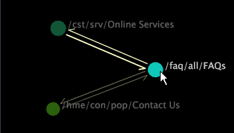

# Selecteer een knooppunt{#select-a-node}

Als u een knooppunt selecteert door erop te klikken, worden de andere knooppunten gedimd, zodat u de pijlen van en naar het gemarkeerde knooppunt gemakkelijker kunt zien.

U kunt hiermee ook de geselecteerde knooppunten als een groep verplaatsen binnen de visualisatie.

>[!NOTE]
>
>Als u een knooppunt selecteert door erop te klikken, worden de gegevens op geen enkele manier gefilterd.

**Eén knooppunt selecteren**

* Klik op het knooppunt om het te selecteren en markeer de pijlen die naar en van het knooppunt wijzen.

   

**Een ander knooppunt of een groep knooppunten toevoegen aan uw selectie**

* Houd Ctrl ingedrukt en klik op een knooppunt of houd Ctrl ingedrukt en sleep over meerdere knooppunten.

**Een knooppunt of groep knooppunten uit uw selectie verwijderen**

* Houd Shift ingedrukt en klik op een knooppunt of houd Shift ingedrukt en sleep over verschillende knooppunten.
