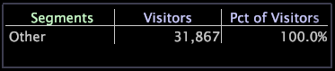

# Creeer een segmentdimensies{#create-a-segment-dimensions}

Om een segmentafmeting tot stand te brengen, begint u door een selectie binnen een werkruimte te maken en dan het segment toe te voegen aan een visualisatie.

**Om een segmentdimensie te creëren**

1. Voeg een segmentvisualisatie aan de werkruimte toe. Bijvoorbeeld:

   

1. Voeg visualisaties aan uw werkruimte toe die u wilt gebruiken om uw segment te bepalen, dan maak de gewenste selecties om uw segment te bepalen.
1. In de segmentvisualisatie, klik het etiket van het segment met de rechtermuisknop aan waarna wilt u dat het nieuwe segment wordt toegevoegd en klikt **[!UICONTROL Add Segment]**.

   >[!NOTE]
   >
   >Om een nieuw eerste segment tot stand te brengen, klik het **[!UICONTROL Segments]** etiket met de rechtermuisknop aan en klik **[!UICONTROL Add Segment]**.

   

   Een nieuw segment (genoemd Nieuw Segment) verschijnt in de visualisatie. Het andere segment vertegenwoordigt alle gegevens niet inbegrepen in uw bepaalde segmenten: het is effectief het verschil tussen uw datasetgegevens en uw segmentgegevens.

1. Klik het pas gecreëerde segment met de rechtermuisknop aan en klik **[!UICONTROL Rename Segment]**.
1. Typ een beschrijvende naam voor uw nieuw segment op het naamgebied.

   >[!NOTE]
   >
   >Als een metrische waarde, zoals een bepaalde bezoeker in [!DNL Site], aan de criteria van veelvoudige segmenten voldoet, is de metrische waarde inbegrepen in slechts het eerste vermelde segment dat het aanpast.

**Om de segmentdimensie te bewaren**

1. Klik het etiket van Segmenten met de rechtermuisknop aan en klik **[!UICONTROL Save Dimension]**. Het [!DNL Save Dimension As] venster wordt weergegeven. De standaardbewaarplaats is de omslag van de Afmetingen van de Gebruiker \*de profielnaam* \ van de Gebruiker.
1. Op het [!DNL File name] gebied, typ een beschrijvende naam voor de segmenten die u als afmeting bewaart en klikt **[!UICONTROL Save]**.

U kunt tot de segmentdimensie toegang hebben wanneer u met een visualisatie werkt. U kunt gegevens ook uitvoeren verbonden aan de elementen in uw bewaarde afmeting gebruikend de eigenschap van de segmentuitvoer.

Voor meer informatie over de eigenschap en de instructies van de segmentuitvoer om het voor uw behoeften te vormen, zie het [Vormen Segmenten voor de Uitvoer](../../../../home/c-get-started/c-exp-data-seg-exp/t-config-sgts-expt.md#task-8857f221fa66463990ec9b60db6db372).
