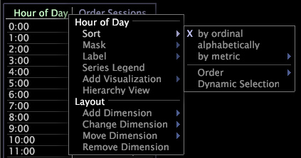

# Gegevens in een tabel sorteren{#sort-data-in-a-table}

Stappen om gegevens te sorteren.

Als de lijst slechts één afmeting heeft, kunt u eenvoudig het etiket van metrisch klikken waarop u de gegevens wilt sorteren.

1. Klik met de rechtermuisknop op een element of het label van de dimensie die u wilt sorteren en klik op **[!UICONTROL Sort]**.

   

1. Klik op een van de volgende opties:

   * **[!UICONTROL By ordinal]** om de elementen te sorteren op de natuurlijke volgorde van de elementen. De elementen van de dimensie Uur worden bijvoorbeeld in chronologische volgorde weergegeven. Als de dimensie geen natuurlijke orde, zoals met verwijzing of URI heeft, is de soortorde niet nuttig, zodat zou u moeten selecteren om of alfabetisch of door metrisch te sorteren.
   * **[!UICONTROL Alphabetically]** om de dimensie alfabetisch te sorteren op elementnaam.
   * **[!UICONTROL By metric]** om metrisch te selecteren waardoor u de gegevens wilt sorteren. Bijvoorbeeld, kunt u de afmeting van de Verwijzer door metrische Versies sorteren om te zien welke verwijzers de meeste zittingen op uw plaats bijdragen.

      Wanneer u op metrisch sorteert, door gebrek beantwoordt de orde in de lijst aan de waarden van metrisch zoals die door de selectie op dat ogenblik worden beïnvloed. Als u de selectie later wijzigt, verandert de gesorteerde volgorde niet in de oorspronkelijke volgorde, tenzij de afmeting wordt gesorteerd of u Dynamische selectie inschakelt. Wanneer u **[!UICONTROL Sort]** > **[!UICONTROL Dynamic Selection]** klikt, wordt de lijst opnieuw gesorteerd telkens als u de selectie verandert.
   Als u op een bestaande metrische waarde in de tabel wilt sorteren, klikt u op het metrische label.

1. (Optioneel) Als u wilt kiezen of u in oplopende of aflopende volgorde wilt sorteren, klikt u met de rechtermuisknop op een element of op het label van de dimensie die u wilt sorteren en klikt u op **[!UICONTROL Sort]** > **[!UICONTROL Order]** > **[!UICONTROL Ascending]** of **[!UICONTROL Sort]** > **[!UICONTROL Order]** > **[!UICONTROL Descending]**.

   Als de tabel maar één dimensie heeft, kunt u gewoon op het label van de metrische waarde klikken om de sorteervolgorde om te keren. Als u nogmaals op het label klikt, wordt de sorteervolgorde omgekeerd.
